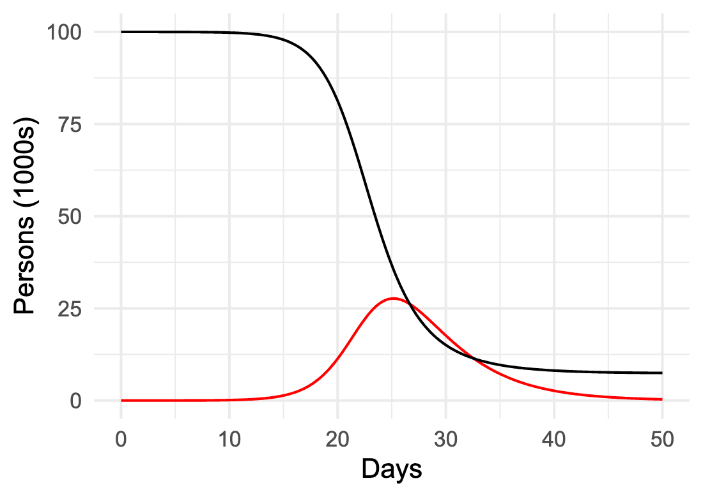

# Argument and reasoning {#sec-models}



```{r include=FALSE}
#| label: ch01-r-8d19902c
source("_start-up.R")
```

::: {.aside}
`r paste(readLines("_Words/chap_1.txt"), collapse = "\n")` 
:::

The second word in *Quantitative Argumentation* comes from the simpler word "argument." In everyday speech, an argument is a quarrel. The root of "argument" goes back to pre-history, as documented, for instance, in the Mirriam-Webster dictionary. In the hypothesized proto-Indo-European language, *arg* meant shiny or bright. Latin inherited this sense of shining a light; the Latin *arguere* means "to make clear," "enlighten," "prove," or "demonstrate." Entering English in the 1300s, "argument" means a reason or proof used to settle a doubt. `r xf_definition("Argumentation")` refers to the process of constructing good arguments, a central theme of this book.

"Quantitative" for most people means using numbers. This is a good start, but "quantity" is a richer concept than "number." *Quantitative argumentation* is using the power of quantitative reasoning to enhance our broader, native reasoning ability. Those enhancements allow us to frame compelling arguments about diverse real-world situations, arguments that can foster consensus and guide useful debate with the goal of making informed decisions and effective actions.

This chapter examines reasoning and how we can combine different forms of reasoning to improve our understanding and decision making.

[The notation `r xf_definition("word or phrase")` highlights that the word or phrase has a technical meaning and is not just used in a casual, everyday sense. At the end of each chapter, make sure that you feel comfortable with the technical meaning so that it will come to mind when you encounter the word again. As a reminder, the technical words will be highlighted in the margin in each chapter that they appear. ]{.column-margin}

Reasoning transforms [`r xf_definition("givens")`]{} into new beliefs and understandings. "Givens" include facts, beliefs, assumptions, observations, knowledge, premises, perceptions, and impressions as we have them at the start of a reasoning process. Reasoning is the extraction of meaning from the givens.

Two forms of reasoning will be important to us. `r xf_definition("Heuristic reasoning")` is the sort widely used because of its efficiency and applicability throughout our interaction with the world. We could define it simply as common-sense reasoning, but "common" hides as much as it reveals. The second form of reasoning, `r xf_definition("formal reasoning")`, has a much smaller range of applicability in the world but gives (when correctly applied) more certainty and the persuasiveness that goes along with certainty. 

Combining the two types of reasoning gives us the benefits of both: the broad applicability of heuristic reasoning and the reliability of formal reasoning. `r xf_definition("Quantitative models")` bridge the gap between the two forms of reasoning. Understanding the process of modeling, and using models well and deliberately, is what quantitative argumentation is all about. 

## Reasoning from givens

Consider a familiar example: a rooster's crowing awakens you. You reason that it is dawn. One *given* is an observation: you heard a  rooster sound. Another given is that you were awakened. But "dawn" is not a given. You did not directly observe dawn, it comes through reasoning from the givens. 

Hearing a rooster sound is not the same thing as "a rooster is crowing." For instance, you might have been dreaming about the rooster noise. The observation itself is uncertain. This uncertainty propagates to the conclusion. So we don't know for sure that it is dawn.

What links "rooster sound" with the reasonable belief that it is dawn? The link is a small bit of knowledge: "Roosters crow at sunrise." 

Common sense says that the other given---you were awakened---supports the belief that it is dawn. This supporting role does not come from either "a rooster is crowing" or "roosters crow at sunrise." 

There are many words that describe the creation of a new belief or fact from givens: a deduction, an inference, a conclusion, a finding, etc. A logician---that is, someone who strictly enforces the rules of formal logic---would call a foul for claiming that "it is dawn" is a conclusion from hearing a rooster sound. She can argue, "That could be right, but it's not necessarily so." For instance, the crowing sound might have come from a social media feed, not a rooster. Without the rooster involved, the link "roosters crow at sunrise" would be irrelevant. It's also fair to say that, although roosters stereotypically crow at dawn, they don't *always* do so; there can be crow-less dawns. And roosters sometimes crow at other times of day or night.

A simple metaphor illuminates the process of reasoning: a chain. Physical chains are made by joining elements together. Each link ties together the surrounding links. The link between "a rooster is crowing" and "it is dawn" is the knowledge or belief that "roosters crow at dawn."

Consider a richer example. You are driving on a highway. The brake lights on the car ahead of you flash on. Naturally, you touch your own brakes to slow down. This is a matter of experience and common sense. But let's treat it as a chain of links between the observation ("brake lights flash") and the action ("touch your brakes").

Here are three beliefs that might participate in the chain:

i. Brake lights imply rapid slowing down.
ii. A difference in speeds between two cars can lead to a collision, while matching speeds avoids collisions.
iii. To match a slowing speed, use your brakes.

There are overlapping uses of words or synonyms in these three statements such as "speed" and "slowing" or "difference" and "match". Now imagine a mental process that even unconsciously notes such overlaps and uses them to link the beliefs together. Seeing brake lights flash might, for instance, activate belief (i), which then activates belief (ii), which in turn activates belief (iii). In this way, a mental connection is made between observing brake lights and the action of touching your brakes.

We will leave the biology of this to neuroscientists. But computer scientists have long studied reasoning, especially machine reasoning. The last few years have seen breakthroughs in building such machines, resulting in the so-called "Large Language Models" (LLMs) or "Artificial Intelligence" (AI) that you may be using on an everyday basis.

LLMs rely on finding alignments between text segments and using such alignments to build reasoning chains. Later chapters outline how such machines work. For now, we will stick to the chain metaphor.


## Heuristic reasoning

A heuristic is a useful reasoning link but is not guaranteed to be correct. The phrase "rule of thumb" captures the role of a heuristic. Before standardized rulers were readily available to craftsmen, the length of a thumb provided a handy way to mark of an inch in measurement. (Jokingly, I'll point out that people working in the metric system might have invented a "rule of ring finger" to measure a centimeter. But the metric system was introduced in the 1790s. By then, genuine rulers were commonplace.) 

Some of the examples used in the previous section contain heuristics. For instance, "a rooster sound" is a pretty good indication that a rooster is crowing. "Roosters crow at dawn" may be a stereotype, but it explains a lot about roosters. "Brake-lights flashing on" is a sensible way to detect whether the car ahead is slowing rapidly, but the driver ahead might just be tapping her brakes to signal to you to stop tailgating.

Heuristic reasoning is serious business. Beyond providing a framework for "common sense," three Nobel prizes in Economics have been awarded for descriptions of real-world human and corporate reasoning in terms of heuristics: Herbert Simon in 1978, Daniel Kahneman in 2002, and Richard Thaler in 2017. [The topic of their work is often labelled as concerning "bounded rationality" or "behavioural economics."]{.column-margin}

Traditionally, what came to be called heuristic reasoning was often lumped under the idea of "logical fallacy" and sometime pejoratively called "irrationality." This hostile attitude stems from the misplaced view that *formal reasoning*, the sort taught in mathematics classes, is the only valid form of reasoning. 

Heuristic reasoning aligns well with the actual process of much human reasoning. It is valid in the sense that it enables us to respond quickly and helpfully to inputs in the world around us. Some speculate that heuristic reasoning is a kind of reflex that evolved to support survival. 

## Formal reasoning

The word "argument" is a little misplaced when it comes to formal reasoning. More commonly, formal reasoning is called "deduction," "derivation," "logical reasoning," or "proof." But simple arithmetic is also a form of formal reasoning.

The distinguishing features of formal reasoning are, first, that a proposed link in the chain of formal reasoning is either correct or in error; true or false. Second, each link is based on a "law" or "rule" that is certain. Naturally, people make mistakes in attempting to follow formal reasoning rules; this is why students' math homework often has many red marks to indicate an error. If a reasoning chain has any fallacious links, the entire chain is fallacious. The conclusion at the end of the chain, even if a useful guide for action, is not yet demonstrably true. Many readers are likely familiar with attempted mathematics derivations which contain two fallacious links that happen to "cancel out" so that the conclusion at the end of the chain is true and could have been demonstrated by an entirely correct chain of reasoning.

A correct application of formal reasoning is not subject to meaningful dispute, although people unskilled in formal reasoning may not see the correctness of the chain. Nobody should argue about whether $7 + 11 = 18$ nor that 6.83 is bigger than 3.79. Formal reasoning is completely reliable, except when humans make an error applying it. 

In discussing heuristic reasoning, we have used "givens" as the name for the statements at the start of a chain in reasoning. Formal reasoning also has starting points conventionally called "premises," but "givens" works just as well. [Other synonyms include "assumptions," "axioms," and "postulates.]{.column-margin}"

A premise is a statement assumed to be true for the purpose of reasoning. It is a starting point for a chain of reasoning. The "formal" in "formal reasoning" means that it is whether a premise is a true or useful description of the world is technically irrelevant to the correctness of a chain of formal reasoning. For instance, Euclidian geometry is based on a set of premises that are indisputable within the framework of Euclidian geometry, for instance that "a straight line is the shortest path between two points." Denying this in a Euclidean geometry class is inadmissible. But there are other frameworks for geometry---to so-called non-Euclidean geometries---where curves can be the shortest path between points. 

Despite the certain strengths of careful formal reasoning, it can give misleading results when applied to many real-world situations. The starting points for formal reasoning---premises---do not necessarily reflect the realities of the world. For instance, airplane pilots and mariners learn to deal with the spherical shape of Earth, travelling along "great circle" routes. But even if using spherical geometry correctly, the notion of "shortest distance" may not reflect the actual goal of navigation. It might be more appropriate to think about paths with the shortest journey *time* or *energy cost* which can depend on factors such as winds and currents.

In use formal reasoning to move from real-world *givens* to useful conclusions, we need a bridge the gap between formal premises and the real world. Formal reasoning is reliable but narrow in application. Heuristic reasoning is widely applicable, but not completely reliable.

## Models as bridges to formal reasoning

We will use `r xf_definition("models")` as bridges between real-world givens and the power and reliability of formal reasoning. For now, consider models are used in everyday life, commerce, and science.

A model is a *representation* of an item, process, or setting of interest. We build models because they are easier to use or modify than the reality. For instance, a blueprint is a model of a building; model houses or apartments let people see a building at full scale without intruding on neighbors’ privacy. The blueprint helps us to think about the situation: Is there enough space for the needed furniture; will windows bring in enough light? Medical research often uses animal models to study the physiology of disease progression or to test potential treatments ultimately intended for use in humans. And there are model ships, trains, trucks, and planes that represent large real-world objects and bring them within a child’s reach.

For quantitative argumentation, appropriate models are built from mathematical components. Some of the tools and materials from which quantitative models are built will be familiar from your previous studies and experiences. Other modeling materials and common model-building patterns will be new to you. As with so many things, you learn at first from copying and modifying models from textbooks and other sources, that is, models already built by other people. With growing practice and confidence, you may find that you can create your own useful models. But knowing about the structure of quantitative models will help you make better sense of quantitative arguments, so that you can apply your own judgment and knowledge when deciding whether to accept or rebut an argument. 

Once built, the model becomes a *premise*, the starting point in a chain of formal reasoning. The model, however, may not be a true description of the real-world situation. The model is a representation, not the real world itself. If the model is faulty, the conclusions from the formal reasoning chain may be faulty as well.  

Building a model is *not* an exercise in formal reasoning. Instead, model construction uses our knowledge, understanding, and belief about real-world matters, together with heuristic reasoning. Many different models may suit a given situation. The choice among them depends on what we hope to accomplish, whether that be decision-making, prediction, or testing and augmenting our understanding of the situation. Appropriate models are therefore built to suit our real-world purposes. 

The following chapters will cover concepts, techniques, and methods that have been found useful in constructing quantitative models. By analogy to carpentry, learning to model starts with exposure to important kinds of tools. For instance, you can drive a nail by using a rock, but you will likely bend the nail and not be able to remove it. A hammer is a purpose-designed tool for driving nails. The length of a hammer's handle, the shape of the business end of the hammer head, the curved claw at the other end of the head, and technique---how to hold the hammer, how to swing your arm---make the hammer effective. Probably you learned how to use a hammer by watching others and applying intuition. You did not need to study extensively the properties of wood or the metallurgy of nails. 

A final point. Recall that we build quantitative models using heuristic reasoning. There is no such thing as proving the correctness of a model. Indeed, a famous truism is

> "All models are wrong. Some models are useful."

A model's usefulness depends partly on the modeler's purpose. Importantly, modeling is usually an *iterative* process. We build a model, then check the extent to which it captures the essential aspects of reality. When it does not, careful analysis can reveal where the model fails. Even if the first model proposed is not adequate, cycles of testing and improvement can eventually lead to a model that is useful for the purpose at hand. 

## Example: Modeling an epidemic {#sec-modeling-an-epidemic}

We begin with an accessible example. The features of an epidemic, such as COVID-19, are familiar. A pathogen, such as SARS-CoV-2, emerges from a typically unknown origin and infects a handful of people. The pathogen is contagious: infective people transmit it somewhat at random to susceptible people. Some of the susceptibles become infective and can transmit the virus to other people. At the same time, infective people recover, losing their ability to convert susceptibles into new infectives.

The verbal description in the previous paragraph is a model of an epidemic. The given mechanism is called "Susceptible, Infective, Recovered," or `r xf_definition("SIR")` for short. Later techniques, particularly in `r xf("sec-composing-models")`, translate the verbal description into a quantitative model that allows us to simulate the outbreak. The form of the model is bookkeeping that, based on today's numbers of susceptible and infective people, calculates tomorrow's tally of new cases and recoveries. 

The number of new cases is a function of the current size of the outbreak---that is, the current number of infectives---and the number of susceptible people who can come into contact with infectives. As infective people recover, the number of infectives goes down. However, this may be more than balanced by the new cases coming from the susceptible group in the population. As the susceptible group decreases in size, few new cases will develop and the epidemic will wane.

Note that bookkeeping is an instance of formal reasoning. In this example, the formal reasoning will be handled by a computer program which can calculate the day-to-day numbers of susceptibles, infectives, and recovered people as the epidemic evolves. The mechanism implemented by the computer program is strongly analogous to the way a river current, with its eddies and backflows, transports piece of flotsom, say, a fallen leaf. (`r xf("sec-dynamics")` introduces the largely intuitive mechanics of such flows.)

`r xf("fig-SIR-interactive")` shows an epidemic in a population of 100,000 people. It starts on day 0 with the arrival of the initial cases and progresses day by day for 50 days. The number of infectives (red) grows at first, then declines. The susceptible population (black) decreases in proportion to the number of infectives.


::: {#fig-SIR-interactive}



The progression of a simulated epidemic among 100,000 susceptibles in the 50 days after the initial cases appear. The black curve shows the number of susceptibles; the red curve shows the number of infectives. 
:::

`r qr_margin_note(
  "https://dtkaplan.github.io/QA-exercises/Apps/App-113.html",
  "Interactive SIR model"
)`

Use the interactive version of the model to explore scenarios for epidemics. For instance, you might be interested to know the relationship between the size of the outbreak and the number of initial cases. Similarly, you can explore whether social distancing is effective or the possible importance of isolating infectives. "Play" is a light-hearted word, but such activity is genuinely useful for drawing conclusions about the epidemic and the effectiveness of various interventions.

