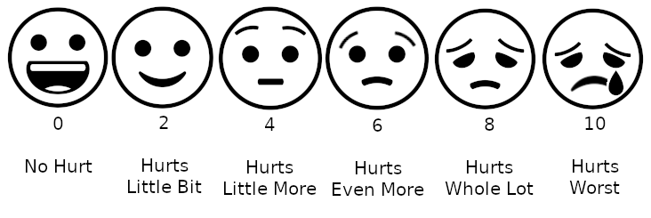
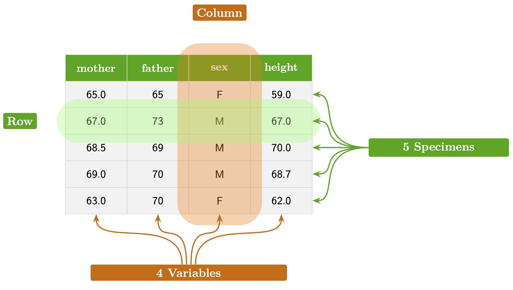

```{r include=FALSE}
#| label: ch02-r-setup
source("_start-up.R")
```


# Systems, dimensions, and data {#sec-systems}


::: {.aside}
`r paste(readLines("_Words/chap_2.txt"), collapse = "\n")` 
:::

IN DRAFT: Talk about acyclic graphs for systems and raise the question of cyclic graphs. 


Even in informal speech, we use the word "system" a lot. In this book, we will build and use models of ... well, what? We could provide a several nouns to complete "models of ...", for instance, "things," "objects," "processes," or "phenomena." In this book, we will use the abstract word `r xf_definition("system")` as a general way to refer to what is being modeled. The reason has to do with a specific meaning for "system" that will help us understand a very useful structure for models used in argumentation.


> **System**: *a framework or an organized structure with interconnected elements.* Or, from the [Merriam-Webster](https://www.merriam-webster.com/dictionary/system) dictionary: "a regularly interacting or interdependent group of items forming a unified whole."

`r qr_margin_note(
 "https://www.merriam-webster.com/dictionary/system", 
 'Merriam-Webster'
 )`
 

This chapter sets up a framework for thinking about "elements" or "items" productively, with an eye toward what goes into a model used in quantitative argumentation. To give you an idea of what's coming, consider the following thought, which at this point may seem like a mere jumble of words

> "Systems are composed of dimensions and the relationships which connect them. In models, dimensions are represented by quantities."

In some cases, being consistent in terminology means avoiding some words with which you are undoubtedly familiar from mathematics classes. The issue here is that words like "variable" are used for so many unrelated purposes that they lose specific meaning. For instance, in statistics and data science, the noun variable refers to an aspect or quality of an object, for instance temperature or humidity or comfort. But in mathematics, "variable" has several distinct meanings, such as an "unknown" or a symbol, as in "$x$ is a variable. Find $x$." 

In the traditional curriculum, mathematics and statistics are treated largely independently and in different courses. Quantitative argumentation, however, encompasses both. Conflicts and ambiguities of meaning therefore need to be dealt with carefully and explicitly. Let's get started! 

## Dimension

There are several synonyms for scientist's or statistician’s "variable." Familiar among these are  "characteristic", "factor," and "aspect" as well as "trait," "feature," "attribute," and "property." In this book, all such synonyms will be grouped under the word `r xf_definition("dimension")`. An example sentence: "Her personality has several dimensions: intelligence, honesty, anxiety, and diligence."

`r xf("sec-quantities")` uses the geometrical idea of "space." As you know, objects or spaces are often described using their "dimensions." For instance, a book has three spatial dimensions: width, length, and height. Of course, a book has other attributes as well, each of which we will call a dimension: weight, price, page-count, genre, and so on.

Many of the dimensions of a book are easily measured. Others, such as "genre," require not a measurement but a description. This is true as well for the dimensions of, say, personality. How do you measure honesty? Or anxiety? Or even intelligence?

Often, to construct a mathematical model, we will need to quantify a dimension such as anxiety, honesty, or genre. That is, we need to translate a dimension into some measurable quantity. 

The way that the dimension (as in aspect or property) is translated is called `r xf_definition("operationalization")`. We can operationalize length using a ruler. We can operationalize weight using a scale. Such operationalizations are obvious and familiar. But what's familiar to us in the 21st century was not always familiar. The measurement of temperature is a case in point. Before 1600, "temperature" was sensed by skin or the glowing color of hot metal, but not measured. Around 1610, the "thermoscope" enabled visualization of temperature using the level of water in a tube. Not until more than a decade later was a quantitative scale—a ruler—added to the thermoscope, turning it into a thermometer.  From a modeling perspective, a thermometer is a device that operationalizes the quantitative measurement of temperature. Today, of course, thermometers are the obvious and familiar ways to measure temperature.

Age and height are also familiar dimensions. We operationalize height, for instance, by marking the top of a person’s head on a wall or door frame, then using a ruler to measure (that is, "quantify") the distance from the floor to the mark. We operationalize age—this will be obvious—by calculating the time difference between birth and the moment of measurement. (More commonly, we ask the person!)

Sometimes an operationalization is technical, obscure, and to some extent arbitrary. For instance, the economic variables "cost of living" and "poverty level" have official operationalizations in the US. An officially defined, standardized "market basket" serves as the basis for calculating the cost of living. The government defines poverty level by a formula that involves the cost of living, family size, and composition, and is based on pre-tax income and does not depend on location, even though housing costs, food, energy, and such vary markedly from one place to another.

In a quantitative model of a system, each dimension of the system is operationalized into a quantity that measures that characteristic. Being attentive to the details of the operationalization can be an important component of critical thinking.

The `r xf_definition("value of a quantity")` is a specific numerical level along with the appropriate unit. (See `r xf("sec-quantities")`.) Typically, the value will differ across contexts, say, from hour to hour or place to place. For example, as I write this, the outdoor temperature is 52 degrees F, as operationalized by the US Weather Service from a thermometer in a ventilated, shielded box at a specific location in my city. Values can change; the temperature tomorrow will likely be different. In reading "the temperature tomorrow will be different," the underlying idea is not that the variable or operationalization will change—the Weather Service will keep doing what it has done for many years. Instead, the idea of "different" is that the value of the quantity will be different.

## Example: Operationalizing comfort

Imagine a hot, humid, sultry summer afternoon in the US. The relative humidity is 90%, the temperature 95^◦^F (equivalent to 35^◦^C). Sultry weather makes us uncomfortable.

It is helpful to provide people with a quantitative scale of comfort so they can make decisions about outdoor activities. The context is a system composed of three quantities: humidity, temperature, and comfort. (There may be other quantities we will eventually need to tell a complete story—wind speed, for instance—but for simplicity, we work with just the three.)

It may be evident that humidity and temperature are inherently quantities, but what about comfort? In modeling, we often deal with concepts that are not inherently quantitative and may be vague. There are many ways to operationalize comfort to a quantitative scale, each imperfect in its own way. A favored operationalization of weather-related comfort is the "feels like" scale, known as the "heat index." The heat index derives from a technical model of convective heat transfer from the skin. The heat index is not a comprehensive operationalization of the general concept of comfort. Still, the heat index captures an important aspect of comfort quantitatively.

Another example of an imperfect, but practical operationalization is the pain-rating scale shown in @fig-wong-baker-scale.

::: {#fig-wong-baker-scale fig-cap-location="margin"}


The Wong-Baker FACES pain scale, which turns a subjective feeling into a quantitative indicator.
:::

A common criticism of quantitative analysis is that any particular quantitative operationalization is imperfect and incomplete. This criticism can be valid and serve as a prompt to refine the operationalization and the analysis method, but it by no means invalidates quantitative analysis.  The test of operationalization is not whether it is perfect, but whether it is good enough to contribute meaningfully to the purposes for which we are conducting the quantitative analysis.

## Data

We are using "givens" to refer to the entire scope of facts, knowledge, and belief about the world. Some people informally use "data" here. Indeed "Data" is rooted in a Latin root: "to give" or "given." But for us `r xf_definition("data")` will stand for recorded facts, findings, and measurements. 

A broad, modern definition of "data" might be "anything that can be stored on a computer," the sort of material mined when training AI systems. Such data can take many forms: video, audio, maps and other images, text. Even the contents of a personal diary recording fleeting thoughts and perceptions is data in the can-be-stored-on-a-computer sense.

A `r xf_definition("data frame")` is a particular, simple but highly structured organization of data that is similar to a spreadsheet format. Data frames are at the core of much data storage and use in science, government, industry, finance, and so on. Software for handling data, especially databases that encompass multiple data frames, is the basis of a hundreds-of-billions-dollar segment of the worldwide economy and will likely continue to be so despite the explosion in AI usage.

It pays to be familiar with the specific structure of data frames. Even if you don’t work with data, the vocabulary used to describe data frames corresponds to a set of concepts that are ubiquitous in quantitative argumentation. For reference, `r xf("fig-data-frame-schematic")` shows a schematic diagram of a data frame. The data frame itself is just the text and numbers in the rectangular array. The contents of the data frame are measurements made in the 1880s of the heights (in inches) of adult children, along with the child’s sex and the heights of the child’s mother and father.

::: {#fig-data-frame-schematic}




A schematic picture of a small data frame.

:::

A data frame is a rectangular array of cells, organized into rows and columns. Each row represents the records for one specific object or event, which we will call a `r xf_definition("specimen")`. In `r xf("fig-data-frame-schematic")`, the specimen is an adult child. The five rows of `r xf("fig-data-frame-schematic")` correspond to five different children.

All the objects/rows/specimens in a data frame should be of the same kind, which we will call the `r xf_definition("object type")`. So, the object type in `r xf("fig-data-frame-schematic")` is an adult child. The object type in any data frame depends on the setting and purpose for which the data frame is being collected. For instance, a data frame used by a real-estate agent might have an object type of individual houses for sale. [In statistics, it is conventional to use the term `r xf_definition("unit of observation")` instead of "object type." We don’t follow this convention in this book because the word "unit" will be used in an utterly different sense as in "meters" or "miles per hour."]{.column-margin} A data frame used by an astronomer might have an object type of planets. The object type in a data frame used by a grocery store would be a product or object sold by the store.

A data frame can record several or many different dimensions for each object. In `r xf("fig-data-frame-schematic")`, the dimensions are the child’s sex and height, as well as the heights of the child's parents. Almost universally, the word "variable" is used for the columns of a data frame. We will honor that convention. For instance, the data frame in `r xf("fig-data-frame-schematic")` has four variables: mother, father, sex, and height.

At the intersection of each variable and each row, such as the single "M" highlighted in both green and orange in `r xf("fig-data-frame-schematic")`, is a `r xf_definition("value")`. In a data frame, the values in each variable must be recorded as the same type. For instance, all the values under mother are inches of height. Similarly, the values under sex are all either "M" or "F." (This narrow set reflects the social conventions of the 1880s.)

It will suffice for our purposes to emphasize two different types of variables: quantitative variables versus categorical variables. You can think of a categorical variable as one whose values come from a finite set of words or letters. An ID (such as the SKU/bar-code of a grocery item or a registrar’s unique identifier for individual students) is a categorical variable even if it consists only of digits. Other types of variables in widespread use are images (such as a picture of the grocery item), videos, dates, and timestamps, etc.

The entries in each row of a data frame record the values of the variables contained in the data frame for an individual specimen. Typically, a data frame contains many specimens, such as the several children displayed in `r xf("fig-data-frame-schematic")`. The complete 1880s data frame covers 898 specimens, that is, 898 children. The small data frame is a `r xf_definition("sample")` from the original larger data.

::: {.callout-warning}
## Sample vs example

In everyday English, a "sample" is sometimes used synonymously with "example." For instance, a grocery store staffer might give you a sample of some product, like a small cup of apple cider. Such a sample is intended to give the customer an idea of the quality or taste of the product. The paper cup of apple cider might also be called an "example" of the product, although this is not idiomatic in normal English. In contrast, nobody would use the word "example" to refer to a blood sample taken at a doctor's office. 

In this book, however, we use "sample" in its statistical sense. If you were studying fruit juice, say, you might select some bottles of juice from the larger collection on the grocery shelf. This would be a sample from those bottles. 

In statistics, a sample of size one, for instance, a single bottle pulled off the shelf at random, is not a useful sample. To be useful, samples must contain more than one specimen, usually many more. This is because a central question in all statistical inquiry is the extent to which the sample can be considered representative of the larger population from which it was taken. The logic of "Is the sample representative?" is based on comparing *between specimens* in the sample. With just one specimen, such comparison is impossible.

In medical research, samples typically consist of dozens or hundreds of people, although many situations require much larger samples of, say 100,000 people.

:::

It’s easy to imagine how to generate a sample from a large data frame. Scroll through the large data frame, pointing now and again to an individual specimen and copying the values from the different dimensions over to the smaller data frame that will eventually contain the sample.

The specimens in every data frame are often a sample from a potentially larger entity. [The special word "census" is used when the data frame gives a complete enumeration of all possible specimens from the entity.]{.column-margin} For instance, you might record the dimensions of color, shape, size, location, and date of acquisition of seashells in the data frame that contains the catalog of your hobby seashell collection.

You might have assembled your collection in the usual way, by wandering along a beach and picking up the shells that caught your eye. The abstract word for such a process is `r xf_definition("sampling")`. It is helpful to have a term for the larger entity from which each specimen was sampled. The word "population" is often used here. Even though the root of "population" is the same as for the word "people," when it comes to data frames we use "population" to refer to any source of specimens. For instance, we might have a population of stars or a population of events such as daily weather or forest fires.

It’s consistent with our usage in this book to say that a population has dimensions, meaning the set of aspects or qualities of the elements in the population. Those dimensions may be related to one another, for example the relationship between age and height of young children. But there is something subtle going on. When it comes to data, any detected relationships are collective properties across all the specimens in your sample. You can only discern a relationship from data when you have multiple specimens to compare to one another.

