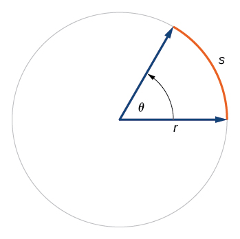

# Quantities {#sec-quantities}


```{r include=FALSE}
#| label: ch03-r-051c5213
source("_start-up.R")
```

::: {.aside}
`r paste(readLines("_Words/chap_3.txt"), collapse = "\n")` 
:::

In `r xf("sec-systems")` we used the word "dimension" to stand for any of the properties or attributes of an object or system. For example, among the many dimensions of a person are age, eye color, sex, strength, health, and so on. We also discussed "operationalization," which mean the process or procedure for converting a dimension into a quantity. That is, operationalization tells how to *measure* a dimension, turning it into one or more quantities. For instance, we might operationalize "health" using measures such as blood pressure, cholesterol level, blood-sugar level, and so on. 

I would be understandable to think that "quantity" is simple another word for "number." Quantitative argumentation, however, needs to take careful account of the *kind* of quantity being considered. For instance, a quantity of 5 could be 5 seconds, 5 dollars, 5 miles, or 5 gallons. The number 5 is the same in each case, but the *kind* of quantity is different. This is likely obvious to you, but there is more to be said.  

In this book, we will use "*quantity*" within a specific framework of surrounding concepts. Mastering this framework will make clear many things that are confusing to untrained people, which is to say, most everybody. The framework is not complex, but it requires some discipline and precision of thought.

## The quantity framework {#sec-quantity-framework}

`r xf_definition("Quantity")` and its framework concern anything measurable in a standardized way. Here are a few examples of *standardized measures*: foot, meter, degrees F, pints, hours, acres, miles, kilograms, pounds, dollars, miles per hour. 
[The word `r xf_definition("per")` is used technically. See `r xf("sec-rates")`.]{.column-margin} Scientists and engineers, craftsmen, business people, health-care workers, and others learn more specialized standard units, such as joules, amps, coulombs, moles, watts, kilowatt-hours, board feet, and many, many more. They also encounter words for the *kind of thing* being measured: length, time, mass, weight, energy, power, volume, flow, speed, costs, prices, and such.

"Standardized measures" are better known, in both technical and everyday speech, as `r xf_definition("units")`. Our technical definition of quantity is a combination of two or (optionally) three elements:

::: {#def-quantity-composition}
A *quantity* is composed of these elements:

> i. A **pure number** such as 7 or 2.15 or 6.1 $\times 10^{-8}$
> ii. A **unit** such as "meter," "bushel," or "acre."
> iii. (Optionally) additional words describing the stuff more specifically, for instance, "a bushel *of apples*" or "a pint *of blueberries*."
:::


The primary use of quantities is to state or record *how much* there is of something. Most people are well acquainted with this use, having learned it about the same time as they learned arithmetic. As a reminder, we turn to a nice book from 1931, *Arithmetic for the Practical Man* by J.E. Thompson. He wrote:

> Common measurements are of several kinds .... The chief of the common measurements are those of
>
> i. Length
> ii. Surface, or area 
> iii. Volume, or capacity
> iv. Weight, or force of gravity
> v. Time
> vi. Angles, latitude and longitude
> vii. Temperature, or intensity of heat
> viii. Money, or value

The "several kinds" of things in Thompson's list are mutually `r xf_definition("incommensurate")`: They cannot be arithmetically compared to one another or added to (or subtracted from) one another. Is a mile larger than a cubic centimeter? Invalid comparison. Is 212°F bigger than 45 degrees of latitude? Don't go there, even though both units are named "degrees." How much is 12 seconds plus 4 dollars? No.

## Base units

`r qr_margin_note(
  "https://www.youtube.com/watch?v=4Lv7DsKfwAk", 
  "Video of flare-up"
)`

A *unit* is a way of quantifying "how much." To say, "this video covers 30" involves a number but not a "how much." For that, we have to specify what the 30 refers to. Thirty seconds or 30 minutes are both reasonable durations for videos,  but one can also find videos that cover high-speed events, like the [flare-up of a match](https://www.youtube.com/watch?v=4Lv7DsKfwAk), with much of the action occurring over 30 milliseconds. At the other extreme, this [time-lapse video of a bean sprouting](https://www.youtube.com/watch?v=w77zPAtVTuI) covers about 30 days. Milliseconds, seconds, minutes, hours, days, months, years, centuries, millennia, etc. are different standard units of time.

`r qr_margin_note(
  "https://www.youtube.com/watch?v=w77zPAtVTuI", 
  "Time-lapse video of a bean sprouting"
)`

Units are part of everyday life: liters, cups, acres, degrees C, miles, cubits, meters, microns, feet, carats, drams, and so on. The quantitative thinker must have in mind, for each quantity under consideration, what the units of measure are. The particular units employed vary from country to country. Different professions use different units for the same kind of quantity. For instance, a jeweler uses a carat as a measure of mass, while a shipping company might use a ton (or, slightly different, a "tonne"). 

`r qr_margin_note(
  "https://en.wikipedia.org/wiki/International_System_of_Units#History", 
  "Information about the International System of Units (SI)"
)`


*Le Système international d'unités*, usually referred to as `r xf_definition("SI")`, is the primary official definition for units. SI distinguishes between two classes of units: seven [`r xf_definition("base units")`](https://en.wikipedia.org/wiki/International_System_of_Units#History) and many, many `r xf_definition("derived units")`. Examples of the kinds of things measured in derived units: force, energy, pressure,  power, and dose of radioactivity. Each base unit (see Table 2.1) provides a "letter" in a seven-letter alphabet for describing all SI units. The different base units cannot be defined in terms of one another, but derived units can. 

:::: {.column-margin}
Table 2.1: The four (of seven) base units in SI most often encountered in everyday life. For completeness, note that the other three base units are the ampere (electric current), the mole (amount of a substance), and the candela (luminous intensity).
::::

Kind of <br> quantity  | Unit <br> name | Unit <br> symbol | Dimension <br> symbol
:------------|--------:|:--------|:---------
time        | second   | s  |  T
length      | meter    | m  |  L
mass        | kilogram | kg |  M
temperature | kelvin   | K  |  $\Theta$

The SI base units have a strongly scientific or technological flavor. But quantitative reasoning is important in other domains as well. Consequently, this book frequently use two more base units that are not covered by  SI: people and `r xf_definition("worth")`. 

We count people not by their mass or volume, but *by the head*. The Latin word for head is `r xf_definition("capita")`, and the phrase *per capita* is common in quantitative descriptions of economies, educational systems, and the like. There are alternatives to *capita* when counting people. It depends on the context: deaths, births, passengers, students, children, patients, victims, fatalities, and so on.

As for "worth," this is a rich and subjective concept. ["Subjective": relating to a personal viewpoint.]{.column-margin} And there are many kinds of worth. The notion of worth that is most widely considered in quantitative reasoning is, effectively, monetary worth. The meaning of a given quantity of money is what it can buy, which changes from place to place and time to time. A second is a fixed amount of time, wherever and whenever, but a dollar corresponds to different amounts of stuff depending on where and when it is spent. 

Economists, to deal with changing value over time, often measure money in terms of inflation-adjusted currency, for instance, "`r xf_definition("constant dollars")`." As regards place-to-place variation, especially between countries, a concept called "`r xf_definition("purchasing power parity")`" (PPP) is applied. [Economists go so far as to identify inflation-adjusted prices as "real prices." The price actually paid is called a "nominal price."]{.column-margin} This operationalization of money is not perfect, nor can it be, considering the broad set of contexts in which money is a factor.  However, the quality of a model reflects its *utility* in providing information. Not including money because of the imperfection of its operationalization would undercut such utility.  

Theoreticians have created a base unit for money called the "International Dollar." In practice, however, the US Dollar (USD) is widely used, augmented by terms such as "constant 2020" or "adjusted for PPP." 

:::: {.column-margin}
Table 2.2: Three dimensions not included in the SI but which are useful for general quantitative reasoning.
::::

Kind of <br> quantity  | Unit name | Unit <br> symbol | Dimension <br> symbol
:--------|------:|:--------|:------------
people | capita | person   |  C (for "capita")
money        | USD  | USD          |  W (for "worth)
pure number | "dimensionless" | none | [1]

We have made up the dimension symbols C and W. There is no standard in general use, though perhaps there should be.

## Derived units

Arithmetic multiplication or division of base quantities produces many of the quantities we deal with regularly. The most familiar examples involve division: a unit for velocity is "miles *per* hour"; a unit for flow of a liquid (as in the output of a shower head) is "liters *per* minute." The word `r xf_definition("per")` is shorthand for "divided by." 

Multiplication is also extremely common. An *area* is a length multiplied by a length. If the lengths are in inches, the area is in "square inches," that is, an inch multiplied by an inch. The units "square mile" or "square foot" are the same, with the base unit inch replaced by mile or foot, respectively. Similarly, volume is area multiplied by length. For instance, a liter is 10 cm $\times$ 10 cm $\times$ 10 cm, or, according to convention, 1000 cm^3^ (pronounced "cubic centimeters").

We use the term "**derived units**" for the kinds of units created by multiplication or division of the base units. A *meter* is a base SI unit; a *cubic meter* is a derived unit. The SI derived unit for velocity is meters per second. Both meters and seconds are SI base units. Meters-per-second, like miles-per-hour, is a *derived unit*.

"Per" is used in units to signify division. In contrast, there is no word to indicate multiplication. Instead, the two base units involved are merely named one after the other, as in "man-hours" (a unit for effort) or "acre-feet" (a unit of volume used in hydrology). 

We often use simple names for units consisting of complicated assemblies of multiplied or divided base units. For example, a watt (unit symbol W) is an SI derived unit of power. In terms of SI base units, it is kg $\cdot$ m^2^ per s^3^.

## Standard dimensions {#sec-standard-dimensions}

Since the unit is an essential component of any quantity, quantitative reasoning requires care in working with units. A matter of considerable importance when working with units is `r xf_definition("commensurability")`, the ability to measure by the same standard. [The word *commensurate* is from the Latin *com* (together) and *mensurare* (to measure).]{.column-margin} For example, all of these units refer to *volume*: liters, cups, cc, pints, gallons, bushels, barrels, cubic meters, and acre-feet. These volume units are *commensurate*, meaning that one can measure the same quantity using any of them. It might make the most sense to measure the volume of water in a swimming pool using cubic meters---the volume is 2500 m^3^---since the meter is the SI base unit for length. (A standard pool is 50 m long by 25 m wide by 2 m deep.) Nevertheless, it is possible---if frivolous---to measure the pool's volume in cups, bushels, or acre-feet. (Just FYI, there are 10,567,000 cups or 70,943.98 bushels or 2.026786 acre-feet in a pool.)

Only when the quantities are commensurate can we add or subtract them. For instance, the sum of 3 cups and 0.5 gallons is a valid quantity equivalent to 2.60247 liters, 11 cups, 0.6875 gallons, etc. However, "3 cups plus 20 seconds" makes no sense, since volume and time are not commensurate. 

`r xf_definition("Dimensional analysis")` is an important method  to keep track of how quantities are related. Tables 2.1 & 2.2  show the symbol for the dimension for each basic unit. These are called `r xf_definition("base dimensions")`. Any unit that is commensurate with a base unit---for instance, mile and yard are commensurate with the base unit meter---shares that base unit's dimension.

Each quantity expressible in a derived unit has a corresponding 
`r xf_definition("derived dimensions")`. Just as derived units are composed by multiplication and division, derived dimensions are composed by multiplying and dividing the basic dimensions. For instance, the dimension of *surface area* is `r mydim(length)` $\times$ `r mydim(length)` . Some derived dimensions are complicated, for example, the dimension of *power*: `r mydim(power)`. When writing such dimensions, we tend to use exponents when a basic dimension appears more than once, such as the -2 on `r mydim(time)`^2^.

Just looking at `r mydim(power)` does not easily call to mind the word "power." It helps to have a notation for translating names into the corresponding composition of base dimensions. For this purpose, we use square brackets. For instance, we can write the dimension of *power* using square braces: [power]. In this shorthand, [power] means the same thing as `r mydim(power)`. Similarly, if we are working with a derived unit like miles per hour (mph), we will write that unit in square braces when referring to the corresponding dimension. For instance, [mph] = `r mydim(velocity)`.

In addition to the six dimensions listed above---T, L, M, $\Theta$, C, and W---it will be helpful to add one more: the dimension of a `r xf_definition("pure number")`. A pure number is a special kind of quantity in that it carries *no unit designation*. 7 is a pure number, as is $\pi$ and most of the numbers you considered in high-school mathematics. All pure numbers share the same dimension, which we will write by putting the number 1 in square brackets, like this, `r mydim(number)`.

All the base dimensions have names---e.g. time, worth, capita, length---and `r mydim(number)` is certainly an important and useful dimension deserving of a name. The word equivalent for `r mydim(number)` is "`r xf_definition("dimensionless")`." Admittedly, using "dimensionless" as a type of dimension takes some getting used to.

Pure numbers are not the only kinds of dimensionless quantities. Importantly, angles are dimensionless but are measured in units such as degrees or radians. An angle of 90 degrees is the same as an angle $\pi/2$ radians. Different units, same quantity. Students may recall from trigonometric studies the definition of the unit "*radian*" as the `r mydim(length)` along the arc of a circle divided by the `r mydim(length)` of the radius, as in @fig-angle-ratio. A length divided by another length is dimensionless.


::: {#fig-angle-ratio fig-cap-location="top"}
{width="2.5in"}

An angle (denoted $\theta$ here) is the ratio of the length $s$ of the arc subtended by the angle to the radius  $r$ of the circle centered on the vertex of the angle: $\theta = s / r$. [Image source: [UTSA Libraries and Museums](https://utsa.pressbooks.pub/precalculus/chapter/__unknown__-2/)]
:::


`r qr_margin_note(
 "https://utsa.pressbooks.pub/precalculus/chapter/__unknown__-2/",
 "Image source"
)`

Steep roads often have "grade markers" indicating how steep they are. In the US, interstate highways may not be steeper than 6%. The *steepness* is operationalized as the change in elevation divided by the horizontal distance travelled. Driving the steepest mile along Lincoln Gap Road in Vermont (USA) involves a net change in elevation of about 800 feet. The road grade is therefore 800 ft/mile. We can write the ratio more explicitly in terms of the two quantities involved:

$$\frac{800\, \text{ft}}{1\, \text{mile}} = 
\frac{800\, \text{ft}}{5280\, \text{ft}} = 
\boxed{\frac{800}{5280}}\ \cancelto{1}{\boxed{\frac{\text{ft}}{\text{ft}}}} = 0.1515\ .$$ {#eq-lincoln-gap}

In the boxed quantity in @eq-lincoln-gap, we have converted 1 mile to its equivalent: 5280 feet. The result is a unit ft-per-ft, which is simply the number 1. So the grade is $800/5280 \approx 0.15 = 15\%$. Percent is the standard dimensionless unit to report grades.
ß


## Unit conversion

To facilitate addition, subtraction, and comparison of quantities, we often need to convert them to a common unit, as in @eq-lincoln-gap. For conversion, the units must be commensurate. Except for temperatures, [The units for representing [temperature] are commensurate: °C, °F, °K. However, conversion among them involves not just multiplication but also addition or subtraction. The reason has to do with the meaning of zero.  While 0 s means no time at all and 0 m means no length at all, the commonly used temperature units differ on what zero means. In degrees C, zero is the freezing point of water. In degrees F, zero marks a temperature well below freezing. In °K, zero means no thermal energy, corresponding to -273.15°C.]{.column-margin} we convert between commensurate units by multiplication with a `r xf_definition("conversion factor")`.


Every conversion problem involves a "from" quantity and a "to" quantity. In converting 12.5 miles to meters, the "from" quantity is in units of miles and the "to" quantity is in meters. The conversion factor *always* multiplies the "from" quantity. The result of the multiplication is the "to" quantity. The appropriate conversion factor for 12.5 miles to meters is 1609.34 m/mile. The conversion is 

$$1609.34\, \frac{\text{m}}{\text{mile}} \times 12.5\, \text{miles} = 1609.34 \times 12.5 \, \boxed{{\text{m}} \times \cancelto{1}{\frac{\text{miles}}{\text{miles}}}\ \ \ }$$
$$= 20116.75\, \text{m} .$${#eq-miles-to-meters} 


The key to the conversion is in the box of @eq-miles-to-meters. The "mile" appears on both the top and bottom of the quantity. This cancels out the two occurrences of "mile" to leave us with m.

Conversion factors are always dimensionless; that is, [any conversion factor] = `r mydim(number)`. Even so, keeping the *units* of a conversion factor in mind substantially reduces the possibility of confusion or error. We call conversion factors `r xf_definition("flavors of one")` because every conversion factor is equivalent to the number 1. Every conversion factor is the ratio of *two equal quantities*, although the quantities are expressed in different units. 

To illustrate, we will rewrite statements like "an inch is 0.0254 m" as flavors of one. Naturally, the word "is" in "1 inch is 0.0254 m" means that "1 inch" is the same quantity as "0.0254 m." Dividing one by the other gives:

$$\frac{1\, \text{inch}}{0.0254\, \text{m}} = 39.37\, \frac{\text{inches}}{\text{m}} = \text{flavor of}\ 1\ .$$

Similarly, "1 day is 86,400 s" can be translated to a ratio with "1 day" on top and "86,400 s" on the bottom: 

$$\frac{1\, \text{day}}{86400\, \text{s}} = 0.0000157407 \, \frac{\text{days}}{\text{s}} = \text{flavor of}\ 1\ .$$

Writing conversion factors as ratios *with units* signals clearly which is the "from" quantity and which is the "to" quantity. Not writing the units ratio explicitly invites confusion. For example, when converting 1 second to days, does one multiply by 86,400 or divide by 86,400? Remember that the conversion factor always *multiplies* the "from" quantity. Therefore, the correct conversion factor will be the flavor of one with the "from" unit on the bottom. Accidentally flipping the top and bottom of the conversion factor results in large errors.

Both $39.37\, \frac{\text{inches}}{\text{m}}$ and $0.0000157407 \, \frac{\text{days}}{\text{s}}$ are quantities that are flavors of one. The numerical parts of the quantity---39.37 and 0.0000157407---are not 1, but the units---for instance, $\frac{\text{days}}{\text{s}}$---balance this out to give an overall "unit-full," dimensionless quantity that equals 1.


## Change as a quantity {#sec-change-as-a-quantity}

You walk to work on a crisp, autumn day. On your return home, it's uncomfortably warm. What happened? The temperature changed. It was 41^○^F in the morning and 75^○^F in the late afternoon. That's a **change** of 34^○^F *from* morning *to* afternoon. 

Many people find this obvious, but it is worth pointing out. The change---34^○^F in the example---is calculated by taking the *to* value and subtracting the *from* value: 75^○^F - 41^○^F = 34^○^F.

That night, the temperature drops to 52^○^F. The temperature change *from* late afternoon to nighttime is 52^○^F - 75^○^F = -23^○^F. Change can be either positive or negative, depending on whether the *to* value is larger or smaller than the *from* value. 

For a quantitative change to be meaningful, both the *to* and *from* quantities must have the same dimension; they must be the same *kind of thing*. In the previous examples, the variable is temperature for both *to* and *from*. 

It is natural to think about change in terms of *change over time*, e.g., from morning to afternoon. However, quantitative reasoning often uses "*change*" in a more general sense: any difference in the value of a quantity from one setting to another. For instance, air pressure changes with elevation: at sea level, it is relatively high compared to the pressure at the top of a mountain. We call this *change over elevation*. Another example: look at a map of average temperature. The average temperature at 45^○^ latitude is typically different from that at 35^○^ latitude: a *change over latitude*. Still another example: the relative humidity is, all other things being equal, lower at higher temperatures: a *change over temperature*.

Although we quantify change by looking at the shifting value of one variable, there is always a *second variable*. The second variable sets the context for the change. In the previous paragraph, we used the word "over" as the marker for the second variable. To illustrate, in the change in air pressure over elevation, we are primarily interested in the variable *air pressure*. The second context-setting variable is *elevation*. 

Recognizing that quantitative change involves *two* variables, we will highlight the second, context-setting variable with a more memorable phrase: "`r xf_definition("with respect to")`," as in "change in humidity with respect to temperature" or "change in GDP with respect to tariff levels" or "change in blood pressure with respect to dosage of some drug."

Often, several context-setting variables contribute at the same time to a change in the primary variable. Imagine, for instance, that the primary variable is the dollar value of sales in an ice-cream shop. Typically, sales varies from one time to another, that is, *with respect to time*. But underlying the change with respect to time are other context-setting variables: the change with respect to outdoor temperature or sunniness level. Sales may shift with respect to price; perhaps the shop raised prices. Moreover, we might gain an advantage in understanding sales patterns by treating *time* as two distinct variables: sales with respect to the *hour of the day* or with respect to the *day of the week*.

A distinctive concept in quantitative reasoning is `r xf_definition("partial change")`. We signalled partial change very subtly in an earlier example with the phrase "`r xf_definition("all other things being constant")`."  In a partial change, we examine the change in the primary variable with respect to one context-setting variable, while holding the other context-setting variables constant. The `r xf_definition("total change")` in the primary variable is regarded as being the sum of contributions over all the context-setting variables from the individual partial changes with respect to one context-setting variable at a time. (Economists sometimes use the Latin phrase [*ceteris paribus*](https://en.wikipedia.org/wiki/Ceteris_paribus) to express the idea of holding all other things constant.)

`r qr_margin_note(
  "https://en.wikipedia.org/wiki/Ceteris_paribus",
  "*ceteris-paribus*"
)`

Reasoning with partial change is one facet of quantitative `r xf_definition("analysis")`. (The word "analysis" stems from two Greek roots which together mean "loosen up.") breaking up the overall system into contributing components. But how to hold the other context-setting variables constant? Experimentalists do this by imposing constant, laboratory control conditions. There are also statistical techniques that can be applied even when a good experiment is not feasible. The reports of results from such statistical studies often contain the phrase "`r xf_definition("controlling for")` or "`r xf_definition("holding constant")`" even though even though data were collected outside a controlled laboratory environment. How to accomplish "controlling for" is a central and important issue in statistical and econometric method; important enough that the [2021 Nobel prize in economics](https://www.nobelprize.org/uploads/2021/10/advanced-economicsciencesprize2021.pdf) was awarded for work on this issue.

`r qr_margin_note(
  "https://www.nobelprize.org/uploads/2021/10/advanced-economicsciencesprize2021.pdf",
  "2021 Nobel prize in economics"
)`


## Spaces {#sec-spaces}

For understandable reasons, humans have a strong intuitive sense of spatial relationships. Some (but not all) quantitative reasoners instinctively apply spatial metaphors to mathematical concepts and perform aspects of mathematical reasoning in terms of spatial relationships. A key example is the `r xf_definition("number line")`, which simplifies reasoning about numbers. 

A number line is a valid representation of a quantity. In this metaphor, a `r xf_definition("point")` on the line stands for a value for the quantity. The number line itself is the set of all admissible values for the quantity. (Many kinds of quantities do not admit negative values in which case we start the line at zero and extend it in only the positive direction.)

Often, quantitative reasoners must work with multiple quantities simultaneously. For instance, in the epidemic model introduced in `r xf("sec-models")`, the numbers of susceptibles (S) and infectives (I) change simultaneously in a coordinated manner.

One could think of this pair of quantities as represented by a pair of number lines, but there is a more powerful spatial representation: a mathematical `r xf_definition("space")`. For the (S, I) pair, the space is analogous to the physical space of points on a table top. Each *point* on the table top corresponds to a specific, unique (S, I) value pair. To read off the quantitative values, we place two perpendicular, intersecting number lines on the table. The two number lines form the `r xf_definition("Cartesian coordinate system")`, named after the French philosopher René Descartes (1596-1650), who contributed substantially to methods for spatial reasoning about mathematical objects. The *space* denominated by the coordinate system is the `r xf_definition("coordinate plane")`.

The coordinate plane is said to be *two-dimensional*, since each point corresponds uniquely to two coordinate values. Many people are comfortable thinking about *three-dimensional* coordinate space, marked out by three mutually perpendicular number lines. For instance, three quantities specify an airplane's instantaneous position: latitude, longitude, and altitude. The everyday space that we (and airplanes) move around in is familiar: no math training necessary!

Most people find it hard to intuitively grasp the meaning of spaces of dimension higher than 3. Indeed, many people insist that there is no such thing. However, the physical existence of high-dimensional spaces is not the issue; it turns out to be incredibly powerful to *think* in terms of high-dimensional spaces. Almost always, such thinking involves training and mastering a fluent switching back and forth between sets of quantities and positions in space. In this introductory-level book, we will use only a handful of examples involving high-dimensional spaces. The examples we use will be one- or two-dimensional so that intuition can guide.

The take-home point is that we use the word *space* to refer to a collection of quantities. If the collection has just a single quantity, the space is the number line. A set of two quantities corresponds to the coordinate plane, and a set of three quantities to a point in regular 3-dimensional space. In this sense, a set of ten quantities corresponds to a point in 10-dimensional space, and on and on to higher dimensions.

