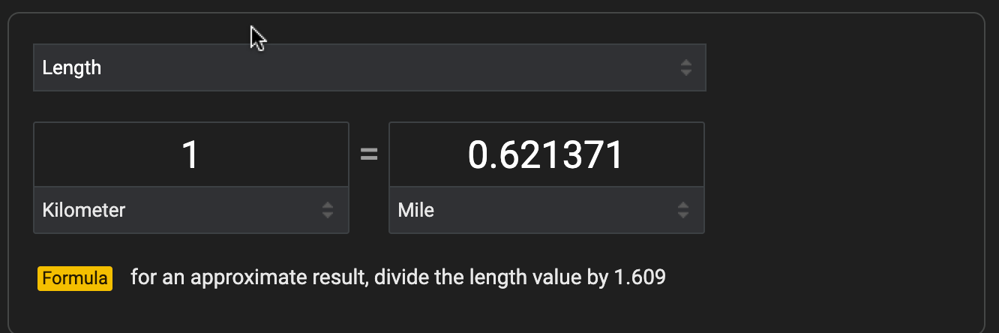

# Rates {#sec-rates}


```{r include=FALSE}
#| label: ch04-r-60cfd9d4
source("_start-up.R")
```

`r xf_definition("rate", "Rates")` appear so often in quantitative reasoning that it is worth taking pains to be explicit about what they are and when they should be used. Recall that a *ratio* is simply one quantity divided by another. A rate is a kind of ratio, but in a rate the division reflects a particular intent to describe the relationship between the *dimension* underlying the quantities. 

Everyday conversation is peppered with rates, but we don't always use the word "rate" when mentioning them. The situation is like the comedic character ["My faith! For more than forty years I have been speaking prose while knowing nothing of it, and I am the most obliged person in the world to you for telling me so." --- Monsieur Jourdain in *The Would-be Gentleman* by Molière, 1622-1673]{.column-margin} who is informed, to his pleasure, that he had been speaking *prose* for his entire life. Likewise, automobile fuel economy is a kind of *rate*. It relates how far a car goes to how much fuel is consumed. Electricity prices are *rates*; they relate how much electricity is used to the amount of the bill. Acceleration is a *rate*. Money inflation is a *rate*. And, naturally, so are bank or credit card interest *rates*, although with interest the word "rate" appears explicitly. Paying attention to when and whether the thing you are talking about is a rate pays dividends (also a kind of rate) to the quantitative reasoner. And always take note of the dimensions being related by a rate.

To illustrate a rate that doesn't look like one, consider this everyday example. I walk for exercise, so I prompted an AI,

**Prompt**: Walking consumes calories, but how much?

**AI Response**: Walking a mile burns approximately 60-to-100 calories, but this varies based on individual weight, pace, terrain, and fitness level. The word "calorie" is common in everyday speech, so it's understandable that the AI is using it. However, the quantitative unit is a "cal." One-thousand cal is, in metric convention, a kcal, but it is often written "Cal," with a capital C. Dietary information is usually presented in this large unit. A cal or Cal is commensurate with the metric unit Joule (J). We will use "Cal" in this dialog. 

[Just FYI ... The *dimension* of cal, Cal, and J is [energy]. [Energy] in terms of base dimensions is written M L^2^ T^-2^ ]{.column-margin}

The AI agent might have responded, "How should I know? You didn't tell me how many miles you walk." But the actual response was clever, as if the AI were thinking, "He didn't tell me his walking distance. What kind of answer can I give that will be meaningful even without the distance information?" That is where *rates* come into the matter.

The AI response contains two quantities: 1 mile and 60-to-100 Cals. As you may know, 60-to-100 is a way of describing *uncertainty*, [The uncertainty stems from not knowing my individual weight, pace, terrain, and fitness, all of which the AI mentions as playing a role.]{.column-margin} which won't be covered until `r xf("sec-uncertainty")`, so for the present we simplify to "80 Cals." Do these two quantities---1 mile and 80 Cals---specify a rate? Not until we go through the trouble of dividing one by the other, for instance 80 Cals per mile. 

By giving a rate, the AI is providing a DIY answer. My role, as the you-it-yourselfer, is to calculate the calories burned in my daily walk by *multiplying* the rate by my walking distance: [The word **per** in the expressions "80 Cals per mile" and "0.0125 miles per Cal" plays the same role as the $\div$ symbol: to signify division. We could equally well write $80\ \frac{\text{Cals}}{\text{mile}}$ or even 80 Cals mile^-1^.]{.column-margin} 

$$80\ \frac{\text{Cals}}{\text{mile}} \times 4\ \text{miles} = 320\ \text{Cals}$$

The rate is about *my* energy consumption, it is about the act of *walking*. A similar rate likely applies to your own walk, to your friend's walk, and even a complete stranger's walk.

When we talk about rates in this book we will tend to be explicit. We will (in this chapter) use the words "rate" and "per" to signal that the quantity we mean is a rate. For instance, at the risk of being long winded, we will say, "My car's fuel economy rate is 36 miles per gallon." [Returning to the point about a rate being a ratio of *two* quantities, we might even have said, "36 miles per 1 gallon." But this is not common practice.] 


The two quantities in the AI response were 1 mile and 80 Cals. We formed these into a rate by dividing 80 Cals by 1 mile giving 80 Cals per mile. But we could equally well have done the dividing the other way round: divide 1 mile by 80 Cals giving a different rate: 0.0125 miles per Cal. These two rates are different, but they both describe the relationship between walking and energy consumption. But even though the rates *80 Cal per mile* and *0.0125 mile per Cal* describe the same situation, they are not just different formats; they are entirely different quantities. First, the *dimension* differs: Cal-per-mile (`r mydim(length)` `r mydim(mass)` `r mydim(time)`^-2^ ) versus mile-per-Cal (`r mydim(length)`^-1^ `r mydim(mass)`^-1^ `r mydim(time)`^2^ ).

Which of the two rates to prefer? The answer depends on the context. Here is one possible context:

*Suppose you have just come home from a 3-mile walk and want to quench your thirst with a can of soda. In walking 3 miles, you (or, more precisely, the model person described by 80 Cal/mile) used up 240 Cal, that is* $$80\  \frac{\text{Cal}}{\text{mile}} \times 3\ \text{miles} = 240 \ \text{Cal}$$.

Now consider this different context: 

*Last night your friend ate a lot of pasta---3000 Cal's worth---loading up for her participation in a walking marathon. How far will this get her towards the total distance of 26.219 miles? You want to know how many calories the runners will use up. This calculation involves the other rate: $$0.0125\  \frac{\text{mile}}{\text{Cal}} \times 3000\ \text{Cal} = 37.5\ \text{miles}, $$ More than enough!*

You can also frame the relationship another way; how many Cals will propel you the whole distance, 26.219 miles. The end result is to be in Cals, so we need a rate that will transform 26.219 miles into Cals. Here we use the form of the rate with Cals on top and miles on the bottom: 80 Cals per mile. Multiplying the distance times the appropriate rate gives: $$26.219\ \text{miles} \times  80\  \frac{\text{Cals}}{\text{mile}}  = 2097.5\ \text{Cals} .$$


## Everyday rates


Some examples of rates encountered in everyday life:

- comparison shopping: dollars per oz.

- dollars per square foot 

- earnings payment *per* money in an investment account

- flow versus rate of flow: water volume per minute used by a shower

- economic product per person


- miles per gallon (Compound: ton miles per gallon(truck) or passenger miles per gallon (car or plane).


## Conversion: Flavors of 1 {#sec-flavors-of-one}

In `r xf("sec-quantities")` we referred to "dimensionless quantities." For instance, 60 is pure number; pure numbers lack units and are therefore always dimensionless. However, even dimensionless numbers can have *units*. For example, an angle is dimensionless: it is a ratio of two lengths. [See `r xf("fig-angle-ratio")`. The dimension of the angle ratio is [length] / [length], that is, L / L or `r mydim(number)`.]{.column-margin}

Dimensionless quantities (that is, quantities with dimension `r mydim(number)`) play an important role in converting from one unit to another. In general, to accomplish the conversion from one unit (say, miles) to another of the same dimension (say, km), multiply the first quantity by a `r xf_definition("conversion factor")` that is dimensionless. [Temperature is an exception.]{.column-margin} As introduced in `r xf("sec-quantities")`, we call such conversion factors `r xf_definition("flavors of one")`.

A flavor of one is a ratio formed by dividing a quantity by an *exactly equal* quantity. For example, 1 km is the same length as 0.621371 miles. The conversion factor that converts miles to km will be a ratio with km on top and miles on the bottom. Constructing this ratio from the two equal amounts gives:

$$\frac{1\ \text{km}}{0.621371\ \text{mi}} = \frac{1}{0.621371}\  \frac{\text{km}}{\text{mi}} = 1.609334\ \frac{\text{km}}{\text{mi}}$$

The conversion factor 1.609334 km/mi is a flavor of one; it is the ratio of two equal quantities. 

A different, but closely related flavor of one converts km to miles: 0.621371 mi/km.  In both cases, the *`r mydim(dim)`* 
of the flavors of one are L / L = `r mydim(number)`. That is, "dimensionless."

Every conversion factor is a quantity, having both a pure number and units. Looking at the pure number in isolation won't tell you which way the conversion goes. For that, you need the units. If the units are mi/km, the conversion goes from km to miles. If the units are km/mi, the conversion goes from miles to km. In general, the units of the conversion factor that translates *from* into *to* has units *to*/*from*.

@fig-google-km-to-miles shows the result of a Google search on "kilometer to miles." The boxes labeled "kilometer" and "mile" indicate the units of the two main quantities provided. However, the value in the formula, 1.609, omits the units, which should be listed explicitly as mi/km. *Multiplying* the km value by 1.609 mi/km turns km into miles.

::: {#fig-google-km-to-miles}


The Google app for converting a kilometer into the equivalent distance in miles. The "formula" is correct, but it may be confusing because the units are missing from the quantity written as "1.609."
:::

## Percent

`r xf("sec-standard-dimensions")` introduced the notion that "percent" is a *unit* sometimes used to report dimensionless quantities. (See `r xf_to_def("percent")`.) For instance, 13 percent---often written 13%---is the same dimensionless quantity as 0.13. The word "percent" is short for the Latin phrase "per centum." The word *centum* means 100.["C-note" is old American slang for a $100 bill, perhaps short for "*centum*-note. The Latin numeral C also means 100.]{.column-margin} Since *per* means "divided by," *per centum*" means "divided by 100."

Most adults interpret "%" as meaning "a fraction *of*." The *whole* of something is 100% (which is, of course, just 1.00). A store discount of 20% means "we take 20% off *of* the price." Subtracting 20% from the whole means the new price is $$100\% - 20\% = 1 - 0.2 = 0.8 = 80\%$$  *of* the original (non-discounted) price. A credit card interest rate of 28% per year means that after a year, if there are no new charges or payments, 28% *of* the original debt will be *added* to the original debt. In other words, the end-of-year debt will be $100\% + 28\% = 1 + 0.28 = 1.28 = 128\%$ *of* the start-of-year debt.

In the above paragraph, the word "*of*" has been *italicized*. "80% *of* ..." is perfectly idiomatic English. It means "0.80 multiplied by ...." The quantitative thinker has to pay careful attention to this use of idiom and translate it properly into the appropriate mathematical operation. 

When it comes to *division*, standard English uses the keyword "*per*" to signal which quantity is being divided by which. Unfortunately, "*of*" is not a reliable signal for multiplication; "of" is used in so many other ways in English. By analogy to "*per*," we quantitative thinkers might push for general acceptance of a Latin word that provides a clearer signal. Appropriate choices are "*ex*," "*de*," and "*e*," all of which carry the meaning "out of." With such a convention, we would say "20% *ex* price" instead of "20% of the price." 

In mathematical theory, the use of percent is extraneous. Anything we write as a percent, we can write in decimal notation. In practice, people have a marked preference for quantities expressed with one or two digits, that is, in the range 0 to $\pm$  100. This preference is why it would be absurd to report weather temperatures in the SI base unit kelvin. "Today's high temperature will be 303$^\circ$K," violates the 2-digit preference, whereas the equivalent "30$^\circ$C" or "86$^\circ$F" remain within the preferred range.  


[Be on the lookout for purely *rhetorical* uses]{style="font-variant:small-caps;"} of units in percent. "Rhetoric" refers to techniques for speaking persuasively or compellingly. Everyone supports genuinely compelling quantitative arguments, but sometimes quantities are presented in ways that create a misleading impression. Here is an example from the *New York Times* in an article about the distinctive rhetorical style found in AI compositions:

> *"A.I.s like gesturing at complexity ("intricate" and "tapestry" have surged since 2022), as well as precision and speed: "swift," "meticulous," "adept." But "delve" — in particular the conjugation "delves" — is an extreme case. In 2022, the word appeared in roughly one in every 10,000 abstracts collected in PubMed. By 2024, usage had shot up by 2,700 percent."* --- Sam Kriss, "Why does AI write like … that", [New York Times, Dec. 3, 2025](https://www.nytimes.com/2025/12/03/magazine/chatbot-writing-style.html)

An increase from *1 in 10,000* to 2700 is staggering and suggests that things are getting out of hand. But the quoted increase by 2700 *percent* corresponds to growing from 1 in 10,000 to 28 in 10,000. This is still a very small fraction. The double-zeros at the end of 2700 cancel out the "percent": 2700% is the same as 27. "Shooting up" from 1 by 27 gives 28. 

Be aware that the practice of using percent as a unit can produce large numbers, like 2700%, that may create a misleading impression. The statement in the article would have been more meaningfully phrased as, "By 2024, 28 in every 10,000 abstracts contained 'delve'."


## Rates of change {#sec-rates-of-change-brief}

Earlier, in `r xf("sec-change-as-a-quantity")`, we introduced *change* in a quantity as a simple difference in the value of the quantity. When modeling *systems*, we focus on the connections between the quantities involved. So why did the value of the quantity change? Typically, it is because something else changed in the system. We use the phrase "*with respect to ...*" to identify what may have changed. For instance, we can look at the change in temperature over an hour; the varying condition is then *time* and the change is described as being *with respect to time*. Sticking with the temperature example, we all know that temperature changes with respect to elevation (as we, say, climb a mountain), with respect to the amount of sunlight, or with respect to position. 

The simple idea of *change* (`r xf("sec-change-as-a-quantity")`) involves looking at the shifting value of one primary quantity. *Rate of change*, however, involves *two* quantities, a primary and a context-setting, "with respect to" quantity. 

A `r xf_definition("rate of change")` includes both the primary and the context-setting quantity in the calculation. To form a rate of change, divide the quantitative difference in the primary quantity by the corresponding difference in the context-setting quantity. 

"Primary" and "context-setting" can be thought of in terms of *functions*. (See `r xf("sec-intro-to-functions")`.) The context-setting quantity is the input, while the "primary" quantity is the output.

To illustrate, consider the temperature of a cup of coffee over time as the cup sits at room temperature. "Over time" corresponds to the quantitative-thinking concept of *function*: temperature is a function of time. @fig-stan-coffee shows some data collected by [Prof. Stan Wagon](www/Cooling_Coffee_without_Solving_Different.pdf). He poured near-boiling coffee into a cup instrumented with a recording thermometer. Following the familiar pattern, the coffee cooled.

::: {.column-page-inset-right}
```{r}
#| label: fig-stan-coffee
#| echo: false
#| layout-ncol: 2
#| fig-cap: "Coffee temperature recorded every five minutes for four hours (240 minutes)."
#| fig-cap-location: bottom
#| fig-subcap:
#| - Change in temperature with respect to time
#| - Rate of change of temperature with respect to time
Cool <- mosaicData::CoolingWater |> 
  filter(time > 0, (time %% 5) == 0)
Marks <- tibble::tribble(
  ~ time, ~ temp, ~ temp2, ~ label,  
  # 75, 84.9, 65.3, "19.6 C",
  # 125, 65.3, 55.0, "10.3 C",
  125, 84.9, 55.0, "29.9 C"
) |> mutate(mid = (temp + temp2) / 2)
Cool |> point_plot(temp ~ time) |>
  gf_labs(y = "Temperature (C)", x = "Time (min)") |>
  gf_hline(yintercept = ~ temp, color = "blue",
          data = Cool |> filter(time %in% c(5, 35))) |>
  gf_segment(temp + temp2 ~ time + time, data = Marks,
             color = "magenta", 
             arrow = grid::arrow(ends="both", type = "closed", 
                                 length = unit(0.15, "inches"))) |>
  gf_label(mid ~ time, label = ~ label, data = Marks, color = "magenta")
  
  Marks2 <- tibble::tribble(
  ~ time, ~time2, ~ temp, ~ temp2, ~ label,  
  # 75, 84.9, 65.3, "19.6 C",
  # 125, 65.3, 55.0, "10.3 C",
  5, 35, 84.9, 55.0, "Slope -1.0 C/min"
) |> 
  mutate(midtemp = (temp + temp2) / 2,
         midtime = (time + time2) / 2)
Cool |> point_plot(temp ~ time) |>
  gf_labs(y = "", x = "Time (min)") |>
  gf_hline(yintercept = ~ temp, color = "blue",
          data = Cool |> filter(time %in% c(5, 35))) |>
  gf_segment(temp + temp2 ~ time + time2, data = Marks2,
             color = "darkgreen", 
             arrow = grid::arrow(ends="both", type = "closed", 
                                 length = unit(0.15, "inches"))) |>
  gf_label(midtemp ~ time2, label = ~ label, data = Marks2, color = "darkgreen",
           angle = -65)
```
:::

Blue lines mark the temperature levels recorded at 5 and 35 minutes. The *change* in temperature with respect to time is the vertical distance shown by the [magenta arrow]{style="color: magenta;"}. The change over the 30-minute time interval is 29.9$^\circ$C. The dimension of the change is simply `r mydim(temperature)`, that is, temperature, read directly from the vertical axis.

The *rate of change* over the 30-minute time interval is - 29.9$^\circ$C / 30 min = - 0.997$^\circ$C/min. Notice that the dimension of the rate of change is `r mydim(temperature)``r mydim(time)`^-1^, that is, temperature *divided by time*.

Note that we could have calculated the rate of change for any interval, not just the 30-minute interval between times marked by the blue lines. Thus, the rate of change can itself change. The idea of changing rates of change takes some getting used to. But it forms a cornerstone of quantitative argumentation. We come back to it in `r xf("sec-dynamics")`.

## Compound rates

As stated previously, a rate is a quantity. Calling the quantity a "rate" is merely a way of pointing out how the quantity was formed by the division of one quantity by another. Other than this history of the process of formation, a rate is no different than any other kind of quantity: a pure number plus a unit plus (optionally) a descriptive word. 

Rates are often composed by arithmetic on other rates. We call these `r xf_definition("compound rates")`, but this is merely to call attention to the formation of the rate. Like all rates, a compound rate is simply a quantity. Even so, in interpreting a quantity, it is helpful to keep in mind where it comes from. The words "rate" and "compound rate" are helpful in this.

Consider this example from an AI search on "running energy per mile":

*Running energy per mile, or calories burned per mile, averages around 100 for a 150-pound person but varies significantly based on individual factors like body weight, fitness level, age, sex, and muscle mass. A commonly cited rule of thumb is to estimate about 100 calories burned per mile; a more accurate estimation involves multiplying body weight (in pounds) by 0.71 to get a general figure, for example, a 200-pound person burns around 142 calories per mile.* --- AI generated

"Running energy per mile" is a rate. [You can also think of it as a rate of change, since "Calories burned" is a change in the runner's stock of energy and the mile is really a change in the distance run.]{.column-margin} The AI response goes on to discuss the role of body weight in the number of calories burned. Part of this involves a *compound rate* 0.71 Calories *per* mile *per* pound of body weight. Note the two uses of "per" in the phrase. The two occurrences of *per* signal that this is a compound rate.

The English grammar of *per*-*per*s creates an ambiguity. Two different mathematical interpretations are possible for the English phrase "per mile per pound." The parentheses of mathematical notation make this clearer. For instance, here are the two interpretations using mathematical parentheses to indicate the order of operations:

1. (Calories burned per mile) per pound, or
2. Calories burned per (mile per pound), 

Alternatively, using the over-under notation of ratios: 

1. $\Large\frac{\text{Calories burned / mile}}{\text{pound}}$, which is $\Large\frac{\text{Calories burned}}{\text{mile} \times \text{pounds}}$.
2. $\Large\frac{\text{Calories burned}}{\text{miles/pound}}$ which resolves to $\Large\frac{\text{Calories} \times \text{pound}}{\text{mile}}$.

Compound rates (1) and (2) are different quantities. To see this, imagine a 150-pound person running 3 miles, burning 300 Calories in the process. Note that there are three quantities involved:

i. 300 Calories burned
ii. 150 pounds of weight
iii. 3-mile length run

Compound rate (1) works out to be 300 Calories / (3 mile $\times$ 150 pounds), that is, 0.667 Calories per (pound-miles). In contrast, compound rate (2) is (300 Calories $\times$ 150 pounds) / 3 miles, or  15,000 Calorie-miles per pound. (1)  and (2) are different numbers, different units, and different dimensions.

It is not possible to tell just from the English phrase "Calories per pound per mile" which compound rate is intended. Instead, we need to look for clues.  The AI text gives a clue about the use of the quantity 0.71. It says, "for example, a 200-pound person burns around 142 calories per mile." Quantity (1) divides the calories-per-mile by pounds, whereas quantity (2) multiplies the calories-per-mile by pounds.  We can try both:

1. $\Large 0.71\, \frac{\text{Cal}}{\text{mile-pounds}} \times 200\, \text{pounds}$ gives 141 Cal per mile.
2. $\Large 0.71\, \frac{\text{Cal}}{\text{mile-per-pounds}} \times 200\, \text{pounds}$ gives 141 Cal pounds^2^ per mile.

Only format (1) gives the result cited in the AI example.

There is a more fundamental way to see why interpretation (1) is the right one. The person is using 0.71 Cals to carry out a task. Which task? To move one pound for one mile. The unit "pound-mile" measures the amount of the task; a 150-pound person needs to perform 150 pound-miles to get themselves a distance of one mile.

:::: {.column-margin}
::: {#fig-curved-road fig-cap-location="bottom"}


Curves and hills shorten sight lines.
:::
::::

Consider this example involving an eco-science task: measuring the number of animals crossing different roads. The technique: position the observer along the road who will spend a couple of hours with binoculars, counting the crosses they see. Making a fair comparison between roads requires adjusting for the time duration of observation. Less obvious, the raw count also needs to be adjusted for the length of roadway visible in binocular range. (On a curved or hilly road, for instance, sightlines might be limited to, say, 100 yards, while on a straight road, a half-mile of road is visible.) The amount of monitoring done by the observer units of mile-hours, that is, miles of road visible *times* hours spent monitoring. The format for the compound rate that fairly compares roads is animal crossings per mile-hour.


Some other examples of compound rates:

- Shipping costs. Dollars per the amount of shipping. There are two components to "Shipping": the weight of the goods and the distance covered. The total amount of shipping is the weight times the distance. For railways, this is sometimes presented as "ton-miles."
- Medicine dosing. Nurses using an intravenous (IV) drip to administer medicine are given the dose as a compound rate: milligrams of medicine per kilogram-hour. The nurse mixing the medicine in the IV bottle needs to know how many hours the bottle will last. The bigger the bottle, or the bigger the patient, the more milligrams needed. 
- Rent. Rents for commercial space are often specified in dollars per square-foot-months, that is, monthly rent per unit area. Multiply monthly rent per unit area by the number of square feet to get the rent payment needed each month. 
- Work effort is sometimes tallied using units such as person-hours or person-months. 
- Energy use. The amount of energy needed to heat a house depends on the size of the house, the length of the heating season, and the temperature. An AI search on "amount of natural gas to heat a house" produced this response:
    
[Another standard metric is the energy use per square foot per heating degree-day (HDD), where a typical range is 5.0 to 10.0 BTU/HDD/Sq.Ft.]{.column-margin} 
    
BTU (British Thermal Unit) is a measure of energy. The amount of heating "service" required is the product of duration, coldness, and house size. The standard unit is degree-day-square-feet. So the rate of energy use is BTU per degree-day-square-feet. There are [tables showing the average annual number of heating degree-days](https://www.eia.gov/energyexplained/units-and-calculators/degree-days.php) for various locales. A web search for "annual heating degree days for Minneapolis" yielded an estimate of 6000 degree-days. For a house of 1200 square feet, this comes to a demand of 1200 square-feet $\times$ 6000 degree-days, or just over 7 million degree-day-square-feet. The typical range for energy use over a year would be 35 to 70 million BTU.
    
Notice that the unit "BTU/HDD/Sq.Ft." quoted by the AI is ambiguous. It should be BTU per HDD-(ft^2^). Suppose that we misinterpret the quoted range---5.0 to 10.0---as being in units of BTU/(HDD/ft^2^). For the 1200-square-foot house in the example, we would have 6000 degree-days divided by 1200 square feet, resulting in 5 degree-days per square foot. The total BTU usage for the house would be (mis-)calculated as 5.0 to 10.0 BTU per (HDD/Sq.Ft.) $\times$ 5 HDD/Sq.Ft. = 25 to 50 BTU. For comparison, bringing 1 liter of water to a boil consumes about 250 BTU. It is hard to imagine that heating a house for a year would use less energy than boiling a liter of water. Mistaking HDD $\times$ ft^2^. for HDD *per* ft^2^ will cause a lot of trouble when designing or outfitting a house! 

## Multiplying quantities

This morning, the author went for his habitual walk, which he estimates consumed 300 Cal. For diet planning or indicating general health, 300 Cal can be a good summary of the exercise. But the estimate combines two different factors: the energetics of walking and the distance walked. We use a rate, Cals per mile, to describe the energetics of walking. For walking, the rate is approximately 80 Cal/mile. Just about anyone on just about any walk can use the rate to find the total calories consumed; multiply the walk's length by the energetic rate. A two-mile walk consumes 80 Cal mile^-1^ $\times$ 2 mile = 160 Cal. [This is roughly the caloric content of one can of (non-diet) soda.]{.column-margin} 

Using the rate, we can compare the energetics of walking and running, again using a Cal/mile rate. 

> *Take a moment to guess whether running or walking consumes more calories.*

Many people guess that running consumes more energy. For instance, the author used to go for a 3-mile run each morning, and people assume that the author's 4-mile walk is less exercise than the 3-mile run. There is no reason to assume; an internet search shows that running consumes about 100 Cal/mile. Surprisingly, that is similar to the energy rate for walking. 

The author's 4-mile walk uses about 300 Calories, roughly the same amount of energy as the 3-mile run: 100 Cal mile^-1^ $\times$ 3 mile = 300 Cal. Once again, knowing the energy *rate* enables us to calculate a *total energy*: multiply the rate by the distance.

The pattern that "rate $\times$ quantity gives total" is encountered every day. Some examples:

Context | Rate  | Multiplier | Result
--------|------|------------|--------
Buying groceries |12 dollars per pound | 0.75 pounds | 9 dollars
American driving | 35 miles per gallon | 10 gallons | 350 miles
European driving | 5 liters per 100 km | 500 km | 25 liters
Wages | 17 dollars / hour | 40 hours | 680 dollars

The ratio/rate (price per pound, liters per 100 km, dollars per hour) describes the context. Multiplying the rate by an amount---in terms of the denominator of the ratio---gives a total in terms of the numerator of the ratio.

As previously stated, we use dimensionless flavors of one to convert units between two quantities with the *same* dimension. It is reasonable to view dimensionful rates similarly: as conversion factors between different dimensions. Have gallons and want miles: multiply by the rate miles-per-gallon. Have 3/4 of a pound of cheese and want the price: multiply by the rate dollars-per-pound. 

For some people, the result of multiplying two quantities sometimes seems odd. For instance, units of *passenger-miles* denote the amount of transportation service. One passenger going one mile is one passenger-mile; an airplane carrying 150 passengers for 3000 miles is providing 150 passengers $\times$ 3000 miles of transit: 450,000 passenger-miles. A water-resources engineer might measure volume in acre-feet: multiplying area in acres by the depth in feet of water.  Mechanics working on a car or a bike have to apply the right amount of torque to tighten a bolt without overstressing it. Torque is measured in foot-pounds: a foot of length times a pound of force.

-----

### New terms {#sec-new-terms-04}

`r xf_new_words("04")`

