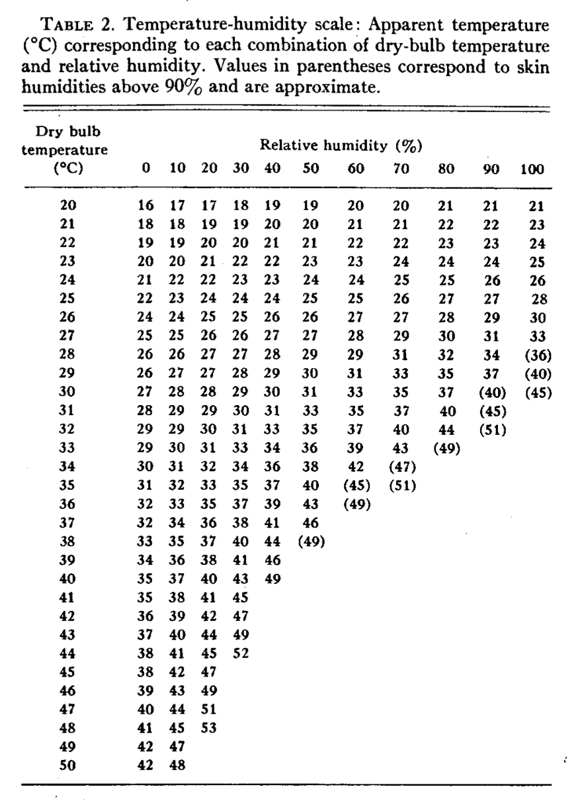

# Introduction to Functions {#sec-intro-to-functions}



```{r include=FALSE}
#| label: ch06-r-5b73e1b6
source("_start-up.R")
```

::: {.aside}
`r paste(readLines("_Words/chap_6.txt"), collapse = "\n")` 
:::

In the nomenclature of this book, a `r xf_definition("system")` is a framework or an organized structure with **interconnected elements**. We have called these elements *dimensions* and *operationalize* them to translate them into quantities.

This chapter introduces an important modeling representation for the connections between system elements: `r xf_definition("functions")`. 

A function is a mathematical or computing concept, a way of organizing knowledge and encapsulating a process. A good way to think about a function is as a machine for transforming inputs into an output. 

## Example: A solar-panel system {#sec-system-diagram}

To illustrate how functions come into play in modeling systems, consider this diagram of the relationships in a household solar-panel system:


::: {#fig-solar-diag1}
```{mermaid}
graph LR
  A(Sun position)
  B(Cloudiness)
  A --> C[Production]
  B --> C
  


class A exogenous
class B exogenous
```

A diagram of a simple system. The dimensions are named. A sharp-cornered box encloses a dimension that is the output from a function. The arrows impinging on the sharp-cornered box indicate inputs to each function.
:::

Such diagrams name the dimension, e.g., "Cloudiness." The arrows pointing into the box surrounding the word indicate which other dimensions are having an influence. In @fig-solar-diag1, "production" is in a box with sharp corners, with arrows pointing in, signifying that "production" is the *output* of a function. The inputs to the function are at the tail-end of the arrows: "cloudiness" and "sun position." Taken as a whole, the diagram says that electricity *production* is a function of the *sun position* and the amount of *cloudiness*.

Models are always limited in scope; they don't try to account for every feature in a system. The notation used in @fig-solar-diag1 makes it explicit what dimensions are being modeled and which dimensions are taken as givens. The sharp-cornered box denotes dimensions that are produced within the model. [Economists call such dimensions `r xf_definition("endogenous")` meaning to "come from inside."]{.column_margin} The round-cornered boxes indicate which dimensions are taken as given, that is,  "coming from outside" the model. [Economists use the word `r xf_definition("exogenous")`, where the prefix *exo* means "outside of."]{.column-margin} 

@fig-solar-diag1 depicts a very simple model of a photovoltaic electricity generation system. But models can be much more complicated, with both sharp- and round-cornered boxes providing inputs to any given sharp-cornered box.

## The organization of a function

In diagrams like @fig-solar-diag1, each sharp-cornered box corresponds to a function. Specifying what are the inputs to a function is essential, but the complete story requires an essential additional feature: an `r xf_definition("algorithm")`. The algorithm is a complete operational description of the process to be followed in turning the inputs into the output. 

Mathematics classes often use functions without displaying the algorithm that implements the input-to-output process. For instance, you may remember the $\sin$ function, and even memorized the output produced for a handful of particular inputs. A typical classroom notation might look like $\sin \pi = 0$. This particular example denotes that when the input number is $\pi$, the output of the $\sin$ function will be zero.

For any input values that you haven't memorized, you need to refer to the algorithm behind $\sin$ to calculate the output. The algorithm, however, is hidden inside a calculator or the like. You provide the input using the keypad then press a labeled button to invoke the algorithm to work on that input. The output is displayed on the screen. 

Functions like $\sin$ take only a single input. But the functions we use in modeling often take two or more inputs. The notation we use for functions therefore has to be able to handle multiple inputs and, of particular importance, say which input plays what role in the algorithm.

We will use a concrete example to demonstrate how this is done. 

On a hot day, comfort is a function of temperature and humidity. That is, temperature and humidity are the inputs, comfort is the output. Hot and wet conditions produced discomfort; cool, dry conditions are more comfortable. The previous sentence corresponds to a function that takes temperature and humidity as inputs and produces "comfort" as an output.

Temperature and humidity are both quantities, so they are directly suited to be inputs to a function. It's less obvious how to operationalize *comfort*, which is a subjective and multi-dimensional concept.

One widely used operationalization of comfort is the so-called "heat index," which often appears in weather reports and forecasts. [@sec-heat-index presents the heat-index algorithm and its origins.]{.column-margin} 

It helps to give a function a name so that it can be referred to and distinguished from other functions. Using mnemonic names---that is, names that remind you what the function is about---is a good practice. We will call the function `heat_index()`.

The parentheses following the name are a convention to remind us that `heat_index` is a function. Otherwise, we might confuse it with a quantity. For the sake of clarity, this book will write function names followed by parentheses, e.g. `heat_index()`. In use, the parentheses provide punctuation for organizing the inputs. These will be placed inside the parentheses, separated by commas. For instance, the heat index on a day where the temperature is 30 °C and the humidity is 80% will be calculated as: 

```{r}
heat_index(30, 0.80)
```

The process of calculating the output of a function for specific inputs, as above, has many names. Informally, we could say that we are "running the function." Some people prefer the verb to be "executing." [Here, "executing" is not about killing but instead about doing something, for instance the orders of an executive officer.]{.column-margin} In mathematics, the process is called "evaluating" the function or even "applying" the function to its inputs. 

We have already mentioned that the `heat_index()` function takes two inputs: temperature and humidity. In the algorithm implemented by `heat_index()`, temperature and humidity play different roles. We identify where each comes in by using names. You don't need to know how to program computers to follow this book. Still, much of the notation can be understood with just a little instruction. In the text of this book, we will use the conventions of a popular computer language: R.

Without going into detail, the definition of `heat_index()` looks like this:

```{verbatim}
heat_index <- function(temperature, humidity) {
  # Algorithm goes here.
}
```

This notation organizes four pieces of information:

1. this is a function; 
2. the name of the function is `heat_index`; 
3. it takes two inputs, 
4. the first input is named temperature, the second is named humidity, 

The names that go inside the `function()` parentheses are often called the *arguments* of the function (although we will also refer to them as *inputs* in this book). Arguments are like characters in a play. Inputs are the actors who play the characters. Note, however, that in this book we are already using "argument" with a specific meaning as in the title of this book. We will use the shorthand `r xf_definition("arg")` the names of inputs to a function, and reserve "argument" for the sense of `r xf("sec-models")`, that is, a claim supported by evidence and a chain of reasoning. .

When using `heat_index()` to perform a calculation, we give the arg values inside parentheses as in `heat_index(30, 0.80)`.


If the user wrote the inputs in the wrong order, `heat_index(0.80, 30)` it would be as if the user wanted to specify a very cold temperature (0.70 °F) and a meaninglessly high humidity (8500%). To avoid such problems, the R language allows the user to refer to the args by their names rather than their positions:

```{r}
heat_index(humidity = 0.80, temperature = 30)
```


## Operationalizing comfort: the heat index {#sec-heat-index}

The heat index is familiar to those living in hot climates; few realize that it originated as a careful quantitative operationalization of comfort. [R.G. Steadman ["The Assessment of Sultriness"](www/Foundations/apme-1520-0450_1979_018_0861_taospi_2_0_co_2.pdf), *Journal of Applied Meteorology and Climatology*. July 1979 pp. 861-873]{.column-margin} Key research into the manner was presented by R.G. Steadman in 1979 as the "sultriness index".

@fig-sultriness-table displays the sultriness function graphically, but doesn't convey the extensive quantitative modeling that went into its development. 

::: {#fig-sultriness-table}
{width="3.5in"}

The sultriness function. (Source: [Assessment of sultriness](www/Foundations/apme-1520-0450_1979_018_0861_taospi_2_0_co_2.pdf), p. 862.) Note: Meteorologists measure the "dry bulb" temperature with an ordinary thermometer. In contrast, the "wet bulb" temperature measures evaporative cooling, operationalized by wrapping the thermometer with wet gauze.
:::


## Algorithms

We called @fig-sultriness-table the sultriness *function*. But the research article that introduced it did not write `sultriness(temperature, humidity)` or give an implementation as a formula. @fig-sultriness-table, which is intended for a human reader, is the only presentation that was given in the research article.

It's likely that you can figure out how to find the output of `heat_index()` given the inputs. You can confirm that a temperature of 30 °C and humidity of 80% corresponds to a heat index of 37 °C.

But, imagining that you don't know how to use @fig-sultriness-table, let's write out instructions. Such instructions have a more formal name: `r xf_definition("algorithms")`. Admittedly, the name "algorithm" is offputting to many people. It comes from the name of a mathematician, Muhammad ibn Musa al-Khwarizmi (c. 780 – c. 850). He is famous for a book whose key word is "al Jabr," Arabic for "the reunion of broken parts." Our word "algebra" comes directly from "al Jabr." Al-Khwarizmi's book gives a description of the steps to follow when reuniting, say, the broken parts of what we now write as $a = x / b$ to get $x = a\,b$.

Here's a table-reading algorithm, in a form intended for an educated person:

1. Take the temperature and find the closest value in the left column of the table. That closest value marks the row of interest.
2. Take the humidity and find the closest value in the top row of the table. That closest value marks the column of interest.
3. Find the number at the junction of the row and the column of interest. That is output. 

Like all algorithms, this one is written in terms of tasks that the processor already know how to perform, e.g. "find the closest value." If you didn't know how to perform that task, you would need a description of the steps involved. That is, algorithms are often written in terms of other algorithms.

The simplest algorithms are those where the answer is already known. For instance, to learn how to add numbers with multiple digits, you first had to memorize the basic facts of single-digit arithmetic: the *addition table*.

`r xf("sec-basic-functions")` introduces a small set of basic functions called the "core modeling functions." Each of these is pretty simple, and you will be expected to be able to sketch out a rough graph and know the values of certain special inputs and their output values. Of course, human memory is fallible. So you will have a computer implementation of each core modeling function to use and refer to. 


## What do you need to know about an algorithm?

In the modern world, many of the objects we use productively every day are so complicated that few people, if any, know exactly what is inside them. For example, telephoning a friend does not require knowing in detail how a phone or a telecommunications system works. Drivers typically do not know how a modern gasoline engine works. We can use these machines because they have a user interface that we know how to operate. Using the interface lets us confirm we are using it properly. For instance, confidence in a phone comes (in part) from the text messages sent and successfully received.

The same is true of functions. Using a function requires knowing what kinds of inputs it takes and observing what kind of output it produces. [Although the "t" in "mortgage" is silent, it refers to an important aspect mortgage loans. The root *mort* means "death", as in "mortality." In a mortgage, the borrower pays the lender a fixed amount each month. This gradually reduces the amount of money owed. When that amount reaches zero, the mortgage is dead: no more payments are required. Some people even have funereal rites to celebrate the death of a mortgage.](.column-margin) To illustrate, consider a situation faced by people buying a home. Almost always, they buyer needs to borrow money, a form of loan called a "mortgage." 

The internet has apps that calculate monthly mortgage payments. Behind such apps is a function that takes three inputs: the amount borrowed (the principal), the annual interest rate on the loan, and the loan duration (that is, the number of monthly payments needed to pay off the loan.) The function's output is the amount of the monthly payment. In internet apps, inputs are often specified with sliders or check-boxes or drop-down menus. To stay close to the `function(arg1, arg2, arg3)` notation, we provide an implementation using that convention. In the interactive version of this book, you can even find the output for any inputs you care to specify.

::: {.content-hidden unless-format="html"}
Try it out in @chk-monthly-payment, where, at least initially, the args have been set to a $200,000 loan at 6 percent interest for a standard 30-year duration (360 months).

```r
monthly_payment(principal, interest_rate, duration)
```

```{webr}
#| echo: false
#| context: setup
monthly_payment <- function(principal, interest_rate, duration) {
  # Annual in percent to monthly interest rate in decimal
  r <- interest_rate / 1200 # monthly interest
  duration_in_months <- duration * 12
  principal * r * (1+r)^duration_in_months / ((1+r)^duration_in_months - 1)
}
```

```{webr}
#| caption: "Mortgage payment calculator"
#| label: chk-monthly-payment
monthly_payment(200000, 6, 30)
```

:::

```{r}
#| label: ch06-r-8ef51a62
#| echo: false
# This duplicates the webr definition
monthly_payment <- function(principal, interest_rate, duration) {
  # Annual in percent to monthly interest rate in decimal
  r <- interest_rate / 1200 # monthly interest
  duration_in_months <- duration * 12
  principal * r * (1+r)^duration_in_months / ((1+r)^duration_in_months - 1)
}
```

::: {.content-hidden unless-format="pdf"}

```{r}
#| label: ch06-r-b9b18c00
monthly_payment(200000, 6, 30)
```

Keep in mind that `monthly_payment()` is a *model* of what you have to pay. It takes into account the interest rate and the duration of the loan. But there are often other dimensions of the situation, for example, processing fees or mortgage insurance. You, or your real-estate agent, will need a more complete model of the situation. Even AI can easily get it wrong if it doesn't know the details of the mortgage contract you will eventually be signing.
:::


Typically, computer languages accept purely numerical inputs rather than a complete description of the quantity. So, the first input is `200000` rather than $200,000, the second is `6` rather than 6%, and the third is `30` rather than 30 years.


What is needed to know to use this function successfully? Here is a list:

1. The name of the function: `monthly_payment()`.
2. The order in which to provide the inputs: `(principal, interest, duration)`
3. The meaning of each input and the eventual output:
    i. `principal`: a numerical amount, the currency does not matter.
    ii. `interest_rate`: a yearly interest rate
    iii. `duration`: the number of years
    iv. Output: A numerical amount. The currency will be the same as that of the `principal` input.
4. A way to check the function's action and whether the user correctly works the interface. Such checking can take several forms. The simplest is to give the same inputs to a trusted source, as in @fig-mortgage-calculator-app, and compare the outputs.

::: {#fig-mortgage-calculator-app}


A randomly selected mortgage payment calculator from the internet. The interface is different from the `monthly_payment()` function, with entry slots for house price and down payment rather than `principal`.
:::

`r qr_margin_note(
  "https://en.wikipedia.org/wiki/Mortgage_calculator",
  "Derivation of a mortgage calculator formula"
)`

What about the algorithm behind the app? Does the ordinary user need to know that? Being able to see and interpret the algorithm---which is, in this case, a formula---would enhance mastery of the subject. However, in practice, even algebraically skilled people who might understand a [derivation of the formula](https://en.wikipedia.org/wiki/Mortgage_calculator) and be able to translate it into computer code will need to check the results. Will AI help? Maybe eventually. Sadly, the AI query I used in 2025, "How to calculate mortgage payment," returned a formula with a fatal error.

