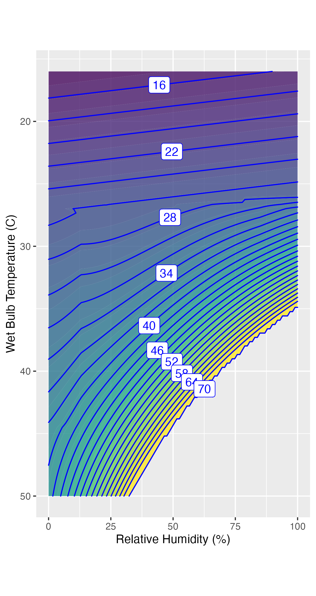

```{r include=FALSE}
#| label: ch09-r-a6438c2b
source("_start-up.R")
```



# Composing functions {#sec-customizing-functions}

::: {.aside}
`r paste(readLines("_Words/chap_9.txt"), collapse = "\n")` 
:::

This chapter describes tools to build custom functions. The tools help the modeler compose a function that encompasses their ideas and data about a given relationship. 

To illustrate, consider this situation: a person develops a sinus infection, ending up having to go to an urgent-care clinic for treatment. An antibiotic is prescribed, the patient picks up the prescription from the pharmacy and begins taking the medication as directed: one small pill every eight hours for seven days.

Wouldn't it be more  convenient to take just one pill a day? Or why not just one pill that covers the entire week? A model can help us understand the implications of different dosing schedules.

To start, we need to know a bit about the physiology of drug absorption and elimination in the human body. The drug in the pill is absorbed through the gut over a short period of time, say, an hour. But even as the drug is being absorbed, the liver metabolizes it and removes it from the blood stream. The removal rate is proportional to the current concentration of the drug in the bloodstream; low concentration means a slow removal rate, while high concentration means a fast removal rate.

There's no single function among our core modeling functions that captures both absorption and removal of the drug. Still, the exponential function seems a match to drug elimination. As `r xf("fig-one-pill-separate")`(a) shows, the exponential function with input and output scaling shows a pattern of high rate of reduction when the drug concentration is high, and low rate of reduction when the concentration is low.


```{r}
#| label: fig-one-pill-separate
#| message: false
#| echo: false
#| fig-cap: "These core modeling functions cover different aspects of the drug absorption and elimination processes."
#| fig-cap-location: "top"
#| fig-subcap:
#| - Exponential function
#| - Hillside function
#| layout: "[[1, 1.2]]"

scaled_plot(function(t) 0 + 4*exp2(-t/4), 
             input_range = c(-1, 11), 
             output_range = c(0, 6), a = 1, 
             floating_axes = c(grid = TRUE)) |>
  gf_labs(y = "Drug concentration (mg / liter)", 
          x = "Time (hr)") |>  
          gf_refine(coord_cartesian(ratio = 1)) 

scaled_plot(hillside, 
             input_range = c(-2, 2), 
             output_range = c(-0.25, 1.4), 
             x0 = -2,
             a = 0.15,
             A = 100,
             floating_axes = c(grid = TRUE)) |>
  gf_labs(y = "Fraction absorbed (%)", 
          x = "Time since pill taken (hrs)") |>  
  gf_refine(coord_cartesian(ratio = 1)) |>
  gf_theme(theme(plot.margin = margin(5.5, 5.5, 5.5, 18)))
```

The model of absorption is the hillside function with input scaling so that about half-an-hour after the pill is taken, practically all has been absorbed.  

Now we are going to combine the two functions to become a reasonable model of the whole process: absorption and elimination. Drawing on past modeling experience, we're going to multiply the two functions together, giving the overall function in `r xf("fig-one-pill")`.

```{r echo=FALSE}
one_pill <- function(t, at=0) {
  # ifelse(t < at, 
  #       0, # none yet
         5*exp(-0.2 * (t-at)) * hillside(6*(t - at -0.3))
  # )
} 
```

```{r}
#| label: fig-one-pill
#| echo: false
#| fig-cap: 'Multiplying the two functions in `r xf("fig-one-pill-separate")` to create the overall drug concentration profile for a single pill.'
slice_plot(one_pill(t) ~ t, domain(t = -1:24), npts = 500) |>
  gf_labs(y = "Drug concentration (mg / liter)", 
          x = "Time since pill taken (hr)") 
```

IN DRAFT: Fix the figure reference in the caption.


::: {.callout-note}
## Multiplication in epidemics

Recall the SIR model introduced in `r xf("sec-epidemics")`, where it was described as a book-keeping device for tracking the number of susceptible, infective, and recovered individuals in a population.  For each new day, the number of new infectives is a function of the current number of infectives (I) and of susceptibles (S).

Consider how new infectives are *produced*: a current infective comes into contact with a currently susceptible person. Each such encounter or *interaction* carries a risk that the susceptible person will become infected. Imagine that the infective encounters several other people each day. Those other people might currently have the illness, or have already recovered from the illness. But some of the contacts will be susceptible. How many? It depends on the fraction of the population who are susceptible. The fraction is S / N, where N is the total population. In terms of our core modeling functions, the fraction of people who are susceptible is `same(S)` with some output scaling. Likewise, the risk that a susceptible who has been in contact with a current infective is just another layer of output scaling on the `same(S)` function. 

Naturally, each of the I current infectives interacts with other people. The bigger is I, the larger is the number of such encounters. Overall, the number of new infectives is an output scaled version of I $\times$ S. This from of function often appears in modeling, so often that it has a name: an `r xf_definition("interaction term")`. This is an instance where the name is descriptive of the underlying mechanism that's being modeled. 

Interaction terms appear in many modeling contexts, not just epidemics. For example, in chemistry the speed of a chemical reaction between two reagents, A and B, depends on the product of their concentrations: [A] [B] in the chemists' notation. But the name used in chemistry is different: the "Law of Mass Action." But an interaction, is still an interaction, whether it be between two molecules or between an infective and a susceptible, or between a fox and a rabbit.
:::


## Linear combinations of functions

Although multiplying functions is a valid and powerful way to construct models, it is much more common to encounter models built by *adding* functions together. 

`r xf("fig-one-pill")` depicts the concentration of a drug after taking a single pill. Let's extend the model to cover situations where multiple pills are taken over time, as with the prescribed "one pill every 8 hours for seven days."

With input scaling, we can adjust the time at which the pill is taken. Let's use `pill(t)` to refer to the function depicted in `r xf("fig-one-pill")`. This pill was taken at hour 0. If hour 0 is mid-night, then `pill(t - 10)` is the function for a pill taken at 10 am. Similarly, `pill(t - 18)` represents a pill taken at 6 pm. And `pill(t - 26)` is the next one on the schedule. and so on for the whole seven-day prescription. 

The drug from each pill adds to whatever is already in the bloodstream. So the function giving the drug concentration for pills taken at 8-hour intervals (starting at 10 am on day 1) is:

```{r eval = FALSE}
all_pills <- function(t) {
  one_pill(t - 10) + one_pill(t - 18) + one_pill(t - 26) + 
  one_pill(t - 34) + one_pill(t - 42) + one_pill(t - 50) + 
  one_pill(t - 58) # ... and so on.
}
```

`All_pills(t)` is an example of a `r xf_definition("linear combination of functions")`. Here, the functions being combined are all input-shifted version of the same `pill(t)` function, but linear combinations can involve any functions. `r xf("fig-drug-bloodstream")` shows `all_pills()` over the first two-and-a-half days of the prescription.


```{r}
#| label: fig-drug-bloodstream
#| echo: false
#| fig-cap: "Concentration of a medicine in the bloodstream of a person who takes a pill every 8 hours, starting at 10 am on day 1."
slice_plot(one_pill(t - 10) + one_pill(t - 18) + 
             one_pill(t - 26) + one_pill(t - 34) +
             one_pill(t - 42) + one_pill(t - 50) +
             one_pill(t - 58) ~ t, 
             domain(t = 6:60),
           npts = 1000)  |>
  gf_labs(y = "Drug concentration (mg / liter)", 
          x = "Time of day") |>
  gf_refine(
    scale_x_continuous(
      breaks = c(8, 12, 18, 24, 30, 36, 42, 48, 54 ), 
      labels = c("6am", "noon", "6pm", "midnight", "6am+1", 
                 "noon+1", "6pm+1", "midnight+1", "6am+2"))) |>
  gf_theme(axis.text.x = element_text(angle = 45, hjust = 1))
```

@fig-drug-bloodstream shows how each additional pill raises the drug concentration. Suppose the pharmacist's goal is to maintain at all times a drug concentration above the therapeutic level of 1 mg/liter, providing no respite to the bacteria causing the infection. 

Compare the situation in `r xf("fig-triple-dose")` to that of `r xf("fig-one-pill")`. A single pill per day regimen would result in the drug concentration falling below 1 mg/liter for most of the day. That's not acceptable. The most obvious fix comes from recognizing that pill every 8 hours is three pills a day. So to be fair, the comparison the daily pill should have three times the dose of the 8-hour pill. Taking this into account, will the one-pill-per-day regimen work if we *tripled* the dose of each pill?

This situation also falls under the aegis of the *linear combination* technique. In linear combinations, the modeler is free to set the output scale the functions being combined. For the one-dose-per-day plan (at triple the dose) the model of drug concentration looks like this:

```{r}
once_per_day <- function(t) {
  3 * one_pill(t - 10) + 3 * one_pill(t - 34) + 
    3 * one_pill(t - 58) # ... and so on
}
```

Let's graph the function:

```{r}
#| label: fig-triple-dose
#| echo: false
#| fig-cap: "Drug concentration over time when taking one pill per day at triple the dose. The drug concentration falls below the therapeutic dose (the magenta line) for almost half of each day."
  slice_plot(once_per_day(t)  ~ t, 
             domain(t = 6:60),
             npts = 1000)  |>
    gf_labs(y = "Drug concentration (mg / liter)", 
                   x = "Time of day") |>
    gf_refine(
      scale_x_continuous(
        breaks = c(8, 12, 18, 24, 30, 36, 42, 48, 54 ), 
        labels = c("6am", "noon", "6pm", "midnight", "6am", 
                 "noon+1", "6pm+1", "midnight+1", "6am+1"))) |>
    gf_theme(axis.text.x = element_text(angle = 45, hjust = 1)) |> 
    gf_labs(y = "Drug concentration (mg / liter)", 
          x = "Time of day") |>
    gf_hline(yintercept = 1, color = "magenta")
```


The process of exponential decay, which we used in our model of drug concentration, is so familiar throughout science and engineering that it was not surprising to pharmacologists to observe the pattern with drug elimination. The model used in this section uses a drug half-life---the amount of time it takes for the value of the function to fall by half---of about 4.5 hours. Naturally, the half-life can vary from drug to drug. When figuring out what dose should be used in a pill and how often it should be taken, scientists used experiment and statistics to determine the therapeutic dose and the drug half-life. 

It turns out that the method of linear combinations is well suited to constructing model functions from data, not just in biomedicine but in all manner of social science and economics contexts. 

## Linear regression

[In everyday speech, the word "regression" means a [return to a previous, less advanced, or worse state.](https://dictionary.cambridge.org/us/dictionary/english/regression) 

`r qr_margin_note(
  "https://dictionary.cambridge.org/us/dictionary/english/regression",
  "Definition of regression"
)`


A linear *combination* is a mathematical idea: a way to build new functions by combining existing functions. This is in not at all the meaning of the word in the phrase "linear regression." We arrived at this confusing situation by historical accident. The original usage in statistics in the 1890s reflected a misconception that treated a simple mathematical pattern as if it emerged from an underlying natural, biological, or economic process. History can be sticky; our modern understanding is better captured by the name `r xf_definition("linear modeling")`.]{.column-margin} Very often, however, the point of building a new function is to represent *data*, constructing a function that captures the patterns seen in the data. The technique for using data to inform the construction of a linear combination is traditionally called `r xf_definition("linear regression")`. 

The `same()` and `flat()` core modeling functions are the most common building blocks for linear regression models, but in principle any function can be included in a linear regression. And, linear regression effectively automates the process of *output scaling* introduced in `r xf("sec-input-output-transforms")`.

Let's use an example to set the stage for understanding linear regression/modeling. Suppose you are studying the factors that contribute to student performance in elementary school. Teachers like to think of themselves as the critical factor, but also point to the benefits of small class sizes and supportive family environments. It's easy to imagine a system where teacher performance in the classroom is carefully observed and scored by experts, although genuine experts are always in short supply. But, for our example, let's operationalize teacher skill using such a performance evaluation. Class size is easy to operationalize: count the students in each class and average over each student's classes. 

Supportive family environments? This is harder. We are all inspired by stories of undereducated parents pushing their children to succeed against the odds. Operationalizing this dimension (these dimensions?) requires identifying measurable indicators. Two such are the parents' level of education and the family's income. (Perhaps it's really *lack of income* that matters, since low-income families often face significant challenges.) 

Operationalizing student performance can be controversial, but for this example let's simply use the `score` on a standardized test. 

[We refer to "inputs" and "output" to be consistent with the nomenclature used in this book to describe functions. In statistics texts, the phrases "predictors" or "explanatory variables" are often used instead of "inputs," and "response variable" is often used instead of "output." In economics, it's common to use the terms "independent variables" and "dependent variable."]{.column-margin}

We've identified four input quantities: teacher `performance`, parent's `education`, family `income`, and class `size`. We want to build a function that translates these four inputs into the one output: standardized test `score`. What should that function look like?

[Linear regression involves basing the construction]{.smallcaps} of the function using data.  For the example, let's imagine a data frame where the specimen is an individual student in grade 5 and the columns correspond to the input quantities (`performance`, `education`, `income`, `size`) and the output (`score`). 


Typically, as in this example, the input quantities have different dimension and are measured in different units. For example, in this example, `income` is measured in dollars (dimension ), `education` in years of schooling (dimension ), `performance` as a score on an evaluation (dimension ), and `size` as the number of students in a class (also dimension ). [There are many scales for measuring school performance. When we talk about them, we don't typically give a unit name. For instance, a score of"600 on the SAT math test," which is roughly equivalent to a score of "25 on the ACT text," or a "gradepoint of 3.5."]{.column-margin} The output quantity, `score`, also has dimension  and its own units. 

A linear combination is an ideal format for combining input quantities with different dimensions. It is a generalization of the **output scaling** introduced in `r xf("sec-core-modeling-functions")` which we used to convert the pure-number output of the core modeling functions to an output quantity with dimension and units. For our example, the function might be written this way:

\newpage

```{r eval=FALSE}
score_model <- 
  function(performance, education, income, size) {
    A * performance + 
    B * education + 
    C * income + 
    D * size +
    E
}
```

The quantity `A` is a conversion factor that turns `performance` into a quantity that has the same units and dimension as `score`. Similarly, `B` converts years of `education` into a `score` and so on for `C`, `D`, and `E`. [Another word for "coefficient" is `r xf_definition("scalar")`. This name is a reminder that the point is to "scale" something.]{.column-margin} These conversion factors are called `r xf_definition("coefficient", text="coefficients")`.
 
We can figure out the units and dimension of each of the coefficients using the *conversion factor* ideas from `r xf("sec-quantities")`. For instance, the `C` coefficient has to turn `income` (dimension ) into a `score` (dimension ), so its dimension would be  / . Even more, we can say what are the *units* of `C`: if `income` is measured in dollars and `score` is measured in SAT points, then the units of `C` would be SAT points per dollar.

Knowing the units and dimensions of the coefficients helps, but it does not directly tell what the numerical value of the quantity should be. This is where the method of linear regression comes in: to find the numerical values of the coefficients that best match the observed data. The calculations themselves are based on theory beyond the scope of this book, but that poses no problem at all since linear regression is implemented in software that anyone can use. [IN DRAFT: Some computing skill development exercises demonstrate how.]{.column-margin}

Given that software finds the values of the coefficients, the modeler can focus on two critical tasks:

1. Identifying the relevant input and output quantities for the model.
2. Interpreting the coefficients and what they tell us about the workings of the system being modeled. 

These two tasks are intimately related . Let's start with (2). 

Each of the coefficients on an input is not just a rate (for instance SAT-points/dollar for `C`); it is also a **rate of change**. In other words, the coefficient tells us how much the model output quantity changes when the input quantity changes by one unit. In the example, each of the four coefficients `A`, `B`, `C`, and `D` is a rate of change that quantifies how the model output will change with a unit change in the corresponding model input. All the terms in the linear combination add together, giving the total change in the model output as a result of changes in all the inputs.

One consequence of this is that each coefficient has meaning only within the context set by the other coefficients. If the modeler were to change the input quantities (for example, leaving out teacher `performance`), the numerical value of each of the other coefficients would also likely change.

[Sadly, even as of the 2020s, mainstream introductory statistics courses often fail to adequately teach students about the context-dependent nature of regression coefficients and the importance of specifying which input quantities are included in a model.]{.column-margin}

This mathematical fact accounts for many of the disputes one hears about in research results. Different researchers who use different input quantities in their models, even when using the same data for fitting, will get their own coefficients that can seem in conflict with those found by other researchers. 

In reporting research results, the phrases `r xf_definition("after adjusting for")` or `r xf_definition("holding constant")`, or `r xf_definition("controlling for")` are used to signal which input quantities are used in the model. This is critical information.

\newpage


## Function graphics

One function that we live with every day is the terrain around us: elevation as a function of latitude and longitude. There is a well-accepted graphical format for showing terrain: the topographical map. `r xf("fig-saint-john")` shows an example: the terrain of an island.

::: {#fig-saint-john}


1958 US Geological Survey topographical map of St. John in the US Virgin Islands in the Caribbean Sea. [Source](https://maps.lib.utexas.edu/maps/topo/virgin_islands/txu-oclc-20009999-eastern_st_john-1958.jpg)
:::

`r qr_margin_note(
  "https://maps.lib.utexas.edu/maps/topo/virgin_islands/txu-oclc-20009999-eastern_st_john-1958.jpg",
  "Topo map online"
)`

The topographical map has many curved lines, called *contours*. These are easiest to see for the part of the scene that is covered by water. There, the contours are thin blue lines. Each such line traces a path that maintains the same depth. 

On land, the contours are brown and are very closely spaced. Here, each contour depicts where the elevation is at a constant elevation above sea level. Many of the contours are labeled. On land, the label gives the elevation; in the sea, the label gives the depth of the water. The map also labels with a number the elevation of a few outstanding points such as the peak of hills or the depth of undersea bowls.

It takes practice to learn how to extract information from topographical maps. Let's get started by focussing on the terrain around Hansen Bay, just to the left of center on the map. The shoreline is marked as a blue curve. More important for our purposes, that blue curve is a contour line that marks elevation 0, at sea level. You can trace the contour around the island: it never goes inland or out to sea. Moving inland, there are several more contours pretty much parallel to the shoreline and to each other. On this map, each successive contour is at a higher elevation than the one previous; the elevation difference between adjacent contours is 40 feet. Walking inland from Hansen Bay toward Nancy Hill, you cross four light brown contours until you arrive a darker brown one. That darker brown contour indicates an elevation of 200 feet above sea level. (If you trace the dark brown contour around the island, you will find a label on it: 200.) Continuing toward Nancy Hill, you cross another 4 light-brown contours then, having ascended another 200 feet, alight on a dark-brown one circling Nancy Hill. The dark-brown contour marks an elevation of 200 + 200 = 400 feet above sea level. Continuing to climb from the 400 foot contour toward the peak, you cross one, two, and a third contour barely visible under the marker for the peak. We have reached 200 + 200 + 120 = 520 feet when we reach the last, highest contour. The peak is just a little higher: marked as 523 feet on the map.

The contours tell you more about the terrain than the elevation at each point. For example, the steepest route up from any given point is perpendicular to the contour through that point. Steep areas of terrain have closely spaced contours. Conversely, areas with widely spaced contours are relatively flat, as you can see along the shoreline of Hansen Bay. Naturally, the steepness of a path depends on which direction the path goes. Paths perpendicular to contours are steep, paths parallel to contours are flat. With this in mind, look at the road that links Hansen Bay to Princess Creek in the far northwest corner of the map. Roads are generally designed to avoid going steeply uphill, and you can see that the Princess Creek/Hansen Bay road tends to follow the contours, crossing obliquely at shallow angles rather than cutting straight up the steepest slopes.

Or consider the narrow neck connecting the two larger landmasses. This is marked "haul over," which makes sense because the path connecting the south side of the next to the north side does not cross any contours. That path is relatively flat, a good route to haul a boat overland between the two sides.  

The equivalent of a topographical map for functions is called a `r xf_definition("contour plot")`. The output of the function corresponds to the elevation in the map, two inputs play the roles of latitude and longitude respectively. A contour plot provides a mechanism to read off the output for given values of the inputs, but the skilled interpreter can glean more information than that. `r xf("fig-sultriness-contour")` shows an example, the heat-index function introduced in `r xf("sec-functions")`. The inputs are temperature and humidity; the output is the heat index.

Panel (a) of `r xf("fig-sultriness-contour")` shows the function in tabular form, just as it was presented in the 1979 paper that introduced the heat index. Given values for the temperature and humidity, you can easily find the corresponding output from the table.

Panel (b) shows the heat index function as a contour plot. By avoiding the table's visual clutter of a grid of numbers, some simple patterns can be seen. For instance, consider on (b) the heat index output for input temperatures lower than 30°C; the contours run in parallel with a slight upward slope from left to right. 


```{r echo=FALSE, eval=FALSE}
my_heat_index <- function(temperature, humidity) {
  temp <- QRA::heat_index(temperature, humidity/100)
  temp[is.na(temp)] <- 70
  temp[temp > 70] <- 70

  temp
}
hi_plot <- contour_plot(
  my_heat_index(temperature, humidity) ~ temperature + humidity,               
  domain(humidity = 0:100, temperature = 16:50),
  filled = TRUE, fill_alpha = 0.8, 
  contours_at =  seq(16, 71, by = 2),
  skip = 2) |>
  gf_labs(y = "Dry Bulb Temperature (C)", x = "Relative Humidity (%)") |>
  gf_refine(scale_y_reverse()) |>
  gf_refine(coord_fixed(ratio = 5))

ggsave(hi_plot, file = "www/sultriness-contour.png")
```

Such parallel contours correspond to the function being a linear combination of the inputs. The slope means that the function increases with both dry-bulb temperature and relative humidity. That the slope is shallow means that---at least in the top portion of the graphical space---the function hardly depends on humidity.

Now consider dry-bulb temperatures higher than 30°C, especially for humidities greater than, say, 50%. The contours are still parallel but they are heavily inclined from left to right and closely spaced together. 

The close spacing of the contours indicates, as in the topographical map of `r xf("fig-saint-john")`, the function is very steep: a small change in either input produces a large change in the output. This relationship is what's behind the common summertime complaint: "It's not the heat, it's the humidity."

The inclination of the contours tells us something else: the heat index for high ambient temperatures is closely linked to both humidity and temperature. And the curvature of the contour lines indicates an *interaction* between temperature and humidity.

::: {#fig-sultriness-contour layout-ncol=2 fig-cap-location="top"}




Two graphical presentations of the heat index function. Panel (b) has been drawn with an upside-down vertical axis, the better to correspond the tabular convention of increasing values from top to bottom.
:::

The explanation for the big change in pattern from top to bottom on the plot is physiological, not meteorological. Keep in mind that human core body temperature is 37°C. Metabolism generates heat and the core temperature would go up above 37°C if it were not for the body's cooling mechanisms. When a lot of heat is being generated, as in exercise, one of these cooling mechanisms becomes evident: sweating. Sweating is most effective at low humidities. At high humidities, the evaporation of sweat is less efficient, leading to a rapid increase in perceived heat, which is captured by the steep contours in the heat index plot.

A heat index of 37°C leaves no way for the body to dissipate metabolic heat. Consequently, the core body temperature starts to go up. You can see from the function output that a heat index of 37°C corresponds to dry-bulb temperatures around 42°C, *so long as the humidity is low*. But as humidity increases, the safety mechanism of sweating shorts out and the skin temperature rises quickly.

A heat index of 65°C or thereabouts is thought to be the limit of human tolerance. After a few hours of exposure at this level the risk of death is very high.  At high humidities, this fatal threshold is reached even when the ambient dry-bulb temperature is near normal body temperature.

