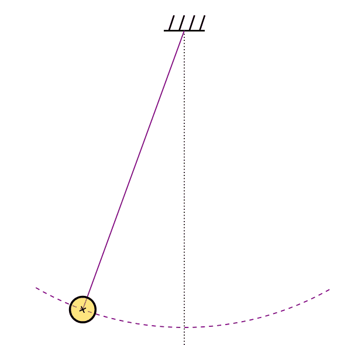
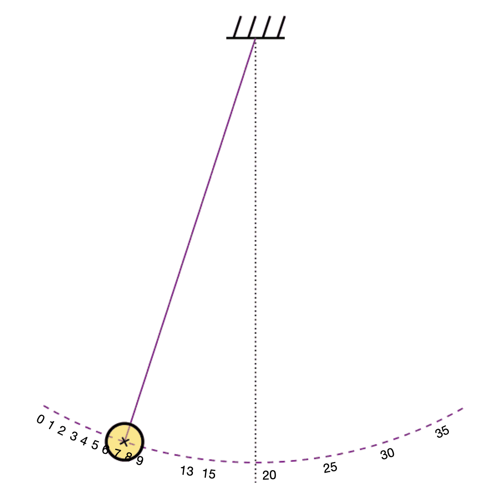
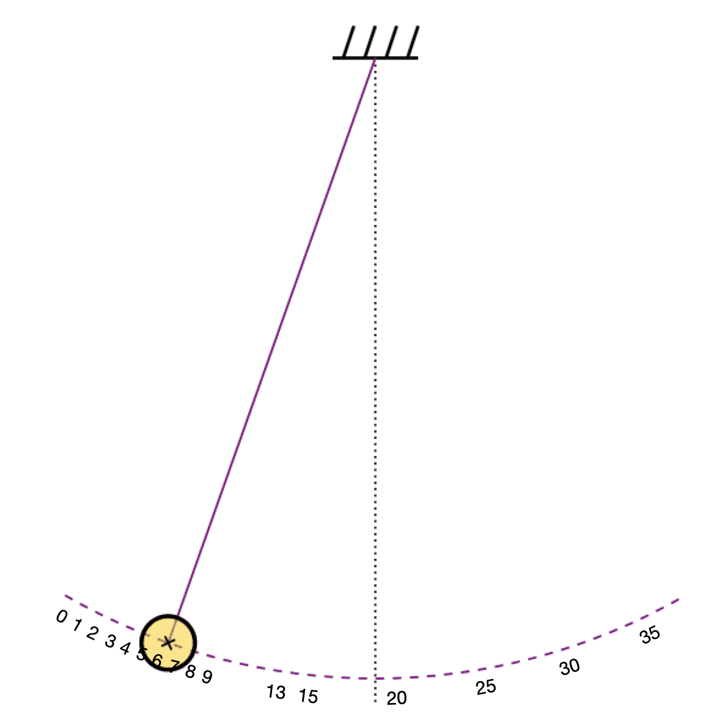
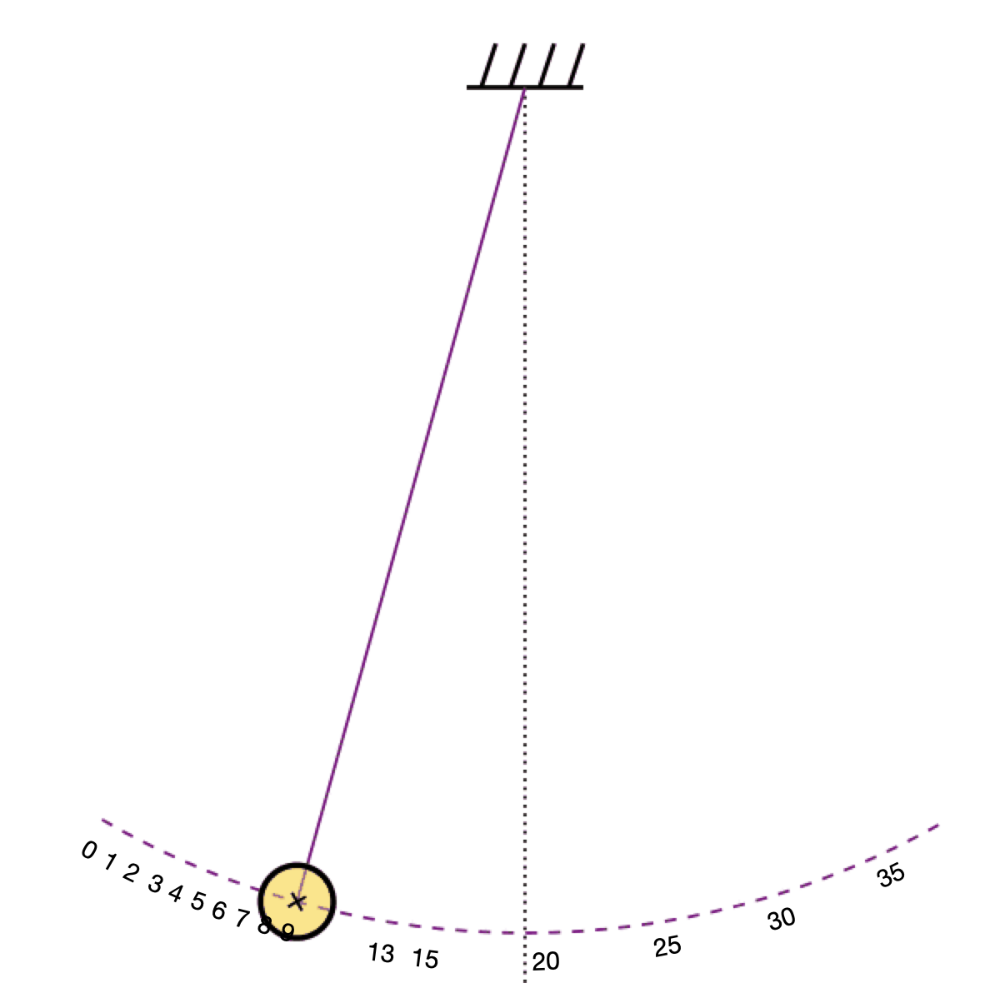
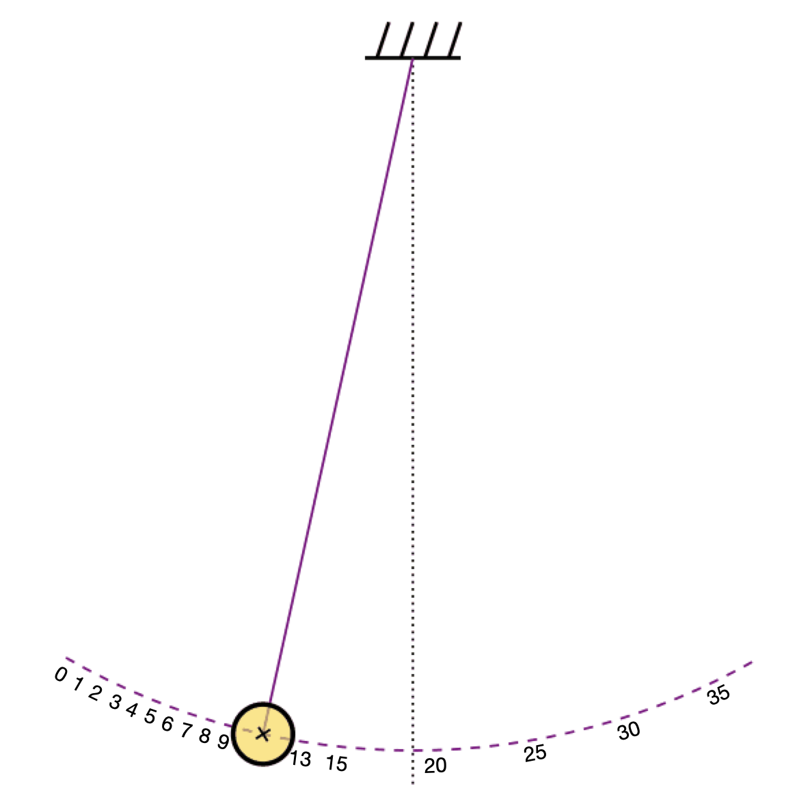
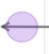
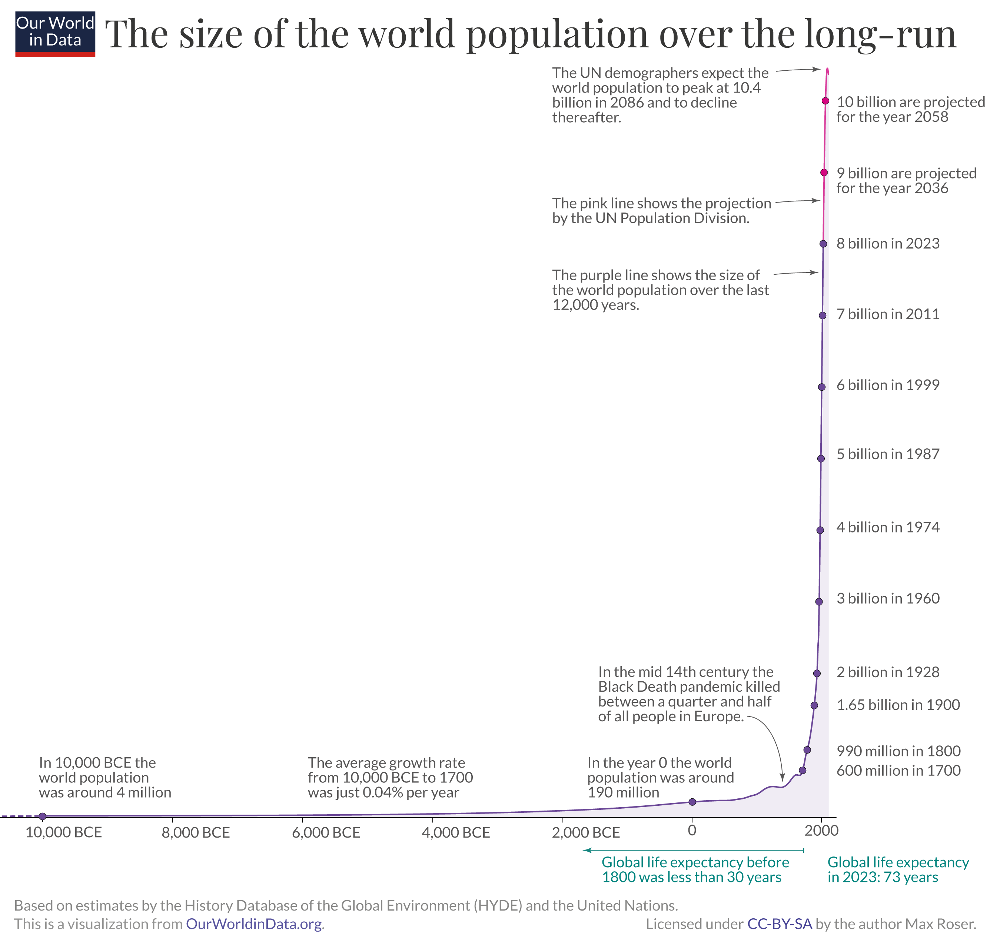

# Dynamics: Modeling change {#sec-dynamics}



```{r include=FALSE}
#| label: ch13-r-e745c2cf
source("_start-up.R")
```

Add a note about cyclical influence diagrams and how the cycle implies something changes over time.

`r xf("sec-modeling-an-epidemic")` introduced a model of an epidemic: the SIR model. SIR tracks the numbers of infective and susceptible people from day to day, week to week, and month to month. Such models, and the systems the models represent, are called `r xf_definition("dynamical systems")`.

In simple language, a dynamical system is one that *changes over time*. A pendulum, swinging back and forth, is a dynamical system. A skyscraper shifting in the wind is a dynamical system. A flying airplane or rocket is a dynamical system. So are a building's heating and cooling systems. Engineers and others often model these real-world dynamical systems to determine the strength, stability, and motion of the objects and, importantly, to design the control systems that govern their behavior. In a modern airplane, the pilot flies a model, and the control system brings the airplane into compliance with the model.

We have to be careful in understanding "changes over time." The pendulum, airplane, and skyscraper are not changing; they are fixed *mechanisms*. It is their state that changes. The angle and speed of the pendulum bob oscillate up and down. An airplane's control surfaces change with every whisper of air turbulence, and with them, the pitch, roll, and yaw of the plane change second by second. Builders may have installed a home heating system a decade ago; the "changes in time" consist of the furnace turning on and off in response to fluctuations in indoor temperature.


Historically, we can trace the mathematical foundations for modeling dynamical systems to the decades around 1700. The "Laws" of science are generally written in the language of dynamical systems. The earliest of these are Newton's Laws, but much more modern frameworks---quantum physics, general relativity, electromagnetism, fluid mechanics---are all formulated in terms of dynamical systems.

We will consider only simple physical systems, such as the swinging pendulum, which suffices to lay out the mechanics of modeling dynamical systems. Mostly, we will emphasize theoretical dynamical systems used to model social, ecological, national security, and similar phenomena, such as epidemics. These theoretical systems are story-like descriptions, not intended to be taken literally as "laws." Despite their approximations and simplifications, the theories serve as frameworks for developing understanding and anticipating the outcomes of interventions in real-world systems. Conveniently, for the person starting to learn what dynamical systems are, the theoretical systems allow a reader to work with familiar mechanisms, such as competition and disease transmission, rather than first having to learn the scientific esoterica of torque, angular momentum, viscosity, space-time curvature, quantum wave functions, and such. However, if the reader develops an interest in such things, he or she will already have a grasp on the mathematics shared by the scientific theories.

## The Euler framework {#sec-euler-framework}

We will use the `r xf_definition("Euler framework")` for introducing the quantitative description of dynamical systems. 
The Euler framework involves three mathematical components:

State
: The `r xf_definition("State")` is a collection of one or more quantities that give a *complete description* of the instantaneous configuration of the system. It can be helpful to consider the instantaneous state to be a *point* in a space, just as we did in `r xf("sec-spaces")`. We use the term `r xf_definition("state space")` as the set of possible states for a dynamical system.

Dynamical rule
: The `r xf_definition("Dynamical rule")` specifies how the state changes over time. The dynamical rule is a *function* that takes a state as input and produces as output a description of the near future. That is, the dynamical rule tells, for each possible state, how the state changes over the next *instant*. Since the dynamical rule is a *function*, for each input there can be only *one output value*. 

As an example, consider the position of a ball dropped from a tower. At any instant, the ball's altitude quantifies how far it has moved since it was released. The altitude is, of course, changing. The `r xf_definition("velocity")` is the rate of change of the position. Similarly, the output of the dynamical rule is the *rate of change* of the state.

Thinking of the picture in terms of a *state space*, the state at any instant is a position in the state space. The output of the dynamical rule is the direction and speed with which the state moves.

Accounting system
: The dynamical rule tells how the state changes, but only over the next instant. Often, we want to trace the state's movement over a substantial interval of time. The accounting system keeps track of the state's instantaneous rate of change, accumulating it to compute the state as a function of time. This function is called the `r xf_definition("trajectory")` of the state.

There are different ways to do the accounting. The methods traditionally taught in college-level math involve algebra that many students find daunting. The method we will use is arithmetical, invented by Leonhard Euler (1707-1783), one of the greatest mathematicians of all time.

The accounting method is entirely mechanical. Although it uses the dynamical rule, the method works for any dynamical rule. Computer software handles the work. 


We will return to the accounting method and give it a dignified mathematical name in Chapters `r xf("sec-rates-of-change", suppress_label = TRUE)`, `r xf("sec-accumulation", suppress_label = TRUE)`, and `r xf("sec-moving-past-two-inputs", suppress_label = TRUE)`. Since it is automatic, the modeler need not be particularly concerned with how it works. Think of it as an appliance, say, a toaster.

Dividing the mathematical work between the dynamical rule and the accounting method greatly simplifies the dynamical rule. The rule needs only to tell the change in the state over the briefest imaginable interval of time. This feature of dynamical rules enables the concise description of scientific theories of nature's operation. 

## Defining the state and rule {#sec-define-state-rule}

It is convenient to start with a system whose dynamical rule is straightforward and where we can easily keep the overall trajectory in mind. With this in mind, imagine a pendulum, such as a tire hanging by a rope from a tall tree branch, or the swinging mechanism of a grandfather clock. 

:::: {.content-visible when-format="html"}
@fig-pendulum-gif shows the situation:


::: {#fig-pendulum-gif}



Animated drawing of a swinging pendulum. ([Source](https://commons.wikimedia.org/w/index.php?curid=97640047)]
:::

<!-- Pendulum source: By Stündle (modification Ideophagous) - based on File:Pendelschwingung.gif, CC BY-SA 4.0)-->


::::

:::: {.content-visible when-format="pdf"}
::: {.callout-note}
## `r xf("fig-pendulum-gif")` 

DRAFT: In this printed version of *Quantitative Argumentation* we cannot display the animation of the swinging pendulum that will make the dynamics more intuitive. You will have to go to a web site: [pendulum movie](https://commons.wikimedia.org/w/index.php?curid=97640047).
:::
::::

The animation in `r xf("fig-pendulum-gif")` consists of a series of frames. @fig-pend-several-frames shows the first five frames individually, making it straightforward to measure the bob's position in each.

::: {layout-nrow=2 #fig-pend-several-frames .column-page-inset-right fig-cap-location="bottom"}

 

 

 

  

  

Five successive frames from the movie. The spacing between tick marks is 1 degree. Between frames 1 and 2, the pendulum is swinging slightly to the left. Thereafter, the swing is to the right.

:::

What is the instantaneous *state* of the pendulum system? Let us start the discussion with a proposition (that will turn out to be wrong): the state is merely the position of the bob at each instant, as marked in the snapshots shown in @fig-pend-several-frames.

The position changes from frame to frame: $$7.2^\circ \rightarrow 6.3^\circ  \rightarrow  7.2^\circ  \rightarrow 8.9^\circ  \rightarrow 11.0^\circ  \rightarrow \ldots\ .$$ 

In both Frames 1 and 3, the position is 7.2 degrees. Following frame 1, the position moves to 6.3 degrees. In contrast, following frame 3, the position moves to 8.9 degrees. 

Recall from @sec-euler-framework that a dynamical rule is a *function*. A function can produce only one output for each particular input. Consequently, the dynamical rule for a pendulum cannot produce two different outputs for the input state of 7.2 degrees. 


Tempting though it might be to deal with this problem by allowing the dynamical rule to be something other than a function, there is a good reason for the (arbitrarily sounding) restriction, introduced in `r xf("sec-intro-to-functions")`, that there be a unique output for any given input.

Instead of changing the *framework*, we need to redefine the state. For a pendulum, this change is straightforward: add another state component. An excellent way to do this is to add the bob's instantaneous *velocity* to the state, so that the state space becomes the coordinate pair (position, velocity).

The markings in @fig-pend-several-frames suffice to mark the position, but the individual frames say nothing about velocity. For velocity, we need to do a calculation. The position at frame 1 is 7.2 degrees, then 6.3 degrees at frame 2. So the change in position from frame 1 to 2 is $6.3 - 7.2 = -0.9$ degrees. Velocity, however, is not just a change; velocity is a *rate of change* with respect to time.

The *frame rate* of the video in `r xf("fig-pendulum-gif")` is 10 per second. That is, the time between successive snapshots in @fig-pend-several-frames is 0.1 seconds. Consequently, the rate of change of position with respect to time---in other words, the velocity---from frame 1 to 2 is -0.9 / 0.1 = -9.0 deg per sec.

In contrast, from frame 3 to 4, the change of position is $8.9^\circ - 7.2^\circ = 1.7^\circ$. The *velocity* over the 0.1 seconds between frames is therefore 17 degrees per second. 

Defining the state as the pair (position, velocity) allows us to construct a dynamical rule that has a unique output for each state input.

Since the state has two components, the output of the dynamical rule must also have two components: the rate of change for each of the components in the state.

The rule for the first component is straightforward because the velocity is the rate of change of position. So the rule (in part) looks like this:

$$\text{pendulum\_rule(pos, vel)} \equiv (\text{vel}, \text{???})$${#eq-pen-rule-1}


We now need to define the rule for the ??? part of @eq-pen-rule-1. The rate of change of the velocity---that is, the acceleration---is given by the physics of gravity, the extent to which gravity tugs with or against the current velocity. At the very bottom of the pendulum's swing, at position 19, the velocity is purely horizontal. And, at this point, gravity is exactly countered by the vertical rod, so at position 19, the acceleration is zero. That lets us specify more of the dynamical rule for the pendulum:

$$\text{pendulum\_rule}(\text{pos}=19, \text{vel}) \equiv (\text{vel}, 0)$${#eq-pen-rule-2}
To construct a complete dynamical rule, we still need to generalize this to apply to any position, not just 19 degrees. A straight-line function of position will be a good start. We know the output of the straight-line function will be zero when the position is 19. By the argument in @nte-find-accel-pendulum, we can estimate the acceleration at $80^\circ \text{per sec}^2$ at position 7.2. Altogether, the dynamical rule is 

$$\text{pendulum\_rule}(\text{pos}, \text{vel}) \equiv \left(\text{vel},\  -6.11(\text{pos} - 19)\right)$${#eq-pen-rule-2}

Rules in this form are suitable for calculation, but to get a better understanding of how the system works, @fig-gif-state-space(a) shows the state space with the two-component output of the dynamical rule drawn as a vector. The graphic displays the dynamical rule at only about 200 points in a row-and-column grid in state space. In reality, the dynamical rule applies to *all* points in the space. We cannot show them all because the graphic would become a solid mass of black arrows.

Applying the accounting method turns the dynamical rule into a trajectory. @fig-gif-state-space(b) shows the trajectory. The initial state (time = 0) is marked 0. The other boxed numbers indicate the time (in seconds) at which the state reached that point.

```{r}
#| label: fig-gif-state-space
#| layout-ncol: 2
#| echo: false
#| warning: false
#| message: false
#| fig-cap: "The dynamical rule for the system of `r('fig-pendulum-gif')`. The rate of change at selected points in the state space is a vector since both components of the state are changing." 
#| fig-cap-location: "top"
#| fig-subcap:
#| - Dynamical rule
#| - Trajectory
pend_gif<- makeODE(dp ~ v, dv ~ - 6.11 * (p - 19))
soln <- integrateODE(pend_gif, domain(t=0:2), p = 8, v=2)

flow_field(pend_gif,
           domain(p = 5:33, v = -30:30), 
           npts = 14, scale = 0.75) |>
  gf_labs(x = "Position (deg)", y = "Velocity (deg/sec)" ) |>
  gf_refine(coord_fixed(ratio=.4)) 
  traj_plot(v(t) ~ p(t), soln, linewidth = 1, alpha = 0.5,
            color = "blue",
          nt = 10) |>
    gf_refine(coord_fixed(ratio=.4))  

```


We draw the dynamical rule at the various points in the state space with a straight arrow. The arrow has two components, horizontal and vertical. Similarly, there is an *instantaneous rate of change* for each component of the state. The arrows show both instantaneous rates of change simultaneously. In contrast, the trajectory traces out the evolving state over a period of time: two seconds in @fig-gif-state-space(b). The trajectory is a smooth curve. The accounting method does the mathematical work to turn the straight arrows of the dynamical rule into a curved trajectory.

::: {.callout-note #nte-find-accel-pendulum}
## Estimating acceleration

We can estimate the acceleration at position 7.2 by examining the short three-frame movie $6.3^\circ  \rightarrow  7.2^\circ  \rightarrow 8.9^\circ$. The velocity represented by the first arrow is, as before, 
$$\frac{7.2^\circ - 6.3^\circ}{0.1\ \text{sec}} = 9^\circ \text{per sec}$$
Likewise, the velocity at the second arrow is 
$$\frac{8.9^\circ - 7.2^\circ}{0.1\ \text{sec}} = 17^\circ \text{per sec}$$

The acceleration is the rate of change of the velocity:

$$\frac{17^\circ \text{per sec} - 9^\circ \text{per sec}}{0.1\ \text{sec}} = 80^\circ \text{per sec}^2$$
:::


## The SIR model

A key feature of the Euler framework is that the dynamical rule describes the rates of change in the state only *instantaneously*. Although the *trajectory* may curve over extended durations of time, at each instant the dynamical rule needs to account for only a tiny change in the state corresponding to a small fraction of the vector. The accounting method moves this small amount, then evaluates the dynamical rule at the new state, then moves again, and so on. Any curve in the trajectory arises from repeated evaluations of the dynamical rule at state points that are very close together. Since the accounting method handles any curvature in the trajectory, the dynamical rule is much simpler than the extended trajectory. 

We can now explore the dynamical rule for the SIR model of epidemics first presented in `r xf("sec-models")`. To start, we need to specify the *state* of the SIR system.

A simple but effective representation of the state is two numbers: the number of susceptible people ($S$) at any instant and the number of infective people ($I$) at that instant.

To keep the model simple, we will not account for the infection's origin. To start an infection, we set $I$ to a nonzero value and let the dynamical rule take over. 


To start, we will draw the state space and the dynamical rule at many individual points in the state space, as in @fig-SIR-model-rule1. Then we will interpret the dynamical rule in terms of familiar aspects of infectiousness and recovery from infection, and we will show the modeling techniques used to implement it. 


```{r}
#| label: fig-SIR-model-rule1
#| echo: false
#| fig-cap: "The state space of the SIR model with the dynamical rule shown with arrows."
highlight <- tibble::tribble(
  ~ S, ~ I, ~ color,
  93000, 0, "brown", 
  21000, 64000, "magenta",
  7500, 85000, "green",
  500, 79500, "deeppink1",
  500, 72000, "deeppink2",
  500, 65000, "deeppink3",
  28000, 50000, "blue",
  35000, 50000, "blueviolet",
  42000, 50000, "violet",
  36000, 29000, "deepskyblue1",
  36000, 22000, "deepskyblue2",
  36000, 15000, "deepskyblue3",)
social <- 20
isolation <- 10
a <- 0.0003 / social
b <- 0.6 * 80 / (100 - isolation)
vectorfield_plot(dS~ ifelse(S > 100000-I, NA, -a*S*I), dI ~ ifelse(I > 100000-S, NA, a*S*I - b*I), 
                 domain(S= 500:100000, I = 500:100000), 
                 npts = 15, transform = function(x) 10*x^.66) |>
  gf_refine(theme_minimal(), coord_fixed()) |>
  gf_lims(x = c(0,100000), y = c(0,100000) ) |>
  gf_theme(scale_color_identity()) |>
  gf_point(I ~ S, color = ~ color, data = highlight, inherit=FALSE,
           alpha = 0.45, size = 6, fill = NA)
```

@fig-SIR-model-rule1 shows a state space suitable for tracking an epidemic in a population of 100,000 or fewer. At any instant of time, the sum of $S$ and $I$ cannot be greater than 100,000. So, we need only draw the dynamical rule in the area of state space where $S + I < 100,000$, the lower triangular region of the state space.

The first thing to notice is that the dynamical rule arrows tend to have a leftward-heading component. The leftward trend indicates that $S$ is decreasing; the model does not include the production of new susceptibles by birth or immigration.

In contrast, the rate of change in $I$ can be either upward or downward. For low values of $S$, the rate of change in $I$ is downward because fewer people catch the disease than the number who are *recovering from infection*. Such recovery occurs at high $S$ as well, but there the susceptible population is so large that many new individuals become infective.  

We have marked a few state-space positions with colored dots to help us consider how the dynamics are different depending on $S$ and $I$.

The dynamical rule comes from the modeler's knowledge of the system. Even those who may not have previously thought about the quantitative description of epidemics likely understand some basic principles.

i. New infectives are created when an existing infective meets a susceptible, converting the susceptible to an infective.

ii. Existing infectives recover at some rate, lowering the number of infectives without changing the number of susceptibles.

iii. If we ignore births, immigration, and deaths, as we are doing here, the only route for a change in the number of susceptibles is conversion via an infective.

iv. All other things being constant, a larger number of infectives leads to a larger number of conversions of susceptibles. Similarly, all other things equal, a larger number of susceptibles results in more conversions.

These principles play out differently across regions of the state space, since the balance between susceptibles and infectives varies with position. Consider these (color-coded) regions in state space:

[**Few susceptibles, many infectives**]{style="color: green;"} [{width=15mm}]{.column-margin}The flow is mainly southward, a little to the west. This corresponds to a slow decline in susceptibles as they run into any of the many infectives. Net decline in effectives: more are recovering than are being created by conversion of susceptibles.
 

[{width=15mm}]{.column-margin} [**No susceptibles**]{style="color: deeppink;"}
The flow is slowly to the sourth. No new infectives, but old infectives are gradually recovering.


[**A few infectives and many susceptibles**]{style="color: brown;"} [{width=15mm}]{.column-margin} 
The flow is slowly to the northwest. This corresponds to slow growth in infectives and a  corresponding decrease in susceptibles.


[**Many infectives and many susceptibles**]{style="color: violet;"} [{width=15mm}]{.column-margin}
The flow is rapidly to the west. This is a rapid decline in susceptibles.


## Trajectories

::: {#fig-chain-of-arrows-SIR}
```{r}
#| label: ch13-r-b65b446a
#| echo: false
#| warning: false
social <- 20
isolation <- 10
initial <- 100
a <- 0.0003 / social
b <- 0.6 * 80 / (100 - isolation)
SIR <- makeODE(dS~ -a*S*I, dI ~ a*S*I - b*I, 
                 a=0.0003/social, b=0.6*80/(100-isolation), 
                 S=100000, I=initial)

Traj <- suppressMessages(integrateODE(SIR, domain(t=0:50)))
Points <- tibble::tibble(
    days = seq(0, 50, by = 0.5),
    infectives = Traj$I(days/2),
    susceptibles = Traj$S(days/2)
) |>
  mutate(lastI = lag(infectives),
         lastS = lag(susceptibles),
         color = ifelse(row_number() %% 2, "tomato", "darkblue"))
vectorfield_plot(dS~ ifelse(S > 100000-I, NA, -a*S*I), dI ~ ifelse(I > 100000-S, NA, a*S*I - b*I), 
                 domain(S= 50:100000, I = 50:100000), 
                 npts = 15, transform = function(x) 10*x^.66)  |>
  gf_segment(lastI + infectives ~ lastS + susceptibles, 
  data = Points,
  color = ~ color, 
  inherit = FALSE, 
            arrow = arrow(length=unit(0.05, "inches"))) |>
  gf_refine(coord_fixed(), scale_color_identity()) |>
  gf_theme(theme_minimal()) 

```

A chain of steps for the SIR model starting with $S \approx 100,000$ and a handful of infectives. Each step covers 12 hours. The steps are plotted in alternating colors to make it clear where one step ends and the next one begins. The path indicated by the chain of steps is the *trajectory* of the dynamical system from the initial state.

:::


In @fig-chain-of-arrows-SIR, each step is a short line segment. The overall path accumulated through many steps, however, is curved. The curve is the result of re-evaluating the dynamical rule at the end of each short, simple step. Since the state moves only a small distance during one step, the output of the dynamical rule will be only slightly different when evaluated at the end of the step than it was at the start of the step. The overall trajectory, the accumulation of many small steps, approximates a gradual curve, just as we perceive smooth motion in a video, which is just one still frame after another. The time between the frames is very small, so successive frames are *almost* identical.

## Exponential growth and decay

Demographers estimate that a fertility rate of 2.1 children per woman keeps the population steady; the number of births matches the number of deaths. In many wealthy countries, however, fertility rates are much lower. To dramatize the consequences, some pundits have extrapolated what would happen if the worldwide fertility rate were roughly one child per woman.

Assuming equal proportions of males and females, this low fertility rate results in half as many births in each generation as in the preceding generation. Over ten generations, successive halvings would result in the tenth generation having only one-thousandth as many births as the starting generation.

These successive halvings are an example of `r xf_definition("exponential decay")`.  Likewise, if the fertility rate were roughly four children per woman, the number of births would *double* every generation.  These successive doublings, each taking approximately one generation illustrate `r xf_definition("exponential growth")`. [Demographers would put the rate for doubling every generation at 4.2 children per woman. Why? One reason is that not all of those children will themselves have children. Certainly, this is true of the boys, who constitute roughly half the population of child-bearing age. So, 4.2 per woman is 2.1 per person.]{.column-margin}

The phrase "exponential growth" appears often in the press, almost always in reference to a quantity growing rapidly, e.g., a population of insects or a national debt. The news media use synonyms for "exponential growth" to convey drama: skyrocketing, explosive, rampant, mushrooming, and so on. 

The characteristic of all exponential growth is successive doublings, each taking the same time as the previous doubling. For example, at an annual compounding rate of 6%, it takes about 12 years for an investment to double.  An investment starting at 1000 USD would grow to 2000 USD in 12 years, then to 4000 USD at the 24-year point, and to 8000 USD at the 36-year point. All forms of exponential growth work like this, whether they be about money, bacteria, growing vegetation, or anything else. They differ only in *how long* it takes for the doubling to occur. The `r xf_definition("doubling time")` is the parameter used to describe exponential growth.

Exponential decay is the same. Imagine an abandoned bank account with 1000 USD, where the bank takes a "service fee" of only 4% per year. At this rate, it takes the bank 18 years to extract half the account balance. So, an account with 1000 USD in 2000 will have only 500 USD by 2018, then 250 USD by 2036, then 125 USD by 2054, and so on. By analogy to the *doubling time* of exponential growth, exponential decay is characterized by a `r xf_definition("halving time")`. 

Some people point to the world's human population (@fig-world-population) as a compelling example of "skyrocketing," that is, exponential growth. However, a careful examination reveals a more nuanced story. After all, even skyrockets run out of fuel at some point.

::: {#fig-world-population .column-page-inset-right fig-cap-location="bottom"}


Source: [Our World in Data](https://ourworldindata.org/population-growth-over-time)

:::

To evaluate patterns like that shown in @fig-world-population, it pays to drop the dramatic descriptions and carefully examine what exponential growth is and the mathematical assumptions that underlie it. Knowing these assumptions lets us judge to what extent those assumptions are justifiable and when they are not. 

We can start with dynamical systems that are, mathematically, extremely simple. What do we mean by "simple?" Two things: 1) the state space consists of just a single quantity, and 2) the dynamical rule is free from complexity. In honor of @fig-world-population, we will call the state quantity $P$. (Of course, any other name would do: $x$, pop, $S$ for state, and so on.)


The simplest function in our core modeling collection is flat(), where the output is always 1 regardless of the input. We will start from there and gradually add complexity.  

```{r}
#| label: ch13-r-3662a127
#| echo: false
phase_line <- function(P, aspect=2) {
  P + 
    coord_fixed(ratio = aspect) +
    theme_minimal() +
    theme(
      panel.grid.major.y = element_blank(),
      panel.grid.minor.y = element_blank(),
      axis.title.y = element_blank(), # Remove y-axis title
      axis.text.y = element_blank(),  # Remove y-axis text labels
      axis.ticks.y = element_blank(), # Remove y-axis tick marks
      axis.line.y = element_blank()   # Remove y-axis line
    )
}
```

@fig-flat-dyn shows the dynamics of the flat() rule in three different ways. On top (panel (a)) is the flow field. In principle, since the state space is one-dimensional, all the flow arrows should be on the number line. To avoid the arrows overlapping, however, we have spread them out at random vertically. Panel (b) shows the dynamical rule, namely, the function flat($P$). Panel (c) shows how the state $P$ changes with time. (The name given to how something changes with time is `r xf_definition("time series")`.)

Keep in mind the substantial difference between the dynamical rule and the corresponding pattern of how $P$ changes with time, that is, the time series. The dynamical rule is a function that takes $P$ as input and produces the rate of change of $P$ as output. The time series is also a function, but instead of taking $P$ as input, it takes *time* (t) as the input. Moreover, in the time series, the output of the function is $P$ itself, not the rate of change in $P$. 


```{r}
#| label: fig-flat-dyn
#| echo: false
#| layout-ncol: 3
#| fig-cap: "Flow field when dynamical rule is flat()."
#| fig-cap-location: top
#| fig-subcap:
#| - Flow field
#| - Dynamical rule
#| - State vs time
system <- makeODE(dP ~ 1, dS ~ 0)
streamlines(system, 
            domain(P=-5:5, S = 0:1), 
            dt = 0.1, npts=5, alpha = 0.5) |>
  phase_line(2) 
slice_plot(1 ~ P, domain(P=-5:5)) |>
  gf_labs(y = "Rate of change of P", x = "State P") |>
  gf_lims(y = c(-1.5, 1.5), x = c(-5,5)) |>
  gf_hline(yintercept = 0, color = "blue") |>
  gf_theme(theme_minimal())
slice_plot(t + 0.25 ~ t, domain(t=0:5)) |>
  gf_labs(y = "State P", x = "Time") |>
  gf_hline(yintercept = 0, color = "blue") |>
  gf_theme(theme_minimal()) |>
  gf_refine(scale_y_continuous(breaks = c(0, 1, 2, 3, 4, 5) ))

```

The flow arrows tell a simple story. The flow is the same for every value of $P$: steady, rightward movement. Tracking along the flow would give us P as a function of *time*, that is, the trajectory (panel (c)). The dynamical rule (panel (b)) corresponds with the flow: the rate of change of P with respect to time is constant. Of course, this is also what the trajectory shows: the rate of change of P with respect to time is constant.

A good name for the patterns in @fig-flat-dyn is `r xf_definition("steady growth")`. A domestic example of steady growth is the accumulation of water in a bathtub as it flows in at a steady rate from the faucet.

Following the strategy of gradually adding complexity to the dynamical rule, consider the second simplest of the core modeling functions: same(). @fig-steady-dyn shows the dynamics. Notice that the flow arrows (@fig-steady-dyn(a)) differ markedly in length. For positive $P$, the larger $P$ is, the longer the right-pointing flow arrow. (For negative $P$, the more negative the larger the left-pointing flow arrow.) The dynamical rule, same(), is straightforward (panel (b). However, the consequences of the dynamical rule are not at all steady. The state grows at an ever-increasing rate; the larger $P$ is, the faster $P$ changes with respect to time.


```{r}
#| label: fig-steady-dyn
#| echo: false
#| layout-ncol: 3
#| fig-cap: "Flow field when dynamical rule is same()."
#| fig-cap-location: top
#| fig-subcap:
#| - Flow field
#| - Dynamical rule
#| - State vs time
system <- makeODE(dP ~ 0.69315*P, dS ~ 0)
streamlines(system, 
            domain(P=-5:5, S = 0:1), 
            dt = 0.1, npts=8) |>
  phase_line(4) 
slice_plot(P ~ 0.69315*P, domain(P=-5:5)) |>
  gf_labs(y = "Rate of change of P", x = "State P") |>
  gf_lims(y = c(-5, 5)) |>
  gf_hline(yintercept = 0, color = "blue") |>
  gf_theme(theme_minimal())
slice_plot(0.25 * exp(0.69315*t) ~ t, domain(t=0:6.3)) |>
  gf_labs(y = "State P", x = "Time") |>
  gf_hline(yintercept = 0, color = "blue") |>
  gf_refine(scale_y_continuous(breaks = c(0, 1, 2, 4, 8, 16) )) |>
  gf_theme(theme_minimal())
```

@fig-steady-dyn shows *exponential growth*. It stems from using same() as the dynamical rule. With same() as the *dynamics*, the state itself follows *exponential* growth.

It is important to point out a distinctive feature of exponential growth, the same feature that we see in the exp2(t) function. Referring to the time series (panel (c) in @fig-steady-dyn), we see the doubling phenomenon. For instance, track $P$ as it increases from $P=0.5$ to $P=1$, a change that occurs in one time unit. Similarly, to grow from $P=1$ to $P=2$ takes one time unit. Same for the growth from $P=2$ to $P=4$: one time unit. And so on. 


It is always the same: exponential growth corresponds to the state doubling every unit of time. In @fig-steady-dyn, we arranged things so that the doubling time is 1. However, it is still exponential growth even when the doubling time is different. For instance, under ideal conditions, a bacterial population doubles every 20 minutes. 

Doubling every 20 minutes means that there are three doublings in one hour. Starting with a population of p, the three doublings produce, successively, at intervals of 20 minutes, population 2p, 4p, and, at the end of the hour, 8p; the population increases 8-fold in one hour. In two hours, the 8-fold increase will repeat, giving a 64-fold increase over the two hours! When the dynamics are same(), the 64-fold increase will occur every two hours.

The pattern of a 64-fold increase every two hours will produce unbelievable growth, as indicated in @tbl-every-20-minutes.

::: {#tbl-every-20-minutes}
time | population | bacterial mass
-----|--------:|-------
Midnight | 1 | roughly 1e-12 gm or 1 picogram
2 am | 64
4 am | 64^2^, or 4096, that is, 4.096e3
6 am | 64^3^, or 262,114, that is, 2.621e5
8 am | 64^4^, or 16,777,216, that is, 1.678e7
10 am | 64^5^, or 1073741824, that is, 1.074e9
Noon | 64^6^, or 68,719,476,736, that is 6.872e10 | roughly 0.0007 gm
... | ... | ...
6 pm | 64^9^, or 1.801e16 | roughly 0.07 gm
8 pm | 65^10^, or 1.346e18 | roughly 5 gm
... | ... | ...
Next Midnight | 64^12^, or 1.801e16 | roughly 20,000 gm
2 am |> 64^13^, or 3.022e23 | roughly 130 kg

Bacterial growth under the hypothesis that the population doubles every 20 minutes.
:::

According to @tbl-every-20-minutes, after a little more than a day, the bacterial mass will be larger than its human host. Unbelievable!

A good rule of thumb is not to believe the unbelievable without challenging it. In reality, of course, the mass of bacteria reaches a steady state estimated at 300 gm.

The reason for the striking divergence between theory and reality is that the theory is wrong. Steady() dynamics will indeed produce exponential growth; that part of the mathematics is correct. However, the same() dynamical rule is not an adequate model.

The reality is that the bacterial mass reaches a steady state, so we know that the dynamical rule must give zero growth at the steady-state mass. The simple dynamical rule same() does not do this. The model is wrong---like all models!---but same() is wrong in a way that fundamentally misstates the pattern of bacterial growth. 

In @fig-theory-vs-practice, we compare the exponential growth dynamics (black) to a more realistic pattern that produces exponential growth when the bacterial mass is small, but brings the growth to zero at the steady state.

::: {.column-page-inset-right}
```{r}
#| label: fig-theory-vs-practice
#| fig-cap: "Dynamics of bacterial growth. Black is the same(P) model, red is a more realistic model."
#| fig-cap-location: top
#| fig-subcap:
#| - Dynamics (vertical axis is mass growth rate)
#| - Time series (vertical axis is mass)
#| layout-ncol: 2
#| echo: false
#| message: false
#| warning: false
# slice_plot(3*log(2)*P  ~ P, domain(P=0:1.3e2)) |>
#   gf_labs(y = "Rate of change of mass (kg per hour)", 
#           x = "Mass of bacteria (kg)") |>
#   gf_hline(yintercept = 0, color = "blue") |>
#   gf_theme(theme_minimal()) 

realistic_fun <- function(P) {
  ifelse(P < 0.01, 
         2.08*P, # up to 0.
         .0208*(1 - (P-0.01)/0.3))
}

theory <- makeODE(dP ~ 2.08*P)
reality <- makeODE(dP ~ realistic_fun(P) )
soln <- integrateODE(reality, P=0.0000001, domain(t=0:60))
theory_soln <- integrateODE(theory, P = 0.0000001, domain(t = 0:8))
Pts <- tibble::tibble(t = c(0,1,2,3,4, 5,5.5, 6, 6.25, 6.5, 6.75, 7, 7.1, 7.15, 7.2, 7.25), P = theory_soln$P(t))    
P2 <- traj_plot(P(t) ~ t, soln, color = "tomato",  linewidth=1.3) |>
  # gf_refine(scale_y_log10()) |>
  gf_lims(x = c(0,60)) |>
  gf_hline(yintercept =0.01, linewidth = 5, color = "green", alpha = 0.2) |>
  gf_line(P ~ t, data = Pts, color = "black", linewidth = 0.5) 
  
P1 <- slice_plot(3*log(2)*P ~ P, domain(P=0:0.4)) |>
  slice_plot(realistic_fun(P) ~ P, color = "tomato") |>
  gf_labs(y = "Rate of change of mass (kg per hour)", 
          x = "Mass of bacteria (kg)") |>
  gf_hline(yintercept = 0, color = "blue") |>
  gf_theme(theme_minimal()) |>
  gf_hline(yintercept =0.007, linewidth = 5, color = "green", alpha = 0.2)
P1 |> gf_theme(theme_minimal(base_size = 16)) 
P2 |> gf_theme(theme_minimal(base_size = 16))
```

:::

In steady growth, as t increases by one unit, the value of $P$ increases by a fixed quantity. So, in @fig-flat-dyn(c), the value of $P$ increases by the same amount when t goes from 0 to 1 as it does when t goes from 1 to 2 or from 2 to 3.


## SIR dynamical rule

As mentioned previously, a dynamical rule is a *function* that takes the state as input and produces the instantaneous change of state as output. In `r xf("sec-customizing-functions")`, we introduced ways to build custom functions to represent a given situation. We are going to put those techniques to work, now.


Recall from `r xf("sec-customizing-functions")` that a straightforward extension of the basic set of functions involves *multiplying* two functions. Consider one such multiplication: the one that describes an interaction between the two inputs:  same(x) $\times$ same(y), or, more concisely, $x\, y$ 

The two state quantities in SIR are the number of susceptibles ($S$) and the number of infectives ($I$). Even without thinking much about the mechanism of epidemics, we can write down a skeleton form for the instantaneous rate of change. We will use the abbreviation ROC to stand for "instantaneous rate of change," and the ROC of $S$ will be named $ROC_{S}()$ and likewise for $I$.
Both $ROC_{S}()$ and $ROC_{I}()$ will take the state $(S, I)$ as input. Each will be a linear combination of four simple functions.

$$ROC_{S}(S, I) \equiv a_s + b_s \, S + c_s\, I + d_s\, S\,I$$ {#eq-roc-s} and $$ROC_{I}(S, I) \equiv a_I + b_I \, S + c_I\, I + d_I\, S\,I$${#eq-roc-i}

The first thing to notice about the proposed functions in Expressions [-@eq-roc-s] and [-@eq-roc-i] is that they are *almost* the same. That might be surprising, since they describe the ROC of two different quantities, $S$ and $I$. Keep in mind that we are building a `r xf_definition("skeleton")` for the functions. We will flesh out the skeleton in different ways.

The "flesh" on the skeleton is the coefficients used in the linear combination. We combine four simple functions, so each expression has four coefficients. We have (uncreatively) named these coefficients $a$, $b$, $c$, and $d$.

We need a dynamical-rule function for each of the two state variables.
For simplicity, we will use the same skeleton for each function, but endow each with its own flesh. That is, we will use different coefficient values for each dynamical rule. A simple notation helps make the skeletons' similarities clear while at the same time signalling that the values of the corresponding coefficients in each skeleton can differ. We do this by adding a subscript, I or s, to each coefficient, depending on whether it is in the dynamical rule for the infectives or for the susceptibles. For instance, $a_I$ is the coefficient on flat() for the $ROC\_I$-skeleton. Similarly, $d_S$ is the coefficient on the *interaction* between $S$ and $I$ for the $ROC\_S$-skeleton.

Ultimately, we will want to give quantitative values for each of the eight coefficients $a_s, b_s, c_s, d_s, a_I, b_I, c_I, d_I$.

Experienced modelers have a trick to facilitate the initial construction of a model. Rather than specifying a value for each coefficient, they state, based on their understanding of the system they are modeling, the *sign* for each coefficient: negative, positive, or zero. Going slightly further, they explore a limited set of scenarios: the state variables are either "large" or "small." (The state variables in SIR cannot be negative, since there is no such thing as a negative number of infectives or susceptibles.)

Let us start with the coefficients in $ROC\_I$. 

- $a_I$: Think about what this term would indicate if both $S$ and $I$ were zero, the hypothetical world with no infectives or susceptibles. It seems reasonable to suppose that new infectives (that is, the rate of change of infectives) would not come out of the air. So $a_I = 0$. [If the model is to allow influx of infectives from other places, the model would call for a positive $a_I$.]{.column-margin}

- $b_I$: This is the coefficient on $S$. Imagine that $S$ is large, but $I$ is zero. What will happen to the ROC of I? Without any infectives, there is no way for a susceptible person to become sick. So $b_I$ must be zero. [If the model is to allow *spontaneous* generation of infection, $b_I$ would be positive.]{.column-margin}

- $c_I$: This is the coefficient on $I$. Imagine, contrary to the discussion of $b_I$, that $I$ is large and $S$ is zero. In such a hypothetical world, there are no susceptibles who can become sick so that no new infectives will arise from the susceptibles. However, there is a mechanism for a change in $I$ even when $S$ is zero: Infectives can recover and stop being infectives. The more infectives there are, the larger the rate (say, infectives/day) at which they recover. In consequence, $c_I$ is a negative number. Without susceptibles, the number of infectives decreases over time.

- $d_I$: The coefficient on the interaction term $S\ I$ for $ROC\_I()$. "Interaction" is an excellent name for this term. A nice way to think about interaction is that it refers to what happens when an $S$ meets an $I$: they interact. With infectious illness, the possible outcomes of the interaction are either no change in the situation or, with some probability, the $S$ catches $I$'s infection, and the $S$ becomes infectious. So when an $S$ meets an $I$, the number of infectives increases. Thus, $d_I$ must be positive; it is creating new infectives.

The analysis of $a_s$, $b_s$, $c_s$, and $d_s$ follows the same kind of logic. $a_s$ would correspond to immigration of susceptibles (if positive) or emigration (if negative). The SIR model does not consider this. SIR also does not consider births or deaths. The number of susceptibles only changes when an $S$ meets an $I$. When that happens, the number of susceptibles decreases as susceptibles are converted into infectives. So $d_s$ must be negative. What is more, since every susceptible individual who is infected becomes a new infective, it must be that $d_s = -d_I$.

A nice convention when writing rate-of-change coefficients is to stipulate that all are positive. When a coefficient enters negatively into the rate-of-change function, we will use a *minus sign* instead of the $+$ used in Equations [-@eq-roc-i] and [-@eq-roc-s]

Taking into account all the coefficients that we argued are zero, we end up with two formulas for the rate of change functions:

$$ROC_{S}(S, I) \equiv - d\,S\,I$$ and $$ROC_{I}(S, I) \equiv -b I + d\,S\,I$$ 

There are only two coefficients, not three, since the decrease in susceptibles balances any increase in infectives! 

-----

### New terms {#sec-new-terms-13}

`r xf_new_words("13")


