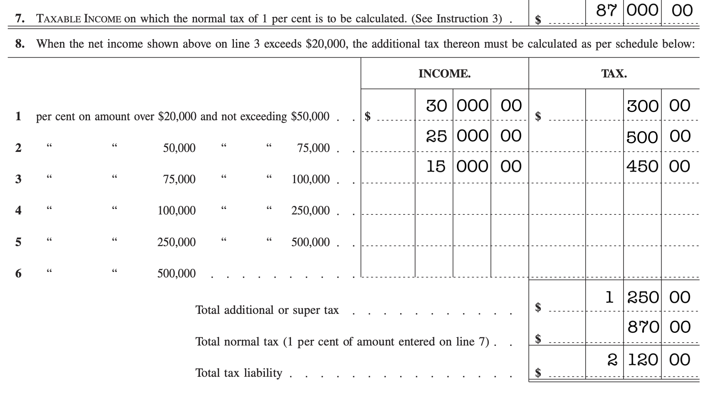
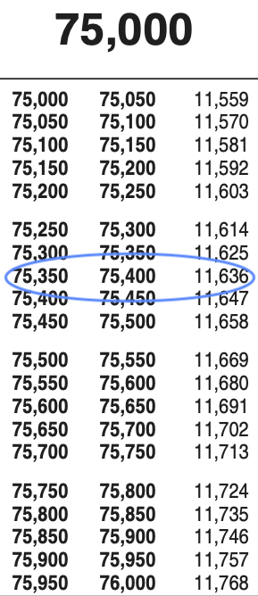

# Rates of change {#sec-rates-of-change}



```{r include=FALSE}
#| label: ch14-r-4d268f3c
source("_start-up.R")
```

::: {.aside}
`r paste(readLines("_Words/chap_14.txt"), collapse = "\n")` 
:::

`r xf("sec-rates")` introduced the distinction between a *rate* and a *rate of change*. A rate is one quantity divided by another. A rate of change is also a rate. But it is a special kind of rate. 

The word "special" when talking about rates of change is relevant in two different senses. One definition is "different from usual." Indeed if a rate is the usual thing, then a rate of change is different from usual because the quantities that form the *ratio* are always *changes* in a quantity. And not just changes, but **simultaneous changes**. By photographic analogy, you can measure a rate by looking at a snapshot: read off the instantaneous values of the two quantities of interest, then divide one by the other. In contrast, measuring a *rate of change* requires a movie: a *series* of instantaneous snapshots. The minimum length of the movie is small, just two frames. You measure the two quantities in one of the frames, then in the other. Take the change in each quantity between the two frames, then form a ratio of those *changes*.


Another meaning of "special" is captured by synonyms: exceptional, extraordinary, unique, important, significant, rare. Although the distinction between a *rate* and a *rate of change* may seem trivial at first glance, the invention of the concept (1600's) and the gradual realization of the many important applications (starting about 1700 and  speeding up over the next century and more) shaped many aspects of the modern world. This is most evident in science, technology, and engineering and the reason that a large fraction of STEM students are *required* to study rates of change and learn to do calculations with them. But it is just as important in economic matters, whether it be theories of how markets and firms work, or business decisions about prices and production.

Even if you have no interest in science, business, or economics, rates of change almost certainly apply to matters of importance to you. Knowing about rates of change, and how they are special, provides a major tool for understanding and making decisions about important matters. Later in this chapter, we'll illustrate using death and taxes. First, though, let's motivate the how and why of rates of change.

## Taxes on the margins {#sec-on-the-margins}

`r qr_margin_note(
  "https://bradfordtaxinstitute.com/Endnotes/IRS_Form_1040_1913.pdf",
  "1913 US Federal tax brackets"
)`

Income taxes in the US are calculated according to "brackets." Each bracket specifies the tax *rate*, that is the fraction of income that is to be paid as taxes. `r xf("tbl-1913-brackets")` gives the brackets for taxes in 1913, the first year after the 16th Amendment to the US Constitution that empowered Congress to impose income tax. 

<!-- [The Amendment says, "The Congress shall have power to lay and collect taxes on incomes, from whatever source derived, without apportionment among the several States, and without regard to any census or enumeration." Strictly speaking, even before the amendment Congress had the power to tax income. However, the Supreme Court had dictated that any such tax had to be "apportioned," that is, imposed equally based on the population of each state. This was impractical, since *per capita* income differs from state to state.]{.column-margin} -->

::: {#tbl-1913-brackets tbl-cap-location="top"}

Income | Tax rate 
-------|----------
$0     | 0%
$3000  | 1%
$20,000 | 2%
$50,000 | 3%
$75,000 | 4%
$100,000 | 5%
$250,000 | 6%
$500,000 | 7%

1913 US Federal tax brackets. Source: [The 1913 1040 form](https://bradfordtaxinstitute.com/Endnotes/IRS_Form_1040_1913.pdf)
:::


Care must be taken in interpreting `r xf("tbl-1913-brackets")`. Despite appearances, it does not say, for instance, that someone earning $3000 must pay 1% (that is, $30) in taxes. The correct interpretation is that the $3K earner pays zero tax.  [Using a standard cost-of-living conversion, $4000 in 1913 was equivalent to about $140,000 in the mid-2020s. The $10 payment in 1913 corresponds to about $44 in 2020s money.]{.column-margin} But on any incremental income amount *above* $3K, the tax rate will be 1%. 
For instance, imagine a taxpayer who earned $4000. They will pay 0% on the first $3000 and 1% on the next $1000, so a $10 payment in total.

In 1913, only about one-percent of households had an income of $3000 or greater, so taxpayers were a wealthy group of people.

`r xf("fig-1913-1040")` shows lines 7 and 8 from the tax form for 1913. The form is blank, but we have filled in the numbers for a person earning the very large (in 1913) income of $90,000 per year.

::: {#fig-1913-1040 fig-cap-location="top"}



Part of the 1913 US income-tax form. It has been filled in as appropriate for a total income of $90,000.

:::

`r xf("fig-1913-1040")` is pretty confusing. There are a lot of numbers filled in. Ironically, even though the income is $90,000, that number does not appear on the form!


::: {#fig-2024-tax-table}
<!-- empty figure block. The actual image is included in the aside below. -->

The format used today for a *tax table* converts directly from income to taxes owed.
:::

::: {.aside}
{width=2in}
:::

The 2024 tax table simplifies the calculation by giving a table. You need only look up your income. @fig-2024-tax-table shows the appropriate entry from page 9 (of 11) of the closely-spaced pages. Less arithmetic, but still the income of $90,000 doesn't appear. 


A tax rate, as you know, is the fraction of income owed as tax. The tax table (@fig-2024-tax-table) does not indicate the rate, just the tax owed.


The quantities presented in the 1913 form in @fig-1913-1040 are not actually tax rates, although they look like it. In the form, they don't even give a name to those quantities. The correct name is `r xf_definition("marginal tax rates")`. A marginal tax rate is a *rate of change*; it compares a small change in income to the corresponding change in taxes owed. The tax policy expressed on line 8 of the 1913 form is a function: for any level of income, it tells the marginal tax rate for that income.

The advantage of specifying taxes in terms of marginal rates is two-fold. First, just a handful of numbers can convey the entirety of the matter. This is much easier to make sense of than the 11-pages of numbers given in the modern tax tables.

The second advantage is one of fairness, avoiding sharp breaks in the amount of taxes owed. Income $3000, taxes (in 1913) zero. Income $3001, taxes (in 1913) one cent, at least if marginal rates are being used. If the numbers gave overall rate, if it said that people with incomes of $3001 have to pay a tax rate of 1%, their taxes owed would be $30.01. A one-dollar increase in income leads to a $30.01 increase in tax owed. Stated another way, the take home earnings of the person with a gross income of $3000 is $3000. The take-home income for a gross income of $3001 will be $2970.99. Not very fair.

Author Charles Dickens expressed his concern about a lack of such fairness in the Victorian-era laws about debt. In *David Copperfield*, Mr. Micawber famously stated: 

> "*Annual income twenty pounds, annual expenditure nineteen pounds nineteen and six, result happiness. Annual income twenty pounds, annual expenditure twenty pounds ought and six, result misery.*" 

[A modern reader, used to decimal currency, may find this hard to follow. The difference between "nineteen pounds nineteen (shillings) and six (pence)" and twenty pounds ought and six amounts to 1 shilling out of a total of 400 shllings. That is, one-quarter of a percent in income separates happiness from misery.]{.column-margin}

The overall principle here is that small differences in input should lead to small differences in output. In mathematical language, this is a principle called `r xf_definition("continuity")`. In terms of the graph of a function, continuity means you can trace the function with a pencil without having to lift it off the table. 

Having dealt with fairness in taxes, it is time to turn to fairness in deaths. First, however, we look at the meaning of "marginal."

## On the margin

The word `r xf_definition("margin")` comes from the Latin *margo*, meaning "edge." On a printed book, the margins are at the edge of the text. "Marginal" is an adjective meaning situated on the edge of something else. When we talk about *marginal income*, the thing with an edge is the income itself. For instance, for the hypothetical person in 1913 with a $3000 income, the edge is at $3000. The *marginal income* sits at the edge; it is a small increment of income, say $1. The marginal tax rate is the rate that applies to that small increment, but not necessarily to the part of the income on the other side of the edge, the part below $3000. 

In exploring systems whose state changes in time in `r xf("sec-dynamics")`, we considered rates of change of the state quantities. In particular, we worked with the concept of an *instantaneous* rate of change of state, the rate of change that applies for just an instant as the trajectory passes through each state in turn. 

*Marginal rate* conveys the same sense as instantaneous, both are concerned with examining a tiny change on the edge of where you are. Of course, "instant" applies to time, while "marginal" applies to other kinds of quantities, for example income or expenditure or tax rate.

Economists often speak of `r xf_definition("diminishing marginal returns")`. Consider, for instance, the situation of buying a car. They buyer is spending money and expects to get benefits in return: convenience and transportation services. For this, it suffices to buy the base model of the car. Many people go further, adding a marginal expense to buy an "options package," with, say, heated seats and cruise control. In response to this marginal expense, the buyer anticipates getting a somewhat better car, that is, marginal benefits. But these marginal benefits are typically small in comparison to the benefits provided by the base model of the car. After all, by far the most important benefit of the car is providing transportaion services. When the ratio of the marginal benefits to the marginal expense is smaller than the benefit/cost ratio of the base model, one says that buying car options has *diminishing marginal returns*.


The next section looks at diminishing marginal returns in the context of setting health policy.

## Competitive allocation {#sec-competitive-allocation}

Many important matters in public and private decision making involve setting priorities. Compelling examples are provided by life-and-death issues. Consider this made-up setting which can illustrate important decision-making principles and is still somewhat realistic:

> There are two innovations in public health care being considered. We will imagine them to be pre-natal clinic and improved cancer treatment, but give them very short names---"natal" and "cancer"---as a reminder that this is a made-up example.

> The potential benefits from each innovation play out over the years. The Natal program will cost $5-billion, the cancer program $10-billion. Which one should the investment go to?

Different people can have different, reasonable views. Families of cancer victims will understandably place emphasis on the cancer initiative. People whose interests and lives center on young children might lean toward the natal initiative. Still others will advocate a compromise: split the $10-billion between both initiatives. And, inevitably, there will be another group who ask, "Why limit the budget to $10-billion? Fund both!"

The funding dilemma is an example of a *trade-off*. (`r xf("sec-tradeoffs")`) The new thing in this situation is that both objective functions---lives saved by spending on "natal" versus lives saved by "cancer" spending---are both quantified with the same dimension. [But see the discussion of QALYs below.]{.column-margin} 

The bald debate between advocates of spending on "natal" versus "cancer" does not point to a resolution. But since the objectives are measured in the same dimension, we do not need to think carefully about the "shadow costs" introduced in `r xf("sec-tradeoffs")`. Instead, it's likely that the dualing advocates have a common goal: maximize the efficiency of the spending. 

Consider briefly what should be the operationalization of the goals of the optimization problem. Perhaps it is obvious that a meaningful operationalization of the positive impact of each initiative would be the *number of lives saved*. Laudable though this be, this operationalization does not capture some important considerations. For instance, does deferring death for one day or one month count equally to deferring death for one year? "Number of lives saved" has dimension [1]. But [T] is also important.

A more nuanced operationalization is *quality adjusted life years* (QALYs). The "years" gives QALYs dimension [T].We will measure benefits in QALYs, but the same quantitative principles apply to other measures of benefit. And, since the reader is probably unfamiliar with QALYs, please accept for the purposes of discussion that QALYs are a better match to many people's intuitive values than "lives saved." Here are the (made-up) facts:

> The Natal program will save 500,000 QALYs each year. The Cancer program will save 750,000 QALYs yearly.

Here are two quantitative arguments that lead to different outcomes:

a. The Cancer program saves more QALYs, so fund Cancer. 
b. The Natal program costs $10,000 per QALY, while the Cancer program costs more: about $13,000 per QALY. Natal is a more economical choice. 

Previous examples in this book have pointed out situations where *rates*, as in dollars-per-QALY, are more informative that single quantities. But it does not seem obviously wrong to favor the save-more-QALYs (a) argument over the save more dollars-per-QALY (b).

Arguments (a) and (b)---amount vs rate---are not the only way to compare the programs. Let's consider one more useful quantitative perspective: *rate of change*.

In order to use rates of change, we need more information than provided above. We have to imagine that each program could be launched with a lower level of funding or perhaps even a higher level. Each potential level of funding corresponds to a QALY savings. @fig-QALY-vs-cost shows two hypothetical functions: QALYs saved as a function of expenditure for the natal and cancer programs separately.

```{r}
#| label: fig-QALY-vs-cost
#| echo: false
#| warning: false
#| layout-ncol: 2
#| fig-cap: "QALYs saved as a function of expenditure on each health initiative. The \"facts\" presented above are represented by the *. Plausible functions are sketched in for each initiative."
#| fig-cap-location: top
#| fig-subcap:
#| - "Natal initiative"
#| - "Cancer initiative"
cancer_f <- function(cost) {(7.5e2/0.70501)*(pnorm(cost, mean = 2, sd = 3.5)-0.283855)}
natal_f <-function(cost) {(5e2/2.236068)*sqrt(cost)}

slice_plot(natal_f(expenditure) ~ expenditure, domain(expenditure=0:15), npts=300) |>
  gf_point(5e2 ~ 5, inherit = FALSE, shape = 8, size = 4, color = "blue" ) |>
  gf_labs(y = "QALYs (thousands)", x = "Expenditure ($billions)") |>
  gf_lims(y = c(0, 10e2)) |>
  gf_theme(theme_minimal())

slice_plot(cancer_f(expenditure) ~ expenditure, domain(expenditure=0:15), npts = 300) |>
  gf_point(7.5e2 ~ 10, inherit = FALSE, shape = 8, size = 4, color = "blue" )  |>
  gf_labs(y = "QALYs (thousands)", x = "Expenditure ($billions)") |>
  gf_lims(y = c(0, 10e2)) |>
  gf_theme(theme_minimal())
```


At a glance, the Natal and Cancer functions sketched in `r xf("fig-QALY-vs-cost")` are very similar. Nevertheless, the two functions have different implications for how to allocate the funds available. An appropriate analysis using *rates of change* will let us see this.

To start, we zoom in more closely to the domain near to the proposed funding level for each initiative. @fig-zoom-in-to-stars shows the competitive situation. In both graphs, the vertical scale covers 4000 QALYs; the horizontal scale covers $100 million.

```{r}
#| label: fig-zoom-in-to-stars
#| echo: false
#| warning: false
#| fig-cap: "Zooming in on the *'s in @fig-QALY-vs-cost."
#| fig-cap-location: top
#| fig-subcap: 
#| - Natal
#| - Cancer
#| layout-ncol: 2
slice_plot(natal_f(expenditure) ~ expenditure, domain(expenditure = 4.5:5.5), npts=300) |>
  gf_point(500 ~ 5, inherit = FALSE, shape = 8, size = 4, color = "blue" ) |>
  gf_labs(y = "QALYs (thousands)", x = "Expenditure ($billions)") |>
  gf_lims(x = 5 + c(-0.05, 0.05), y = 5e2 + c(-1, 1) * 2.5) |>
  gf_theme(theme_minimal())

slice_plot(cancer_f(expenditure) ~ expenditure, domain(expenditure = 9.5:10.5), npts = 300) |>
  gf_point(7.5e2 ~ 10, inherit = FALSE, shape = 8, size = 4, color = "blue" )  |>
  gf_labs(y = "QALYs (thousands)", x = "Expenditure ($billions)") |>
  gf_lims(x = 10 + c(-0.05, 0.05), y = 7.5e2 + c(-1, 1) * 2.5) |>
  gf_theme(theme_minimal())
```

The rate of change of QALYs with respect to expenditure corresponds to the slope of the curve. @fig-QALY-vs-cost shows that the slopes for the two programs are very different at the proposed expenditure levels. @fig-zoom-in-to-stars makes it easier to calculate the slope. For the Natal program, an increase in expenditure of $50 million corresponds to an increase in QALYs of 2,400. In contrast, for the Cancer program, a $50 million increase corresponds to only about 400 QALYs. The rate of change for Natal is $\frac{2400}{50} = 48$ QALYs per $million. For Cancer, the rate of change is $\frac{400}{50} = 8$ QALYs per $million.

The important implication here is that a million dollars is worth more QALYs if spent on Natal than on Cancer. This suggests that we should transfer money from Cancer to Natal. But how much?

Suppose we moved $5 billion from Cancer to Natal. The picture will look like @fig-swap-cancer-natal. The [red]{style="color: red;"} stars mark the new spending proposal, re-allocating $5 billion from Cancer to Natal. The new proposal buys 1260 QALYs, the original proposal buys 1250. In reality we would never have such detailed information to distinguish a model output of 1260 from 1250; they are effectively the same. The implication: we are indifferent between the two proposals.

```{r}
#| label: fig-swap-cancer-natal
#| echo: false
#| warning: false
#| layout-ncol: 2
#| fig-cap: "QALYs gained versus expenditure"
#| fig-cap-location: top
#| fig-subcap:
#| - Natal
#| - Cancer
slice_plot(natal_f(expenditure) ~ expenditure, domain(expenditure=0:15), npts=300) |>
  gf_point(707 ~ 10, inherit = FALSE, shape = 8, size = 4, color = "tomato" ) |>
  gf_point(500 ~ 5, inherit = FALSE, shape = 8, size = 4, color = "blue" ) |>
  gf_labs(y = "QALYs (thousands)", x = "Expenditure ($billions)") |>
  gf_segment(601.0 + 813.2 ~ 7 + 13, color = "tomato", linetype = 2, inherit = FALSE) |>
  gf_lims(y = c(0, 10e2)) |>
  gf_theme(theme_minimal())

slice_plot(cancer_f(expenditure) ~ expenditure, domain(expenditure=0:15), npts = 300) |>
  gf_point(553 ~ 5, inherit = FALSE, shape = 8, size = 4, color = "tomato" )  |>
  gf_point(7.5e2 ~ 10, inherit = FALSE, shape = 8, size = 4, color = "blue" ) |> 
  gf_labs(y = "QALYs (thousands)", x = "Expenditure ($billions)") |>
  gf_segment(301.7 + 805.6 ~ 2 + 8, color = "tomato", linetype = 2, inherit = FALSE) |>
  gf_lims(y = c(0, 10e2)) |>
  gf_theme(theme_minimal())
```


Does indifference between the two spending proposals---$5 billion for natal and $10 billion for cancer, versus $10 billion for natal and $5 billion for cancer---mean that it doesn't really matter how we split the money between the two programs? Before rashly jumping to this conclusion, we should do a bit more analysis. 

In @fig-swap-cancer-natal we have annotated the graph with the rate of change (QALYs per million dollars) at the [red]{style="color: red;"} proposal. This rate of change is, of course, the slope of the function at the selected expenditure level. We would need to do a little calculation to find the numerical value for the rate of change, but we can visualize it by drawing a line segment that has the same slope as the function at the selected expenditure level. The slope is steeper for Cancer than Natal, suggesting that we ought to shift money back to Cancer from Natal. This may seem futile, switching money back and forth, but that's because we are shifting a lot of money: $5 billion. Suppose we shift less.

Whatever spending level we choose, there will be a QALY level marked by the star *and* a rate of change marked by the slope of the line segment. @fig-many-starts plots some of these line segments and stars at many different levels of expenditure.

```{r}
#| label: fig-many-starts
#| echo: false
#| layout-ncol: 2
#| warning: false
#| fig-cap: "QALYs saved and rate of change at many expenditure values. The graphs are too crowded to read clearly."
#| fig-cap-location: top
#| fig-subcap:
#| - "Natal"
#| - "Cancer"
d_cancer <- D(cancer_f(x) ~ x)
d_natal  <- D(natal_f(x) ~ x)
Values <- tibble::tibble(
  spend = seq(0,15, by=1),
  left = spend - 3,
  right = spend + 3,
  cancer_qalys = cancer_f(spend),
  natal_qalys  = natal_f(spend),
  cancer_slope = d_cancer(spend),
  natal_slope  = d_natal(spend),
  left_cancer  = cancer_qalys - 3*cancer_slope,
  right_cancer = cancer_qalys + 3*cancer_slope,
  left_natal   = natal_qalys - 3*natal_slope,
  right_natal  = natal_qalys + 3*natal_slope)

slice_plot(natal_f(expenditure) ~ expenditure, domain(expenditure=0:15), npts=300) |>
  gf_point(natal_qalys ~ spend, data = Values,
           inherit = FALSE, shape = 8, size = 4, color = "tomato" ) |>
  gf_labs(y = "QALYs (thousands)", x = "Expenditure ($billions)") |>
  gf_segment(left_natal + right_natal ~ left + right, data = Values,
             color = "tomato", linetype = 2, inherit = FALSE) |>
  gf_lims(y = c(0, 10e2)) |>
  gf_theme(theme_minimal())

slice_plot(cancer_f(expenditure) ~ expenditure, domain(expenditure=0:15), npts=300) |>
  gf_point(cancer_qalys ~ spend, data = Values,
           inherit = FALSE, shape = 8, size = 4, color = "tomato" ) |>
  gf_labs(y = "QALYs (thousands)", x = "Expenditure ($billions)") |>
  gf_segment(left_cancer + right_cancer ~ left + right, data = Values,
             color = "tomato", linetype = 2, inherit = FALSE) |>
  gf_lims(y = c(0, 10e2)) |>
  gf_theme(theme_minimal())
```

@fig-many-starts is too crowded to serve its main purpose: showing the rates of change at many different values of expenditure. We need to simplify things.

We can accomplish this by changing the format for representing rates of change from slope liness into a quantity that can be plotted. The units for the values will be QALYs per million dollars, a different dimension than shown by the vertical axis in @fig-many-starts. So we need to make a new graphics frame to show QALYs per million dollars. We do that in @fig-qalys-per-dollar.

```{r}
#| label: fig-qalys-per-dollar
#| layout-ncol: 2
#| echo: false
#| warning: false
#| fig-cap: "The rate of change, QALYs per million dollars, as a function of expenditure level."
#| fig-cap-location: top
#| fig-subcap:
#| - "Natal"
#| - "Cancer"

slice_plot(d_natal(expenditure) ~ expenditure, domain(expenditure=0:15), npts=300) |>
  gf_labs(y = "Rate of change (QALYs per million dollars)", x = "Expenditure ($billions)") |>
  gf_hline(yintercept = 75, color = "tomato") |>
  gf_lims(y = c(0,500))


slice_plot(d_cancer(expenditure) ~ expenditure, domain(expenditure=0:15), npts=300) |>
  gf_labs(y = "Rate of change (QALYs per million dollars)", x = "Expenditure ($billions)") |>
  gf_hline(yintercept = 75, color = "tomato") |>
  gf_lims(y = c(0,500))

```

Keep in mind the purpose of the analysis: to find out how to allocate the total of $15 billion to Natal and Cancer to make the QALYs saved as large as possible. The information in @fig-qalys-per-dollar is not yet in the form that lets us see the answer we seek. We will have to do some work in order to get an answer that serves our purpose. 

Whenever our expenditure policy corresponds to different rates of change (QALYs per million dollars) for the two policies, we would want to shift money from the program with the lower rate of change to the program with the higher rate of change. When such shifting brings the expenditures to levels where the two rate of changes are equal, no further shifting is called for: the earlier imbalance has been corrected.

To illustrate, we have annotated the graphs with two red lines, both drawn at the level of 75 QALYs per million dollars. For Natal, this rate of change occurs at an expenditure level of about $2 billion. For Cancer, 75 QALYs per million dollars occurs at an expenditure level of about $5.5 billion. Those two values of expenditure are in balance in a very important sense: at those values, there is no reason to swap funds between Natal and Cancer.

```{r}
#| label: ch14-r-b333a6fd
#| echo: false
#| eval: false
#| fig-cap: Functions to calculate expenditures at any given level of   QALYs per million dollars
dollars_cancer <- function(QALY) { 
  f <- makeFun(d_cancer(x) - y ~ x, y = QALY)
  Zeros(f(x) ~ x, domain(x = 0:15))$x
}
dollars_natal <- function(QALY) { 
  f <- makeFun(d_natal(x) - y ~ x, y = QALY)
  Zeros(f(x) ~ x, domain(x = 0:15))$x
}

q = 40; dollars_cancer(q) + dollars_natal(q)
```

Even so, at the $2 billion (Natal) and $6 billion (Cancer) levels we are spending only (!) eight billion dollars. But there is $15 billion available. To find out where the spending is in balance at a total level of $15 billion, we need to do a little work. This is purely mathematical work, so ideally suited to delegate to a computer. But let's follow the process.

At 75 QALYs per million dollars, we spent only $8 billion. If we spend more, we will be at an operating point with fewer QALYs per million dollars. That sounds bad, but remember that the QALYs per million dollars is a *rate of change*. So long as the rate of change is *positive*, spending more produces more QALYs overall.

In `r xf("sec-dynamics")` explored systems whose state changes in time. There we spoke of the *dynamical function*, that is, the function that gives the *instantaneous* rate of change (with respect to time) of the state quantities. 

Suppose we were to increase spending to bring the system into balance at a level of 50 QALYs per million dollars. This happens at an expenditure level of $6 billion (Natal) and $7 billion (Cancer), so $13 billion in total. Still too little spending, but closer to the target of $15 billion. Evidently, there is more mathematical work to do: keep trying different levels of QALYs per million dollars until we hit upon one that brings us to a total expenditure of $15 billion. Doing so produces the information we need: At a marginal benefit of about 40 QALYs per million dollars, total expenditures are $15 billion, split $7.8 billion for Natal and $7.2 billion for Cancer. Outcome from the spending: 1,313,000 QALYs.

Undeniably, reaching the result involves an intricate argument in which a neophyte is likely to get frustrated and make errors. First, we imagined there to be a production function that relates expenditures to QALYs saved, not just the two pairs given originally as facts.

- Natal: $5 billion produces 500,000 QALYs
- Cancer: $10 billion produces 750,000 QALYs

Next, we introduced a new perspective: A spending level is in balance only when the *rate of change* of QALYs with respect to dollars is the same for both Natal and Cancer.

We then looked at the two production functions, calculating their rates of change at many expenditure input values. Finally, we found expenditure levels totaling $15 billion split between Natal and Cancer in a way that produced an equal marginal benefit for each.

Without spending a single dollar above the $15 billion total expenditure, we have re-allocated spending in a way that increased output from 1,250,000 QALYs to 1,313,000 QALYs. [Of course, the QALYs don't have to go to 18-year olds. 63,000 QALYs might also correspond to saving the lives of 10,000 75-year olds, or 100,000 80-year olds]{.column-margin}That is an increase of 63,000 QALYs with no extra costs. 63,000 QALYs corresponds to saving the lives of 1000 18-year olds, giving each of them 63 extra years of full-quality life. That seems worthwhile d.

Everyone understands why prospective medical professionals---doctors and nurses---go through difficult years of schooling. It helps them to save lives and increase the quality of life. It is the same thing for quantitative reasoning: a few years of difficult schooling to master an approach to analysis that can save lives and increase the quality of those lives.

It is understandable if the reader is not completely convinced that the analysis described above is correct. Partly, that's because many of the concepts are new. And there are some difficult to believe aspects of the argument. For instance, In determining the best allocation of expenditures, we looked only at marginal benefits, not the total change in QALYs. In `r xf("sec-accumulation")` we will see why the marginal-benefit function has latent in it the critical information about the total change. And in `r xf("sec-moving-past-two-inputs")` we will introduce a few mathematical operations, each of which is pretty simple, that can be used to build processes such as the one by which we figured out the optimal allocation of spending. 

## Differentiation and the derivative {#sec-deriv-at-3}

The *marginal*---or, equivalently, *instantaneous*---rate-of-change functions plotted in @fig-qalys-per-dollar for Natal and Cancer are intimately related to the functions presented in @fig-QALY-vs-cost. Indeed, all the information needed to calculate the @fig-qalys-per-dollar is already present in @fig-QALY-vs-cost. One can fairly say that @fig-qalys-per-dollar is `r xf_definition("derived from")` @fig-QALY-vs-cost.

Let's explore how the derivation is done. For the demonstration, we will use a generic name for a function, say $f()$. The function $f()$ could be just about anything: a core modeling function, a linear combination, product, or pipelining of multiple functions. Data could have been involved in composing the function, for example using linear *regression* or *machine learning*.

It will be handy to have a name for the marginal-change function that we derive from $f()$. There are all sorts of possibilities. Isaac Newton (1643-1727) would have called [Why "would have called?" The mathematical concept of "function" was introduced only some decades after Newton's death. Newton's terminology for what we now call a function was variously "a changing quantity" or "a curve."]{.column-margin} $f()$ the *fluent* and the derived function the *fluxion*, although nobody uses that nomenclature now. Newton's contemporary, Wilhelm Leibniz (1646-1716) described the derived function as "the *ratio of the differentials*." For him, a `r xf_definition("differential")` was just a small *change* in a quantity. The *ratio* involves two quantity: take the small change in one and divide it by the corresponding change in the other. We no longer use the name "ratio of differentials," but it is easy to trace the evolutionary link to "rate of change."

The word that used universally today for the kind of function we have in mind, *derived* from a function $f()$, is rather pedestrian: the `r xf_definition("derivative")` of $f()$. The word used to name the *process of calculating* the derivative of $f()$ or any other function is `r xf_definition("differentiation")`. The field that has "differentiation" as a major object is called `r xf_definition("calculus")`.

Despite the off-putting name "calculus," differentiation can be accomplished very simply. We start with a function $f()$ that has one argument. It doesn't matter what that argument is named, but having *some* name is helpful. We will name the argument $t$. By convention, $t$ is often used to denote "time," but differentiation does not need to be about time. For example, in @fig-QALY-vs-cost the argument---the input to the function---was "expenditure" of money.

The nature of a function is that it turns the input into another quantity, the output. We have been graphing functions for a while, but merely as a reminder, in a slice plot the input quantity is represented by position on the horizontal axis, while the output corresponds to position along the vertical axis. Just for illustration, @fig-f-of-t shows  a picture of a made-up $f(t)$.

```{r}
#| label: fig-f-of-t
#| echo: false
#| warning: false
#| fig-cap: "Illustrating the rate of change of the output of the function as the inut changes from 3.0 (blue) to 3.2 (red)."
raw <- mosaicCalc::doodle_fun(~ t, seed = 937)
f <- makeFun((raw((t-2.5)*2 ) + 10)/2 ~ t)
P <- slice_plot(f(t) ~ t, domain(t = 0:5)) |>
  gf_labs(y = "Output f(t)", x = "Input t")
Points <- tibble(
  t = c(3, 3.2),
  out = f(t),
  color = c("blue", "tomato")
) 
P2 <- P |> 
  gf_segment(
    0 + out ~ t + t,
    color = "blue", data = head(Points,1)
  ) |>
  gf_segment(
    out + out ~ t + 0, color = "blue", data = head(Points,1))

P2 |> 
  gf_segment(
    0 + out ~ t + t,
    color = "tomato", data = tail(Points,1)
  ) |>
  gf_segment(
    out + out ~ t + 0, color = "tomato", data = tail(Points,1))
  
```


`r xf("sec-rates-of-change-brief")` introduced the "rate of change" as the ratio of two changes. @fig-f-of-t shows a function evaluated at two nearby input values. From this, we can calculate the rate of change of the output value with respect to the input value, that is, the change in output divided by the change of input. In @fig-f-of-t, read the change of input off the horizontal axis: 3.2 - 3 = 0.2. Read the change of output off the vertical axis: $f(3.2) - f(3) = 5.64 - 4.25 = 1.39$. The rate of change is the ratio of the two changes 1.39 / 0.2 = 6.96.


## Instant? Instantaneous? Tiny input change?

In the previous example, we used input values of 3 and 3.2 as two inputs and calculated the rate of change as the corresponding difference in output---$f(3.2) - f(3.0)$---divided by the difference in input. In the language of *marginal change*, these inputs corresponding to looking at an increment of 0.2 from the "edge" 3.0. 

The word "instant" and the phrase *instantaneous change* implicitly refer to *time*. This nomenclature reflects the history of development of these concepts, where the applications were to motion of objects over time. But application areas are much broader now, for instance, in the QALY/expenditure example the input is *spending level*. An "instant of spending" doesn't make literal sense; the real meaning is the "current spending level." A so-called "instantaneous" change of spending isn't meant to refer to time but to a change in spending that is tiny. How tiny? For spending at the level of a billion dollars, a change of 1 cent is certainly tiny. So is one dollar or even a thousand or a million dollars.

Is it fair to take a change of spending of one-million dollars as tiny, that is, "instantaneous"? As long as we are looking for *tiny*, why not set the change of spending to zero, as small as it can get. 

A input change of zero throws a wrench into the mechanism for calculating rates of change. Looking to the example of `r xf("fig-f-of-t")`, in response to zero change in input the change in output would be $f(3) - f(3) = 0$. The rate of change over the instant would be $$\frac{f(3) - f(3)}{3-3} = \frac{0}{0} =\ ???$$ 

The straightforward resolution to this problem is not to throw the wrench in the first place. Instead of exactly zero duration, use a small but non-zero duration. 

One perspective on small reflects our interest in looking at the rate of change as it varies for different inputs. Consider @fig-many-starts: the slope of the function varies as the input changes. In the Natal vs Cancer allocation problem, @fig-qalys-per-dollar, the changing slope enabled us to find inputs that balanced the marginal benefits of spending between Natal and Cancer. If we are going to compare the slope of QALYs per million dollars at two different spending points, say 3.1 million USD and 3.2 million USD, "small" means "smaller than 0.1 million USD." 

A second perspective is that our choice of "small," so long as it is small enough, should not affect the result of the calculation. Or, more precisely, a change of input is "small" when making it even smaller would give the same result. If there were many people calculating a rate of change, using their own choices for "small," we would like them nevertheless to get the same answer!


## Vanishingly small {#sec-infinitesimal}

Newton and Leibniz and the people who used their techniques for the next 200 years did not have modern computers available. Verifying, by trial and error, that a proposed `h` is small enough would have been tedious work. And the phrase "small enough" doesn't carry enough [gravitas](https://en.wikipedia.org/wiki/Gravitas) to honor a technique that was becoming more and more central to mathematics. Understandably, they sought a more dignified word, a word that would draw attention away from the need to search for a "small enough" change in input. The first ever calculus textbook, from 1694, had the title, "Analyse des Infiniment Petits," that is, "Analysis into the infinitely small." In a somewhat later book, Newton wrote and explanation which is only clear if you already understand it: "Those ultimate ratios ... are not actually ratios of ultimate quantities, but limits ... which they can approach so closely that their difference is less than any given quantity". The phrase "vanishingly small" for the change in input was used by proponents of calculus, and "evanescent" in one famous early critique (philosopher George Berkeley, 1734). Instead of "infinitely small," some preferred the word "infinitesimal." A famous image for the hard-to-grasp notion of something that stays even as it shrinks toward zero was provided by Charles Lutwidge Dodgson (1832-1898) who, under the pen-name Lewis Carroll, introduced the Cheshire Cat. The cat's smile corresponds to the rate of change. You cannot have a smile without a body surrounding it, just as you cannot have a rate of change of a function with a change in the input. In *Alice in Wonderland*, the Cat's smile remains even as the body disappears.

In calculus textbooks from the last 150 years, derivatives are defined as "limits" with a notation like $$\lim_{h \rightarrow 0} \frac{f(x + h) - f(x)}{h} .$$ 

None of this need concern the person using calculus to create and interpret models. The practical test that `h` is small enough is readily implemented on the computer without any need for philosophical reflection.


::: {#fig-cheshire-cat}


The Cheshire Cat from *Alice in Wonderland*.
:::


## The derivative is a function

In @sec-deriv-at-3 we calculated the rate of change of the function graphed in @fig-f-of-t at the input value `t <- 3`. But we could have equally well performed the calculation for any other input value. The output of the calculation is a quantity.

When we can describe the algorithm for a calculation at any in a set of input values, we have a function. In other words, the derivative of a function is also a function. The new function takes the same inputs as the original. An analogy is the relationship between mother and child. Both are people. And children can become mothers with their own children, that is, grandchildren of the original mother. 

To keep track of this generational ladder of functions, it helps to have a notation that shows the family relationship explicitly, such as a surname. We will use a function name as the surname, e.g., $f()$ or $osc()$ or rainfall(). To indicate a derivative of the named function, we will use the symbol $\partial$, which is usually pronounced "d." We need something more: an indication of which is the with-respect-to input. When a function has a single input, naming the with-respect-to input is not strictly necessary. Still, it can be a good habit for clarity. 

Consider a function with two inputs, however, such as $f(x, t)$. $f()$ is the surname. The derivative *with respect to* $x$ is written, $\partial_x f(x, t)$. Similarly, the derivative with respect to $t$ is written $\partial_t f(x, t)$. Both $\partial_x f(x,t)$ and $\partial_t f(x,t)$ are descendents of the same parent function $f(x,t)$. But the two different derivatives are related in a manner analogous to half-siblings, sharing one mother but different fathers. Such children can have very different personalities, but are still closely related. 

Remember that the derivative of a function is itself a function, so think about $\partial_x f()$ and $\partial_t f()$ as being names. This notation for names reminds us where the function came from, or, to use an older English grammar, *whence they were derived*. 

$\partial_x f(x,t)$ and $\partial_t f(x,t)$, being functions themselves, they also can be differentiated with respect to either of their inputs. It would be long-winded to write $\partial_x \partial_x f()$ as the name of the function which is derived with respect to $x$ from $\partial_x f()$. For concision, we write instead $\partial_{xx} f()$. Generically, such derivatives are called `r xf_definition("second derivatives")`. $\partial_x f()$ is the "first derivative of $f()$ with respect to $x$," analogous to the child of $f()$, that is, the first generation of descendents. $\partial_{xx} f()$ is the grandchild of $f()$: the second generation of descendents. $\partial_{xx} f()$ has siblings and cousins such as $\partial_{tt} f()$ and $\partial_{xt} f()$.

There is one everyday situation where second-derivatives can be felt viscerally. Suppose we know where an object (such as a car, plane, or bike) is at any time $t$. That is, position is a function of $t$, which we could call *pos(t)*. The velocity of the object is the derivative of position. The acceleration is the second derivative of position, or, if you prefer, the first derivative of velocity. You can feel acceleration, although we typically label the feeling as "force." Newton's *Second Law of Motion* famously states that force equals mass $\times$ acceleration: $F = m a$.

The second derivative can play an important role in many fields outside of physics or mathematics. There is rarely a reason, except in technical work, to consider the third or higher derivatives.


::: {.callout-note}
## Notations for derivatives

The reader who has studied calculus will be familiar with other notations for derivatives. Naturally, the ones that appeared early in the history of calculus became standards, such as Leibniz's notation $\frac{dy}{dx}$ and Newton's dot notation $\dot{y}$, invented in the late 1600s. Unfortunately, these commonly used notations pre-date the modern concept of a function and nothing in the notation hints that the objects are *functions* rather than *quantities*. (The use of $y$, unadorned with the parentheses that are every function's birthright, stems from an algebraic convention learned by beginning students, such as $y = m x + b$, where we would write $y(x) \equiv m x + b$.)

Another standard calculus notation does use a function's name, as in $f'$ for the first derivative of $f()$ with respect to its single input. Second derivatives are denoted $f''$

For functions with a single input, all of the various notations---$\frac{df}{dx}$, $f'$, and $\dot{f}$---have the same meaning as $\partial_x f()$.
:::


::: {.callout-note}
## The "Two Cultures"

In 1959, C.P. Snow, a British writer and scientist, proposed a model of what he saw as an increasing split between the sciences and the humanities. He called this the "two cultures." Any observer of the contemporary academic world will be sympathetic to Snow's thesis that science and the humanities operate in mutual incomprehensibility. 

Increasingly, decisions in government policy and industry are driven by quantitative analysis of models and data. If such decisions, or support or opposition to such decisions, become incomprehensible even to highly educated people, we are on the verge of descending into conflict and irrationality.

One of Snow's examples is particularly germane to the issue of *instantaneous change*. He wrote:

> "*A good many times I have been present at gatherings of people who, by the standards of the traditional culture, are thought highly educated .... If I had asked---What do you mean by mass, or acceleration, which is the scientific equivalent of saying, Can you read?---not more than one in ten of the highly educated would have felt that I was speaking the same language.*"
:::

Students who take a calculus course memorize the derivatives of a handful of families of functions: e.g. sin(), sqrt(), exp(), ln(), $x^n$, and so on. They learn *rules* for algebraically computing from this handful the derivatives of even more obscure functions. And they spend a lot of time calculating second-, third-, and high-order derivatives. These rules along with the algebraic framework for them, and the insistence on a mathematically precise definition of "small enough," make calculus, as it is commonly taught, a hard subject. And aside from future teachers of college-level math and physics, few graduates of a calculus course will use what they learned in their career. The important, useful ideas in calculus are that one function can be related to another function by differentiation, that the derived function has the same inputs as the original but an output that differs both in value and `r mydim(dim)`, and that important problems of `r xf_definition("equilibrium")`, as in the useful balance of funding between Natal and Cancer, are more easily thought of when the idea of differentiation can be applied.

In `r xf("sec-moving-past-two-inputs")` we will see another important use for derivatives: performing mathematical tasks.


