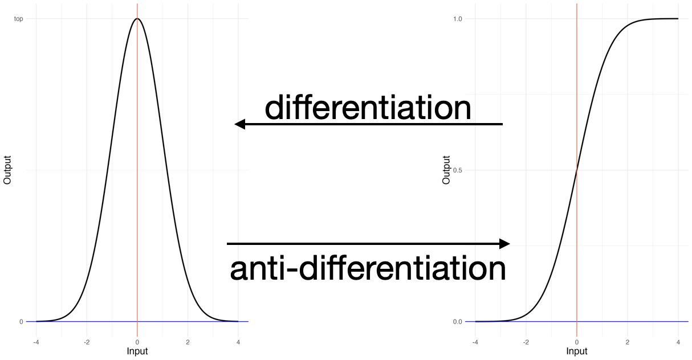
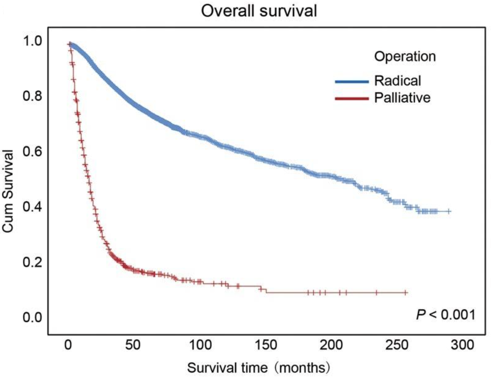

# Accumulation {#sec-accumulation}



```{r include=FALSE}
#| label: ch15-r-cd6c7d55
source("_start-up.R")
# source("R/core-modeling-profiles.R")
source("_software/slope_rose.R")
```

::: {.aside}
`r paste(readLines("_Words/chap_15.txt"), collapse = "\n")` 
:::

Here are a couple of definitions of "accumulation" from the [Oxford Languages]() dictionary.


> *The acquisition or gradual gathering of something. Example: "the accumulation of wealth"*
>
> *A mass or quantity of something that has gradually gathered or been acquired. Example: "the accumulation of paperwork on her desk"*

The previous chapter focused on turning a function into another function that gives the instantaneous rate of change. That process is called *differentiation*. This chapter is about going the other way: starting out with a function that is the derivative of something, and figuring out what that something is. Consider these scenarios:

1. A beachcomber starts with an empty basket and walks north along a beach. Roughly once every five minutes, she sees a collectible shell. She picks it up, places the shell in her basket, and walks on. At the end of a long, two-hour excursion, how many shells has she accumulated?

2. An intern works at a large accounting firm during rush season. He gets paid $25/hour, increasing to $37.50 if he works "overtime," that is, more than 40 hours in a week. At the end of the week, he has worked 68 hours. What are his accumulated earnings for the week?

3. An epidemic spreads through a community. On the first day, only a couple of people catch the virus. But as more people become infected, the infection rate increases, reaching 20 new cases on the 7th day. The health department keeps a daily list of new cases. Overall, how many names accumulate during the first ten days?

Each of these three scenarios involves a quantity accumulating over time: shells, money, and people falling ill. And each involves one or more *rates of change* and a *duration*

1. One shell per 5 minutes over a two-hour walk. 
2. $25 per hour, going up to the "time-and-a-half" rate of $37.50 per hour after 40 hours worked over 68 total hours.
3. Two new cases per day, increasing to a rate of 20 new cases per day at the end of the first seven days.

Solving the *shell-collection* problem is straightforward: *Multiply the rate times the duration*:

$$\frac{1}{5} \frac{\text{shell}}{\text{minute}} \times 2\, \text {hours} = 
\frac{2}{5}\, \text{shell} \times \frac{\text{hour}}{\text{minute}} = \frac{2}{5} \text{shell} \times \frac{60\ \text{minute}}{\text{minute}} = \frac{120}{5} \text{shell} = 24\, \text{shell}$$

The wages problem involves more bookkeeping. The first 40 working hours are paid at a rate of $25/hour. Multiply the rate times the duration, $$40, \text{hours} \times \$25/\text{hour} = \$1000\ ,$$ giving $1000 for that part of the week. The remaining 68 - 40 = 28 hours are paid at $37.50/hour: $$28, \text{hours} \times \$37.50 / \text{hour} = \$1050 .$$
Adding these two components gives  $1000 + $1050 = $2050 in overall earnings for the week.

The epidemic problem is more difficult because the infection rate (new cases per day) is changing during the week under consideration. This change in rate is also seen in the wages problem, where the wage rate changed from $25 to $37.50 during the period of interest.

Even though the three problems appear to differ in complexity, they can all be solved by the same mathematical method. We call this method "accumulation," but it is more widely known by the standard mathematical term "integration".

\newpage

## The rate-of-change framework

To understand why the three problems posed above can be solved by a single method, let's restate them in a common framework. For each, we'll depict the instantaneous rate of change (with respect to time) as a function of time. The output of the three functions is variously shells/hour, dollars/hour, and cases/day. The left column in @fig-three-problems-roc shows the three rate-of-change functions.

```{r}
#| label: fig-three-problems-roc
#| warning: false
#| layout-ncol: 2
#| echo: false
#| fig-cap: The rate of change function for each of the three scenarios.
#| fig-cap-location: "top"
#| fig-subcap:
#| - Shell collection rate
#| - Shells collected so far
#| - Wage rate
#| - Wages earned so far
#| - New cases rate
#| - Total cases to date
f1 <- function(t) {
  ifelse(t < 0 | t > 2, 0, 12) 
}

f2 <- function(t) {
  ifelse(t < 40, 25, 37.50)
}
f3 <- function(t) {
  2 + 18*t/7
}

F1 <- antiD(f1(t) ~ t)
F2 <- antiD(f2(t) ~ t)
F3 <- antiD(f3(t) ~ t)

slice_plot(f1(t) ~ t, domain(t = -0.5:2.5), npts=1000) |>
  gf_labs(x = "Hours into walk", y = "Shells collection rate (shells per minute)") |> 
  gf_theme(theme_minimal()) |>
  gf_lims(y = c(0, 12))

slice_plot(F1(t) ~ t, domain(t = -0.5:2.5), npts=1000) |>
  gf_labs(x = "Hours into walk", y = "Shells") |> 
  gf_theme(theme_minimal()) |>
  gf_lims(y = c(0, NA))

slice_plot(f2(h) ~ h, domain(h = -10:110), npts=1000) |>
  gf_vline(xintercept = c(40), color = "white", linewidth = 1.5) |>
  gf_labs(x = "Hours worked", y = "Wage rate ($/hr)") |>
  gf_theme(theme_minimal()) |>
  gf_lims(y = c(0,40))

slice_plot(F2(h) ~ h, domain(h = -10:110), npts=1000) |>
  gf_labs(x = "Hours worked", y = "Wages ($)") |>
  gf_theme(theme_minimal()) |>
  gf_lims(y = c(0,NA))

slice_plot(f3(d) ~ d, domain(d = 0:7)) |>
  gf_labs(x = "Days into epidemic", y = "New cases per day") |>
  gf_theme(theme_minimal()) |>
  gf_lims(y = c(0,25))

slice_plot(F3(d) ~ d, domain(d = 0:7)) |>
  gf_labs(x = "Days into epidemic", y = "Total cases to date") |>
  gf_theme(theme_minimal()) |>
  gf_lims(y = c(0,NA))
```

The right-hand column of @fig-three-problems-roc shows accumulations of the rate-of-change functions in the left column. Calculating the accumulation from the rate-of-change function is a fully automated process called "anti-differentiation" that requires little or no creative input.

## Example: Figuring taxes owed

`r xf("sec-on-the-margins")` discussed the calculation of income taxes *on the margin*. The tax law specified the *marginal* tax rate at each level of income. (See `r xf("tbl-1913-brackets")`.)

As discussed in `r xf("sec-rates-of-change")`, *differentiation* is the name given to finding a marginal function from a "mother" function. The function so derived is called a *derivative*. These names point to a critically important habit of mind for quantitative reasoners: we think about relationships such as `r xf("tbl-1913-brackets")` as *functions*. Why is this important? Knowing that the relationship is a function reminds us of a set of operations that can be performed on it to put it in a more useful form for whatever purpose is at hand.

Consider the purpose originally served by the tax-bracket table: to inform members of Congress the exact policy they were imposing on taxpayers. The tax-bracket table does not serve another purpose very well: enabling taxpayers to easily figure out what they owe. The result is tax forms like that in `r xf("fig-1913-1040")` which are potentially off-putting.

<!--[Possibly, the legislators did not completely understand their own policy, not envisioning the sort of calculation illustrated in `r xf("fig-1913-1040")`. Senator Elihu Root wrote to a correspondent: "I guess you will have to go to jail. If that is the result of not understanding the Income Tax law I shall meet you there. We will have a merry, merry time, for all our friends will be there. It will be an intellectual center, for no one understands the Income Tax law except persons who have not sufficient intelligence to understand the questions that arise under it." [Source](https://www.taxnotes.com/tax-history-project/tax-history-original-intent-and-revenue-act-1913/2013/09/30/f7h8)]{.column-margin} -->


Quantitative reasoners who know about differentiation and derivatives have a powerful framework for simplifying the presentation of marginal tax-rate information to taxpayers. Since the *marginal* tax rate is a function, we can graph it. (@fig-tax-rate-functions(a))

```{r}
#| label: fig-tax-rate-functions
#| echo: false
#| layout-ncol: 2
#| fig-cap: "Tax-rate functions"
#| fig-cap-location: top
#| fig-subcap: 
#| - "Marginal rate"
#| - "Total rate"
T1913 <- tibble::tribble(
  ~ income, ~ rate, ~ cumulative,
  0, 0, 0,
  3000, 1, 0,
  20000, 2, 170,
  50000, 3, 1070,
  75000, 4, 2070,
  100000, 5, 3320,
  250000, 6, 12320,
  500000, 7, 29820,
  1000000, 7, 64820
) |>
  mutate(cum_rate = ifelse(cumulative > 0, 100*cumulative/income, 0))

margfun <- 
  function(income) {
    ifelse(income < 3000, 0,
           ifelse(income < 20000, 0.01,
                  ifelse(income < 50000, 0.02,
                         ifelse(income < 75000, 0.03,
                                ifelse(income < 100000, 0.04,
                                       ifelse(income < 250000, 0.05,
                                              ifelse(income < 500000, 0.06, 0.07)))))))
  }
                                                
slice_plot(margfun(income) ~ income, domain(income = 0:1e6), npts=1000) |>
  gf_labs(x = "Income ($)", y = "Marginal Rate") |>
  gf_vline(xintercept = 200000, color = "blue") |>
  gf_theme(theme_minimal(base_size = 16))

totalfun <- antiD(margfun(income) ~ income)
slice_plot(totalfun(C=0, income) ~ income, 
           domain(income = 0:1e6), npts=1000) |>
  gf_labs(x = "Income ($)", y = "Total Tax Owed ($)") |>
  gf_vline(xintercept = 200000, color = "blue") |>
  gf_theme(theme_minimal(base_size = 16))

```


The two functions in @fig-tax-rate-functions convey the same information, but in different forms. The *marginal rate* function (@fig-tax-rate-functions(a)) literally the Congressional policy. Using it, you can look up the *marginal* tax rate at any income. For example, a blue vertical line has been drawn at an income of $200,000. The marginal tax rate at that income is exactly 5%. Even so, the tax-payer does *not* owe $200,000 $\times$ 5% = $10,000. The 5% refers to the additional tax owed on a small incremental increase in income. 

The *total tax owed* function (@fig-tax-rate-functions(b)) is set up to suit people calculating how much to pay. The output is the amount of tax owed. At the blue line for a $200,000 income, the tax owed is $860.

This is not a book about income tax calculations. The important point is about the connection between the two functions shown in @fig-tax-rate-functions. This sort of connection is fundamental to quantitative reasoning. 
@fig-tax-rate-functions(a) is the *derivative* of @fig-tax-rate-functions(b). No new information is needed to construct @fig-tax-rate-functions(a) from @fig-tax-rate-functions(b); they are merely different ways of representing the same information.

As we said, function (a) is the *derivative* of (b). The derivation of (a) from (b) is done by the process of *differentiation*, that is, calculating marginal rates of change 

It is equally possible to compute function (b) from function (a). Math textbooks call the computational process `r xf_definition("integration")` or, almost the same thing, `r xf_definition("anti-differentiation")`. A good, everyday word to describe the process is `r xf_definition("accumulation")`. Function (b) accumulates the marginal tax payments over the entirety of the taxpayer's income.

The connection between *differentiation* and *anti-differentiation* (which is so clear from the words used) is important in practice. Many of our core modeling functions are derivative/anti-derivative pairs.

Calculus students memorize such patterns. We defer to the exercises a description of the processes by which anti-derivatives can be computed. This is for two reasons: 1) the process is automatic, 2) the main point is to know, whenever you are working with a function, whether its derivative or anti-derivative might be a better form than the function itself for the purpose a model is being built for. 

## Anti-differentiation

There are various algorithms for calculating the anti-derivative of a rate-of-change function. Traditional calculus students learn---or, at least, study!---algebraic techniques that can become puzzle-solving problems of considerable difficulty. Sometimes, there is no algebraic solution. But finding the anti-derivative need not be a puzzle. Here, we will demonstrate the idea graphically. To illustrate, we will use an important pair of functions related by differentiation and anti-differentiation. 


::: {#fig-diff-antidiff}


`hill()` and `hillside()` are a derivative/anti-derivative pair.
:::

The hill() function gives the *derivative*---that is, the rate-of-change function---of the hillside() function. Conversely, the hillside() function is the *anti-derivative* of the hill() function. Differentiation turns a function into its rate-of-change function. Anti-differentiation undoes differentiation.

A homey metaphor may help here. Imagine a family of functions mutually related by differentiation or anti-differentiation. We'll label the functions Francis, Georgia, Heather, Ulrika, and Victoria: F(), G(), H(), U(), V(). The relationships among these functions are that G() is the derivative of F(), H() is the derivative of G(), H() is the derivative of H(), and so on. In human terms, these functions correspond to succesive generations in a family. Francis is the great-grandmother, Georger the grandmother, Heather the mother, Ulrika the daughter, and the grand-daughter is Victoria. Differentiation is the function that takes a person and produces their direct offspring. Anti-differentiation takes a function and produces their mother.

For demonstration purposes, to see how an anti-derivative can be calculated, let's break convention and use a special graphical format to display a rate-of-change function. 

Keep in mind that differentiation contructs an new "daughter" function from a "mother" function. Finding the daughter is straightforward; it is the function whose **value** at any input corresponds to the **slope** of the mother at that same input. @fig-segmentize shows a function F(x) in black, and a kind of compass for measuring slopes. The slope of F() varies across the input values. We can calculate that slope for many different input values. Ordinarily we would plot the derivative---that is, the daughter function---using the vertical axis for the measured slope. 

But @fig-segmentize(a) shows the daugher function (in [blue]{style="color: blue;"}) not in the usual way as a value, but instead as a small, sloped line segment. The reader can confirm this by matching each [blue line segment]{style="color: blue;"} to the slope of the black function directly above or below it.

```{r}
#| label: fig-segmentize
#| fig-cap: "A function (black) with its rate-of-change function depicted as short inclined segments (blue)." 
#| fig-cap-location: bottom
#| fig-subcap: 
#| - "Differentiation gives the slope for any input."
#| - "Anti-differentiation accumulates the slopes to reconstruct the function (gray)."
#| echo: false
#| warning: false
#| layout-ncol: 2
f <- doodle_fun(~ x, seed = 133)
Pts <- Znotes::segmentize(f(x) ~ x, h=0.25, domain(x=-5:5), npts=1) |>
  dplyr::mutate(top = cumsum(ymax - ymin), bottom=top - (ymax-ymin))

slice_plot(f(x) ~ x, domain(x=-5:5), color = "black") |>
  gf_segment(ymin + ymax ~ xmin + xmax, data = Pts, color="blue", size=1.5) |>
  # gf_segment(bottom + top ~ xmin + xmax, data = Pts) |>
  gf_lims(y=c(-4,10)) |>
  # gf_errorbar(0 ~ -2.35 + -1.85, color="blue", width=2) |>
  # gf_text(0 ~ -2.25, label="dx", color="blue", vjust=-1) |>
  gf_labs(y="Output of F(x)") |>
  slope_rose(nice_slopes = c(-2.5, -2, -1.5, -1, -0.5, 0, 0.5, 1, 1.5, 2, 2.5), y = 2.5, x = 0) |> 
  gf_theme(theme_minimal())

slice_plot(f(x) ~ x, domain(x=-5:5), alpha = 0) |>
  gf_segment(bottom + top ~ xmin + xmax, data = Pts, color = "green", size = 1.5) |>
  gf_segment(ymin + ymax ~ xmin + xmax, data = Pts, color="blue", size=1.5) |>
  gf_lims(y=c(-4,10)) |>
  # gf_errorbar(0 ~ -2.35 + -1.85, color="blue", width=2) |>
  # gf_text(0 ~ -2.25, label="dx", color="blue", vjust=-1) |>
  gf_labs(y="Output of F(x)") |>
  slope_rose(nice_slopes = c(-2.5, -2, -1.5, -1, -0.5, 0,  0.5, 1, 1.5, 2, 2.5), y = 2.5, x = 0) |> 
  gf_theme(theme_minimal())

```

Anti-differentiation is the process of accumulating the sloped segments to reconstruct a function with those slopes. The accumulation itself is child's play. Start with the leftmost segment. Raise the segment next to it so that the two segments match. Continue the process by moving to the next segment, and so on.

Playing this child's game of connecting the segments by moving each segment vertically traces out the green curve. Evidently, the green curve has the same **shape** as the original mother function F(). 

The green curve runs parallel to the original F() but can have a different vertical position. Why? The game-playing child is free to place the first segment at any vertical position she likes. The reconstructed function will be moved up or down accordingly. When we accumulate, whether seashells or inclined segments, we are free to specify how much was "in the basket" when we started.


## Example: QALYs versus cost

`r xf("fig-QALY-vs-cost")` showed functions for the number of quality-adjusted life-years saved and the expenditure on each of two hypothetical programs, which we called Natal and Cancer. Where did these functions come from? The quick answer is that the functions are the anti-derivatives of another function. That other function, the derivative of QALYs(expenditure), has a simple logic that can easily be illustrated. Such a situation is common across many areas of science or quantitative reasoning. Indeed, we saw it in `r xf("sec-dynamics")`. The SIR model is merely a description of the rates of change of susceptibles and infectives as functions of the numbers in each group. Tracking the course of the epidemic over time was a mechanical operation ("Euler's method") that integrated the rate-of-change functions. 

Consider now the QALY(expenditure) function for the Cancer program. From ongoing public health data collection, we know the `r xf_definition("incidence")` of cancer cases, that is, how many new cases arise in a year. We also have a good idea, from medical experience, of *survival times* for people with cancer and how survival is different with and without treatment. To illustrate, @fig-colon-survival shows "survival curves" for colon cancer victims, comparing those who underwent radical surgery to those where the surgical intervention was merely palliative.

::: {#fig-colon-survival} 



Comparative survival curves for people undergoing surgery for colon cancer. [Source](https://pmc.ncbi.nlm.nih.gov/articles/PMC8677537/figure/goab048-F1/)

:::

`r qr_margin_note(
  "https://pmc.ncbi.nlm.nih.gov/articles/PMC8677537/figure/goab048-F1/",
  paste("Source for", xf("fig-colon-survival"))
)` 

@fig-colon-survival shows two survival "curves" constructed from patients' records in a clinical study. Each curve is a function that takes months of survival as input and returns as output the fraction of all patients who survived that long. For instance, about 60% of patients who underwent radical surgery survived for 100 months, whereas only about 15% of palliative-treatment patients survived that long.

`r qr_margin_note(
  "https://www3.mdanderson.org/app/medcalc/index.cfm?pagename=coloncancer",
  "Colon-cancer calculator"
)`

The advantage of thinking of survival time as a function is that we can imagine what other inputs might go into the function. For instance, we might have patient age, sex, and stage of cancer at the time of diagnosis, or other information. Such functions are often constructed by researchers. An example, for colon cancer, is linked to in @fig-mdanderson-calculator.

::: {#fig-mdanderson-calculator}


A calculator for (average) survival time with colon cancer. [Link](https://www3.mdanderson.org/app/medcalc/index.cfm?pagename=coloncancer).
:::


Using such functions, we can compute the expected survival time for each age or cancer-stage class of patients diagnosed with colon cancer. More specifically, we can compute the average *extra* survival time for those who undergo radical surgery.

[This illustrates an important distinction between public health and medicine. For an individual patient, a medical doctor might prefer to present the survival curve to show the range of possible outcomes. But for social policy making, we are not dealing with individuals but *groups* of people. This is the public health perspective. Average outcome gives a good indication for the group as a whole.]{.column-margin}

For the sake of argument, we will imagine that the average *extra* survival time is a decreasing function of age. That is, younger patients are more likely to survive longer. Perhaps this is more easily seen in reverse. An elderly patient is, for various reasons, unlikely to survive the 20-year period covered by the survival curve. @fig-survival-sketch sketches out what the *extra* survival time verus age function might look like. 

```{r}
#| label: fig-survival-sketch
#| echo: false
#| fig-cap: "A sketch of an imagined function giving *extra* survival time versus age."
survive <- function(age) {
  10 * hillside(-(age-60)/12)
}
slice_plot(survive(age) ~ age, domain(age = 30:80)) |>
  gf_labs(y = "Years of survival", x = "Age at diagnosis") |>
  gf_lims(y = c(0,10)) |>
  gf_theme(theme_minimal(base_size = 16))

```

The detailed calculation needed to translate @fig-survival-sketch into a function of QALYs saved per person treated is hard to understand without extensive modeling experience. But the general outline is accessible. Using only the treatment cost and the age distribution of incidence, we can translate the horizontal axis into the total cost of treating all people up to any given age. The result will be a graph showing the marginal years saved at each cost. Accumulating (anti-differentiating) that marginal years saved function over the cost produces the curve shown in `r xf("fig-QALY-vs-cost")`(b). 

The point for us is that figuring out relationships like that in `r xf("fig-QALY-vs-cost")`(b) is based on several habits of experienced quantitative reasoners:

1. Thinking of years saved *on the margin*, that is, the function that describes how many years are saved for each additional unit of cost.

2. Knowing that the on-the-margin function corresponds to another function, total years saved versus cost, that is an ordinary anti-derivative of the function in (1). 

3. Realizing that the function in (1) is much easier to justify, a good format for representing the relationship between years saved and cost, so putting our effort into modeling (1) and then using the automatic process of anti-differentiation to produce the function in (2).


## Example: Predicting peak population

Sometimes, clear patterns in the rate-of-change function can be easily modeled, but then need to be translated via antidifferentiation to display the information of interest. An instance of this is seen in the population of the US, as it has grown over the centuries.

Every 10 years, starting in 1790, the US Census Bureau carries out a constitutionally mandated census: a count of the current population. The overall count as a function of year is shown in @fig-pop-growth. 

```{r}
#| label: fig-pop-numbers
#| echo: false
#| message: false
#| warning: false
#| fig-cap: "Population of the US according to the Census. [[Source](https://en.wikipedia.org/wiki/Demographic_history_of_the_United_States)]"
#| fig-cap-location: bottom
USPop <- readr::read_csv("www/census-totals.csv")
Tmp <- USPop |> 
  mutate(population=prettyNum(population, big.mark=",")) |>
  select(-growth_rate)
Table <- if (knitr::is_html_output()) {
  DT::datatable(Tmp) 
} else {
  knitr::kable(Tmp)
}
USPop <- USPop |> 
  mutate(population = population/1e6)
```

`r qr_margin_note(
  "https://en.wikipedia.org/wiki/Demographic_history_of_the_United_States",
  paste("Source for", xf("fig-pop-numbers"))
)`

In the 230 years spanned by the census data, the US population has grown 100-fold, from about 4 million in 1790 to about 330,000,000 in 2020. @fig-pop-growth shows the growth. Note that there is a lot of fluctuation in the data. These are not just random. The deviations correspond to historical events. There is a relatively low growth rate from 1860 to 1870, due to the US Civil War. The Great Depression is evident in the very low growth rates from 1930 to 1940. Baby Boom: look at the growth from 1950 to 1960. The bump from 1990 to 2000? Not coincidentally, the 1990 Immigration Act substantially increased the yearly rate of immigration.


```{r echo=FALSE, warning=FALSE} 
#| label: fig-pop-growth 
#| layout-ncol: 2
#| fig-cap: "Two views of population growth in the US."
#| fig-cap-location: top
#| fig-subcap: 
#| - Population
#| - Rate of change in population with respect to time
popfun <- spliner(population ~ year, data = USPop)
USPop <- USPop |>
  mutate(growth = population - lag(population)) |>
  mutate(ygrowth = growth/10) |>  # yearly growth
  mutate(prop_growth = ygrowth/population) |>
  mutate(yearly_growth_rate = 100*((1+growth_rate/100)^(1/10) - 1)) |>
  mutate(theory = 0.0194 * population) |>
  mutate(exp_pattern = 3.93*1.0194^(year - 1790)) |>
  mutate(exp_pattern2 = 3.93*1.031^(year - 1790))
mod <- lm(population ~ poly(year, 2), data = USPop)
modf <- makeFun(mod)
P1 <-gf_point(population ~ year, data = USPop) |>
  gf_line(population ~ year) |>
  gf_labs(y="Population (millions)", x = "Year") |>
  gf_line(exp_pattern ~ year, color = "blue", alpha = 0.5) |>
  gf_line(exp_pattern2 ~ year, color = "tomato", alpha = 0.5) |>
  gf_text(400 ~ 1940, label = "3.1%", color = "tomato", alpha = 0.5, inherit = FALSE) |>
  gf_text(350 ~ 2020, label = "1.94%", color = "blue", alpha = 0.5, inherit = FALSE) |>
  gf_lims(x = c(1790, 2100), y=c(0,500))
# P2 <- gf_point(population ~ year, data = USPop) |>
#   gf_point(500 ~ 2100, alpha=0) |>
#   gf_line(population ~ year) |>
#   gf_labs(y="Population (millions)", x = "Year") |>
#   gf_refine(scale_y_log10(breaks=100*(0:5))) |>
#   gf_lims(x = c(1790, 2100))
P2 <- gf_point(ygrowth ~ year, data = USPop) |>
  gf_line(ygrowth ~ year) |>
  gf_lm(ygrowth ~ year, color = "blue") |>
  gf_labs(y="Yearly population growth (millions)", x = "Year") |>
  gf_lims(x = c(1790, 2100), y=c(0,3.5))

mod <- lm(ygrowth ~ population - 1, data = USPop)
P3 <- gf_point(ygrowth ~ population, data = USPop) |>
  gf_line(ygrowth ~ population) |>
  # gf_abline( intercept = 0, slope = coef(mod), color = "blue") |>
  gf_line(theory ~ population, color = "blue") |>
  gf_labs(y="Yearly population growth (millions)", x = "Population (millions)") |>
  gf_lims(x = c(0,500), y=c(0,3.5))
P4 <- gf_point(yearly_growth_rate ~ year, data = USPop) |>
  gf_line(yearly_growth_rate ~ year) |>
  gf_lm(yearly_growth_rate ~ year, color = "blue") |>
  gf_labs(y="10-year population growth (millions)", x = "Year") |>
  gf_lims(x = c(1790, 2100), y=c(0,3.5))
P1 |> gf_theme(theme_minimal(base_size = 16))
P2 |> gf_theme(theme_minimal(base_size = 16))
```

Both panels in @fig-pop-growth are based on the Census data. Panel (a) plots the actual population. The upward curving pattern of the data (in black) in panel (a) is reminiscent of exponential growth. We annotated the data with two curves, both with strict exponential growth at the year percentage rates indicated. In the context of actual exponential growth, the data do not convincingly show exponential growth.

The rate of change in population (with respect to time) is the slope of the segments in panel (a). Panel (b) translates that slope into position along the vertical axis. The blue line in panel (b) guides the eye to see an ascending, straight-line pattern in the data, admittedly with some sharp, decade-long deviations from the line.

One is tempted to conclude from @fig-pop-growth that, if the US population follows the historical pattern, it will continue to grow at an ever-faster rate. However, that conclusion is not well-founded. The problem is the lack of a theoretical framework for interpreting the data.

`r xf("sec-dynamics")` has some lessons to teach about growth, particularly exponential growth. Remember that the Euler framework for dynamics does not start with a time series, such as those in @fig-pop-growth. Instead, the Euler framework starts with a *dynamical rule*, the function that takes the *state* of the system (population, here) and turns it into a rate of change with respect to time. The plots in @fig-pop-growth have *time* on the horizontal axis, not population. @fig-pop-dynamics(a) presents the data in dynamical rule format: change in state (with respect to time) versus state.

```{r}
#| label: fig-pop-dynamics
#| echo: false
#| warning: false
#| layout-ncol: 2
#| fig-cap: Plotting dynamics of growth
#| fig-cap-location: top
#| fig-subcap: 
#| - Dynamical rule
#| - Proportional change (%) of state
P3 |> gf_theme(theme_minimal(base_size = 14))
P4 |> gf_theme(theme_minimal(base_size = 14))
```


@fig-pop-dynamics(a) plots the yearly rate of change (with respect to time) versus the population. The format is exactly that of a dynamical rule in the Euler framework. True exponential growth corresponds to a same() dynamical rule. (See `r xf("fig-steady-dyn")`.) The particular dynamical rule shown corresponds to 1.94%. That is, the blue line shows the dynamical rule that is 
$$\text{ROC population}(P) \equiv 1.0194\, P\ .$$ {#eq-194-percent}

The 1.94% per year dramatically overstates population growth when the population exceeds 100 million, a level reached by 1920. At 100 million and above, the data *suggest* a lower rate of growth. Owing to the peaks and dips in the data, it is hard to see a straight line above 100 million population. Nonetheless, the dynamics are clearly different above 100 million than they were below that.

One way to incorporate *changing dynamics* into @eq-194-percent is to replace the 1.0194 with a function of year. We will call it r(year), and we would like the data to show us what it is. For this, we need to plot r(year) versus *year*, not population. @eq-194-year re-arranges @eq-194-percent to emphasize that both ROC population and population themselves are functions of *year*.

$$\text{ROC population}(year) \equiv r(year)\, P(year)$$
or
$$r(year)\equiv \frac{\text{ROC population}(year)}{\text{P}(year)} .$$ {#eq-194-year}

To see the form of r(year) from the data, plot $\frac{\text{ROC population}(year)}{\text{P}(year)}$ versus year. @fig-pop-dynamics(b) does this. It is much easier to infer from the data in @fig-pop-dynamics(b) a pattern of a linearly decreasing (with respect to time) yearly growth rate (r(year)).


If the trend (blue line in @fig-pop-dynamics(b)) in the growth rate continues, the US will reach zero net growth around 2070, then enter negative growth. Of course, negative growth is just decline. A simple prediction from `r xf("fig-pop-growth")`(b) is that the argmax of the US population---that is, the year that the growth rate reaches zero---will occur around 2070.

Using the tools of mathematical accumulation, we can accumulate the rate of change (that is, r(year) P(year)) over future years to estimate the future population. @fig-population-future shows the result.

```{r}
#| label: fig-population-future
#| echo: false
#| warning: false
#| fig-cap: "The Census population data along with the function forecasting future population based on the rate-of-change model in @fig-pop-dynamics(b)"
growth_mod <- lm(yearly_growth_rate ~ year, data = USPop)
growth_fun <- makeFun(growth_mod)
accum <- tibble(year = 2021:2130,
                pop = 331 * cumprod(1 + growth_fun(2021:2130)/100))

gf_point(population ~ year, data = USPop) |>
  gf_labs(y="Population (millions)") |>
  gf_lims(x = c(1790, 2130), y=c(0,450)) |>
  gf_line(pop ~ year, data = accum, color="magenta") |>
  gf_point(404.4 ~ 2060, color="dodgerblue", size=1) |>
  gf_theme(theme_minimal(base_size = 16))
```


According to the accumulation model, the population peaks in 2075 at 390 million. We will be back down to the present population level in about 100 years. 

Professional demographers construct much more sophisticated models using detailed data from many sources and, as needed, take into account the age structure of the population to predict future births. The demographers at the US Census Bureau predict that the population will reach a maximum of 404 million in 2060, shown by the little blue dot in @fig-population-future. That is not too different from what we got by analyzing the raw census numbers alone. Importantly, we analyzed those numbers in the context of the Euler framework (`r xf("sec-dynamics")`), formulating a model dynamical rule and using the *accounting method* (that is, *accumulation*) to translate the dynamical rule into a time series.

