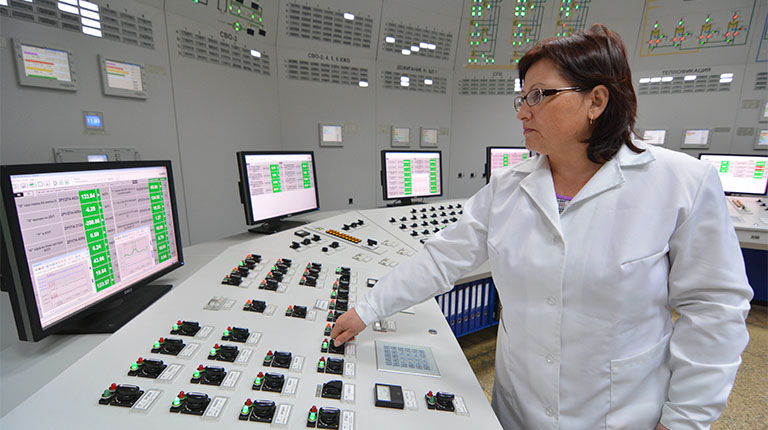
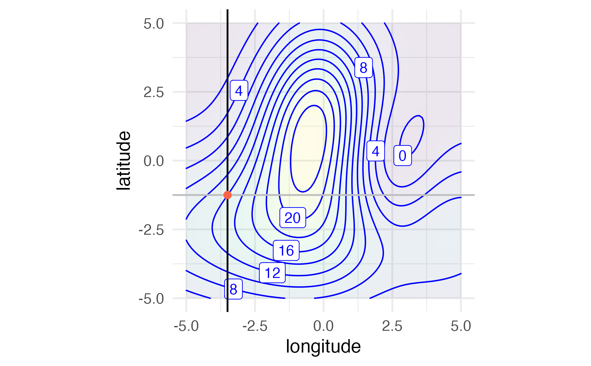
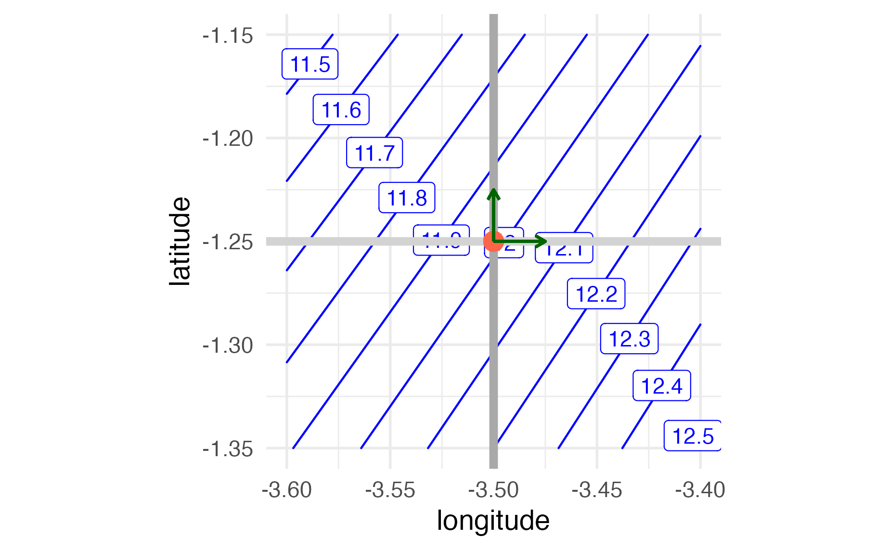
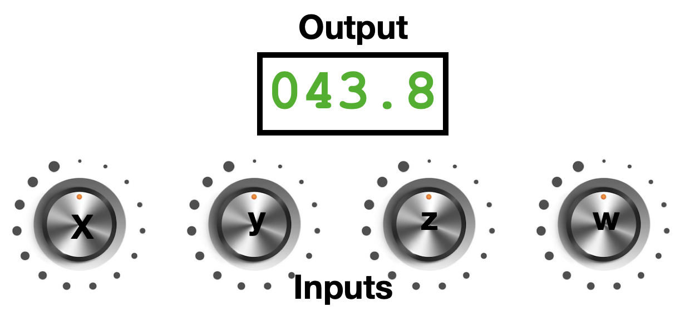
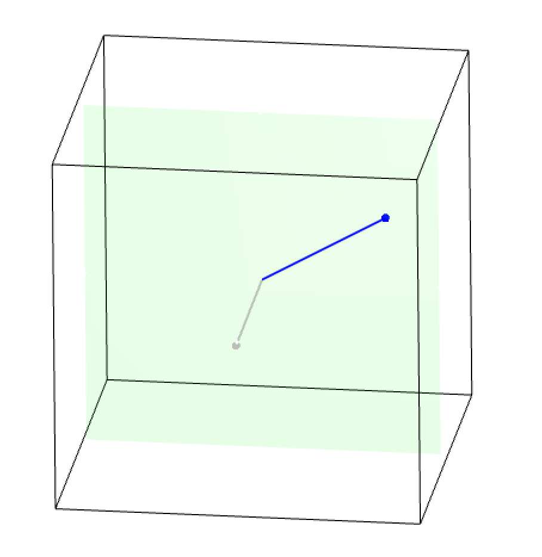
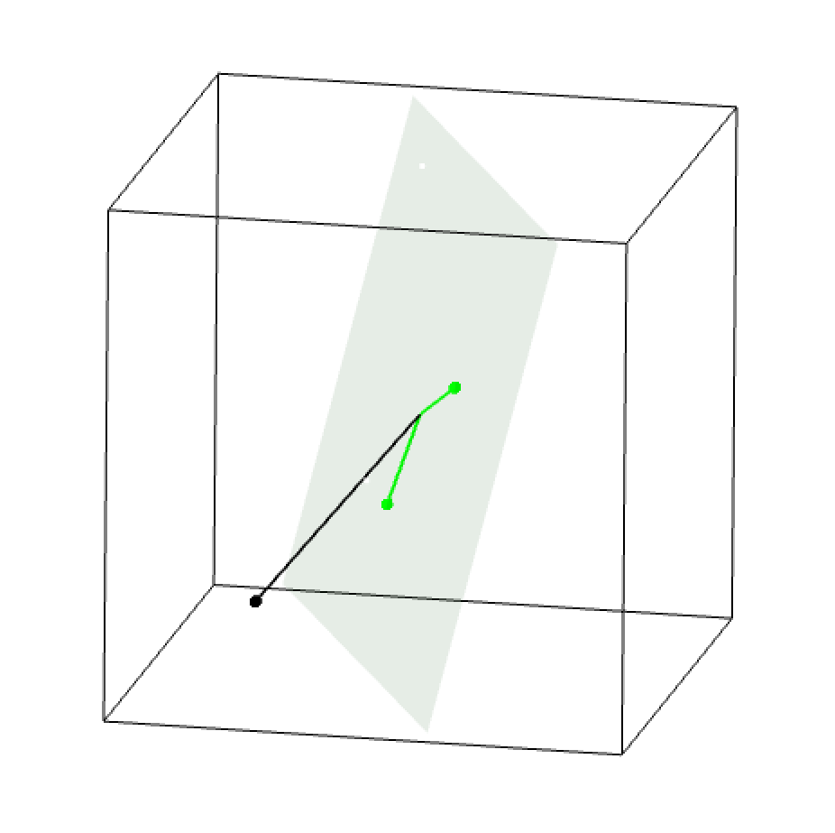
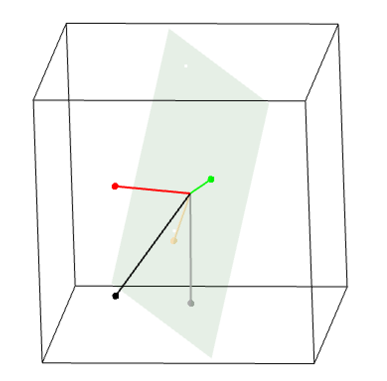
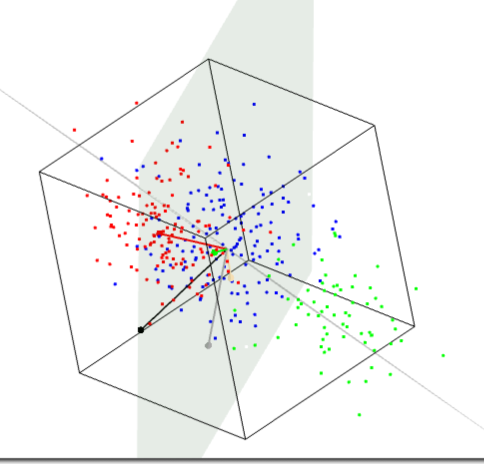
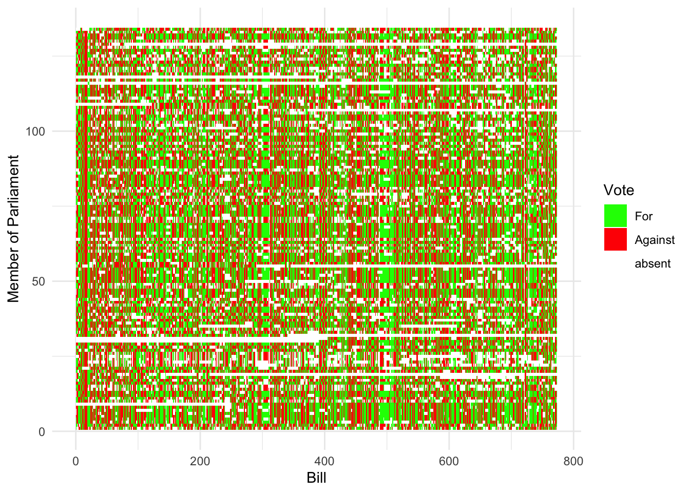
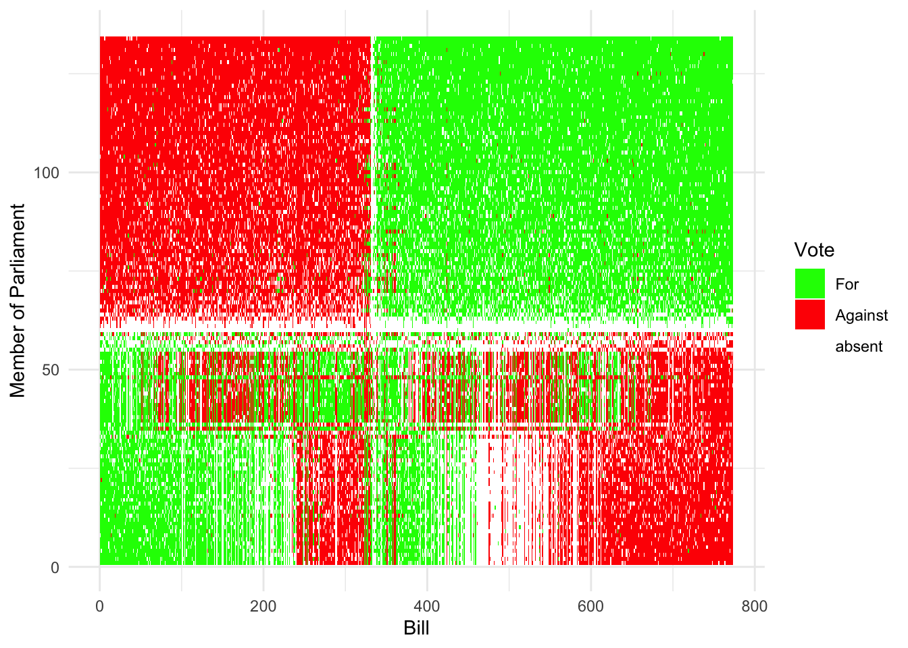

playground.tensorflow.org gives an example of training.


# Moving Past Two Inputs {#sec-moving-past-two-inputs} 



```{r include=FALSE}
#| label: ch16-r-de4e425b
source("_start-up.R")
library(rgl)
knitr::knit_hooks$set(webgl = hook_webgl)
# This is recommended by the documentation for automatic rendering:
setupKnitr(autoprint = TRUE) 
```

In previous chapters, we introduced a framework for quantitative thinking, highlighting dimensionality, which relates aspects of the world through mathematical relationships, such as between location and velocity or between energy and power.

* Functions and their input spaces describe how different aspects of the world are related. They also provide a way to express uncertainty and likelihood, and to extract information from data in a Bayesian style.
* magnitudes as a device for relating the very large to the very small;
* Rates of change and accumulation are versatile tools. They represent dynamics, guide decisions, and capture common relationships among aspects of the world.

This framework developed over centuries, spurred by ingenuity, insight, and technological advances like computing.

In this final chapter, we bring together these components to show how the framework enables new forms of quantitative reasoning. These new approaches take on many forms; for example, the emergence of Large Language Models that attempt to capture meaning in text.


## Revising high-school algebra

To start, we examine two familiar high school algebra problems. Techniques for these were developed when paper and pencil were students' only tools. Unsurprisingly, such methods are ineffective with several variables—and even less so with large quantities.

1. Find "solutions", "x-intercepts," and "roots." These words signal the same kind of problem: finding function inputs that result in a specified output. Here, a "solution" is a value of x that makes the equation true, an "x-intercept" is a point where the graph crosses the x-axis, and a "root" is another term for a solution. For example, you might be asked to find the roots of a polynomial such as $x^2 - 2 x - 3$. This is the same as "solving" $x^2 - 2x - 3 = 0$.

2. Solve `r xf_definition("simultaneous equations")`. There is more than one function, each sharing the same inputs. You want to find the input values that make each function reach a specified value. In textbooks, a simultaneous equation problem usually appears like this: there are always the same number of equations as input variables.

$$\begin{array}{ccccc}
5\,  x & - & 2\,  y & =& 4\\
2\, x & + &3\,y& = & -2
\end{array}$$

A third problem setting, `r xf_definition("optimization")`, is important across applications of quantitative reasoning. It is just beyond the reach of high school algebra methods. An example in the style of high-school algebra is: Given that $x,y = 100$, what values of $x$ and $y$ give the smallest value for $x + y$?^[Or, given that the area of a rectangle is 100 in^2^, what should the side lengths be so the perimeter is as short as possible.]

These three problem settings are important in practice. Imagine yourself controlling a complex system: adjusting valves, pumps, and burners in a chemical plant, or managing logistics to source components for a product like a cell phone. @fig-control-panel shows a generic image of this situation.

::: {#fig-control-panel}


A control panel for managing a complex system. Image source
:::

Perhaps your task for the day is to adjust the controls so the tank's temperature and pressure stay at the right levels. You need to adjust dials, flip switches, and so on. Or, in a bigger task, you might have to maximize plant productivity while staying within limits on quality and safety.

These tasks fit into a framework for finding solutions or optimizing. You don’t have the system’s "equations," but you have some basic knowledge, outputs from various gauges, and switches and dials to set inputs. Quantitative tools here differ from the symbol manipulation found in high school problems. Let’s examine these tools and how they relate to topics from previous chapters.

## Walking uphill

Every child knows how to get to the top of a hill: walk uphill! In this section, we look at the basic mathematics of walking uphill. We then extend it to the realistic case where the entire scene is hidden by impenetrable fog.

We want to solve quantitative problems by walking uphill (or downhill) to find solutions and optimize. For illustration, we create mathematical hills and explore ways to move in the right direction.

Our mathematical hills will be functions. The function's output is the hill's elevation. The inputs are the location where you are standing, and the latitude and longitude. For simplicity, we start with functions with a single input, as if you were obliged to walk along a road to get to the top of the hill. The function's input is the position along the road.

```{r}
#| label: fig-hill-1
#| echo: false
#| fig-cap: "Elevation vs position along a road"
raw <- doodle_fun( ~ x, seed = 8329)
f <- function(x) 30 + raw(x-2)
slice_plot(f(distance) ~ distance, domain(distance = 0:10)) |>
  gf_labs(x = "Position on road (km)", y = "Elevation (m)") |>
  gf_theme(theme_minimal(base_size = 14))
```

@fig-hill-1 provides an example of such a function. Where should you walk on the road to reach the highest elevation? A glance is enough to find the answer: about 5 miles.

@fig-hill-1(b) shows a more realistic view. You can’t see the whole function. You only know the elevation at your current spot and whatever you note in your notebook. We start the walker at position 2 on the road, where the elevation is about 12 m.

```{r}
#| label: fig-hill-2
#| echo: false
#| warning: false
#| fig-cap: "Elevation vs position along a road, but you know the value of the output only at the places where you have already been. Rate of change is the slope of the blue segment."

slice_plot(f(distance) ~ distance, domain(distance = 0:10), alpha = 0) |>
  gf_labs(x = "Distance along road (km)", y = "Elevation (m)") |>
  slice_plot(f(distance) ~ distance, domain(distance=1.75:2.25), alpha = 0.5, color = "blue") |>
  gf_point(f(2) ~ 2) |>
  gf_theme(theme_minimal(base_size = 14))
```

The key tool for navigating the foggy road is the rate-of-change function: the derivative. You can find its value at your position by taking a small step right, then measuring the elevation again. If the new elevation is higher, the rate of change is positive.

The algorithm for reaching the top can be simple: if the function's rate of change is positive, step to the right. Otherwise, go left. Keep on stepping in this fashion.

[The interesting problems are those with many inputs]{style="font-variant:small-caps;"} and expensive evaluations. For example, setting inputs might require shutting down an entire chemical plant. Another example comes from AI: optimizing a large-language model (LLM) like GPT-5 involves about 500 billion inputs. In both cases, finding a good maximum output yields the desired intelligence or outcome.

While building an LLM is far beyond our scope—we would need significant resources for that—we can still develop intuition for strategies that help us find an optimum without graphing the function.

::: {.callout-note}
## An interactive web app.
There is a collection of web apps for QR-A at [https://dtkaplan.shinyapps.io/QR-A-shiny/](https://dtkaplan.shinyapps.io/QR-A-shiny/) including one that lets you evaluate a function without graphing it. Go to the Optimization/g(x,y) menu and experiment. It's hard to find the maximum of a function with two inputs without a graph. But if you turn on the "Follow Gradient" feature, you'll always know which direction is up. Take small, successive steps along the arrow; you’ll trace an uphill path. Until you develop intuition, you may get stuck. Use the "training wheels" option for help when needed.
:::


This strategy of walking uphill also applies to functions with 2 or more inputs, including functions with hundreds, thousands, or millions of inputs. With two inputs, we can create a visualization that guides our intuition for dealing with functions with many inputs.

Recall that for a function with two inputs, say $f(x, y)$, there are two different rate-of-change functions. Imagine standing at your position on the hill. That position is the intersection of two roads. One road runs east-west, the other runs north-south, as in @fig-hill-with-roads.


::::: {.content-hidden unless-format="html"}
:::: {.column-page-inset-right}
```{r}
#| label: fig-hill-with-roads
#| echo: false
#| warning: false
#| fig-cap: A landscape with two roads. You are standing at the red dot.
#| fig-cap-location: bottom
#| layout-ncol: 2
#| fig-subcap: 
#| - Zoomed out to show a large region
#| - Zoomed in close to the intersection of the roads
g <- doodle_fun( ~ x + y, seed = 8332)
contour_plot(g(longitude, latitude) ~ longitude & latitude,
             domain(longitude = -5:5, latitude = -5:5)) |>
  gf_hline(yintercept = ~ -1.25, color = "gray") |>
  gf_vline(xintercept = ~ -3.5, color = "black") |>
  gf_point(-1.25 ~ -3.5, color = "tomato", size=2, alpha = 0.1, inherit = FALSE) |>
  gf_refine(coord_fixed()) |>
  gf_theme(theme_minimal(base_size = 14))
# ggsave("fig-hill-with-roads-a.png") # for pdf version

contour_plot(g(longitude, latitude) ~ longitude & latitude,
             domain(longitude = -3.6:-3.4, latitude = -1.15:-1.35),
             skip = 0) |>
  gf_hline(yintercept = ~ -1.25, color = "lightgray", linewidth = 2) |>
  gf_vline(xintercept = ~ -3.5, color = "darkgray", linewidth = 2) |>
  gf_point(-1.25 ~ -3.5, color = "tomato", size=4, alpha = 0.1, inherit = FALSE) |>
  gf_segment(-1.25 + -1.25 ~ -3.5 + -3.475, color = "darkgreen",
             arrow = arrow(length = unit(2, "mm"))) |>
  gf_segment(-1.25 + -1.225 ~ -3.5 + -3.5, color = "darkgreen",
             arrow = arrow(length = unit(2, "mm"))) |>
  gf_refine(coord_fixed()) |>
  gf_theme(theme_minimal(base_size = 14))
# ggsave("fig-hill-with-roads-b.png") # for the pdf version
```
:::
::::

::::: {.content-hidden unless-format="pdf"}
::: {#fig-hill-with-roads .column-page-inset-right offset="1" fig-cap-location="bottom" layout-ncol=2}




A landscape with two roads. You are standing at the red dot.

:::

:::::

To start, you are at elevation 11.98 m. Take a step to the east, that is, right on the gray road. For the sake of definiteness, each step will length of the green arrows. The eastward step will take you to an elevation of about 12.06 m, that is, an elevation gain of 0.08 m. In contrast, the step to the north will bring you downhill to an elevation of about 11.93, a loss of 0.05 m.


From this information, you can calculate the direction of the step that will take you in the steepest uphill direction. To judge from @fig-hill-with-roads, the steepest step will be in the east-south-east direction.

The step to the east gives you what’s needed to calculate the rate of change of the output with respect to longitude evaluated at the red dot. The step to the north gives you the rate of change of the output with respect to latitude. Each of these is a quantity with units of meters (of elevation) per degree (of latitude) for the north step or meters (of elevation) per degree (of longitude) for the east step. Combining the two rates of change gives the direction of steepest ascent on the hill and the amount of elevation gain achieved by taking a unit-length step. This information—direction and amount—is called the `r xf_definition("gradient")`.

The word "gradient" comes from a Latin root gradi, meaning "to step" or "to advance." The gradient is a `r xf_definition("vector")`. The word "vector" stems from the Latin vehere, which means "to carry." The gradient vector carries you uphill. The algorithm for optimizing by following the gradient vector dates back to 1847.


## Another description of the gradient

The rate-of-change functions give important information about the way uphill. We use the plural "functions" because each direction has its own rate of change function. The goal for the mathematical hill climber is to find the direction with the greatest rate of change.

The problem setup is this:

1. There is a function $f(x, y, \ldots)$ for which you seek to find the value for each input that will give the greatest possible output. We will denote these input values as $x^\star, y^\star, \ldots$, but we do not yet know their values.
2. We are standing at a position $(x_0, y_0, \ldots)$. This is our starting position. It is often chosen at random, as if we drifted downward into the terrain like a leaf or raindrop.
3. We want to find a direction that points uphill and, ideally, uphill in the steepest possible direction.
4. Upon finding this direction, take a small step forward to a new position $(x_1, y_1, \ldots)$. The new position will be higher than the previous one, since the gradient always points uphill. Repeat (3) and (4) many times. In @fig-gradient-climb, these successive steps are marked by circles.

```{r}
#| label: fig-gradient-climb
#| fig-caption: "Success steps climbing up the gradient from initial position 0. Each gray arrow is the gradient vector from the current position."
#| echo: false
#| warning: false
g <- doodle_fun( ~ x + y, seed = 8332)
step <- 0.2
show_step <- 0.7
dgdx <- D(g(x, y) ~ x)
dgdy <- D(g(x, y) ~ y)
position <- data.frame(x = 2.5, y = -1, dx = NA, dy = NA)
for (k in 2:10) {
  deltax <- dgdx(position$x[k-1], position$y[k-1])
  deltay <- dgdy(position$x[k-1], position$y[k-1])
  position$dx[k-1] <- deltax
  position$dy[k-1] <- deltay
  newpos <- data.frame(x = position$x[k-1] + step * position$dx[k-1],
                       y = position$y[k-1] + step * position$dy[k-1],
                       dx = NA, dy = NA)
  position <- bind_rows(position, newpos)
}
position$n <- as.character((1:nrow(position))-1)
position <- position |>
  dplyr::mutate(gx = x + show_step * dx, gy = y + show_step * dy)


contour_plot(g(x, y) ~ x & y, domain(x = -5:5, y = -5:5), alpha = 0.5, label_alpha = 0.5) |>
  gf_refine(coord_fixed()) |>
  gf_segment(y + gy ~ x + gx, data = position, arrow = arrow(length = unit(2, "mm")), color = "darkgray" ) |>
  gf_point(y ~ x, inherit=FALSE, data = position, shape = 1, size = 4) |>
  gf_text(y ~ x, inherit = FALSE, data = position, label = ~ n, size = 3, color="tomato") |>
  gf_theme(theme_minimal(base_size = 14))
```


The walk started at a random position, marked by a circle with the number 0. From position 0, we find the uphill direction. This is the gray arrow from 0. We go a small distance that way and reach position 1. Find the uphill direction again and walk a small distance to point . Continue the process. As we approach the maximum, the steps become shorter. We can stop whenever the steps are too small to matter.

To implement this simple algorithm, we need to find the (steepest) uphill direction. We can do this with purely local information about the rate of change around our current position. For a function with two inputs, there are two rates of change: one with an east-west orientation, the other oriented north to south. These rates of change are easy to calculate:

For the east-west direction, the rate of change is
$$\partial_x f(x_0, y_0) = \frac{f(x_0 + h, y_0) - f(x_0, y_0)}{h} .$$ Similarly, the north-south rate of change is $$\partial_y f(x_0, y_0) = \frac{f(x_0, y_0 + h) - f(x_0, y_0)}{h} .$$
As discussed in `r xf("sec-rates-of-change")`, we can set $h$ to be any small value. The most uphill direction at an input location $(x_0, y_0)$ turns out to be simply $$\left(\partial_x f(x_0, y_0),\  \partial_y(x_0, y_0)\right)\ .$${#eq-partial-gradient} This coordinate pair can be interpreted as a direction and length in the $(x, y)$ space. In mathematics, a coordinate pair such as (3, 4) can be interpreted either as a position in Cartesian coordinates or, equally well, as the direction and distance to that position from the point (0, 0). When we interpret a coordinate pair as a direction/distance, we call the pair a *vector*. 

Vectors serve many important purposes throughout science and technology. The "gradient vector" at the input location $(x_0, y_0)$ is an ordinary vector, which we create by calculating @eq-partial-gradient for the inputs $x_0$ and $y_0$.

The gradient ascent algorithm works with almost any function with any number of inputs. It doesn’t matter if the function is expressed as a formula or as a real-world setting, such as a chemical plant or a logistics operation. The only information needed is local. Following the chemical plant analogy, imagine a set of dials that control the plant, as in @fig-set-of-dials.

::: {#fig-set-of-dials}


Control inputs and a readout of an output.
:::

Each dial's setting specifies one input. All input dials together determine a position in what we might call dial space. The space in @fig-set-of-dials is four-dimensional. For any setting of the dials—that is, any position in dial space—the function produces an output. The readout in @fig-set-of-dials displays this output value.

In @fig-set-of-dials, all the dials are set to 1.

To calculate the rate of change for a dial, record the output displayed: 43.8. Then turn the X dial a small amount, say to 3. This is a change of 2 in the dial position. Suppose, in consequence of the change, that the output now reads 42.2. Then the rate of change is $\frac{43.8 - 42.2}{+2} = 0.8$. This tells us that $\partial_X f(1, 1, 1, 1) = 0.8$.

Turn the X dial back to its original position. Then repeat the procedure with the Y dial. Suppose the rate of change with respect to Y is $\partial_Y f(1, 1, 1, 1) = 1.3$. Turn Y back to its original position, then again repeat the procedure with Z, and once again with W. Suppose that the manipulation of Z gives $\partial_Z f(1, 1, 1, 1) = -0.9$ and W gives $\partial_Z f(1, 1, 1, 1)= 2.2$. You now assemble the gradient vector: 
$$\left(\partial_X f(1, 1, 1, 1),\  \partial_Y f(1, 1, 1, 1),\  \partial_Z  f(1, 1, 1, 1),\  \partial_W f(1, 1, 1, 1)\right) = (0.8, 1.3, -0.9, 2.2)\ .$$ This four-component vector is a direction in the four-dimensional dial space. Take a small step in dial space by turning the dials by 0.08 for X, 0.13 for Y, -0.08 for Z, and 0.22 for W. At the new setting, the output will be higher.^[We can actually estimate how much higher the output will be. Taking the step (0.08, 0.13, -0.08, 0.22), the output will increase by about 0.8]

## Space exploration


```{r label="first-rgl-chunk", eval=knitr::is_html_output()}
#| echo: false
# Define simple rgl vector/plane drawing functions.
rgl_vec <- function(vecs = rbind(0,1,-1), origins=0, 
                    colors = rainbow(5), alpha = 1) {
  if (origins == 0) origins <- 0 * vecs
  nvecs <- ncol(vecs)
  if (length(colors) != nvecs) colors <- rep_len(colors, nvecs)
  for (k in 1:ncol(vecs)) {
    this_one <- cbind(origins[, k], vecs[, k])
    segments3d(t(this_one), col = colors[k], lwd=2, alpha = alpha)
    points3d(t(this_one[,2]), col = colors[k], size=6, alpha = alpha)
  }
}
rgl_frame <- function(len = 1, color = "red") {
  points <- len * diag(3)
  points <- cbind(points, -points)
  points3d(t(points), col = color)
}

rgl_plane <- function(normal = rbind(0, 0, 1), offset=0, color = "green", alpha = 0.1){
  planes3d(t(normal), alpha = alpha, col = color)
}

cross_product <- function(x, y) {
  rbind(x[2]*y[3] - x[3]*y[2],
        x[3]*y[1] - x[1]*y[3],
        x[1]*y[2] - x[2]*y[1])
}

# Draw the plane spanning two vectors.
rgl_span2 <- function(vecs, color = "green", alpha = 0.1) {
  normalvec <- cross_product(vecs[,1], vecs[,2])
  rgl_plane(normalvec, color = color, alpha = alpha)
}

rgl_vscene <- function(
    vecs = cbind(
      rbind(1,0,.5), 
      rbind(0,.5, -.2)
    ),
    plane = TRUE,
    box = TRUE,
    axes = FALSE,
    color = c("blue", "magenta", "brown"),
    alpha = 1) {
  rgl_frame(color = NA)
  rgl_vec(vecs = vecs, 
          color = color, alpha = alpha)
  
  if (box) box3d(col="black")
  if (axes) axes3d(col = "black", labels = c("x", "y", "z"), lwd = 1, nticks=5)

  if (plane && ncol(vecs) > 1) rgl_span2(vecs[, 1:2])
  view3d(fov=0)
  #close3d()
}
```

Chapters 11 and 12 introduced vectors in two-dimensional space, where simple tasks can be performed intuitively. For example, to measure the *length* of a vector, use a ruler! To find out whether two vectors are parallel, just look! 

Now we want to extend our capabilities into higher-dimensional space. The motivation for this is, for example, making sense of complex data or constructing a model of language.

We start with three-dimensional space, where the geometry can be conveyed by moving the viewing perspective. This will let us explore how pairs of vectors can be used to specify a unique `r xf_definition("plane")`. This leads to a new operation, `r xf_definition("projection")`, which casts the shadow of a vector onto another vector or onto a plane. 

The projection operation is key to working with data, for instance, building statistical models or identifying patterns in the data. But projection is especially powerful when working in high-dimensional spaces.

In four- and higher-dimensional spaces, it is practically impossible to draw a meaningful graphic. But the operations we can see in three dimensions can be calculated in any dimension using arithmetic. This includes vector length, angles between vectors, and projections onto planes or higher-dimensional extensions of planes. 

To build intuition, let’s return to 3-dimensional space. Consider @fig-blue-gray, which shows two vectors, one in [blue]{style="color: blue;"} and the other [gray]{style="color: gray;"}. They are drawn on a green background. At a glance, one can see that the angle between the vectors is obtuse, perhaps about 130 degrees. Also, the gray vector is shorter than the blue vector. Easy! 

In fact, each vector is 3-dimensional. And the green "background" is actually a plane that contains both the vectors. Try rotating the scene to see this more clearly.


:::: {.content-hidden unless-format="pdf"}
::: {#fig-blue-gray}

Two vectors: blue and gray. You can position the cursor over the scene and press/drag to rotate the vectors in three dimensions. (Add a link to interactive version.)
:::
::::

:::: {.content-hidden when-format="pdf"}
::: {#fig-blue-gray}
```{r dss, webgl=TRUE, echo=FALSE, eval=knitr::is_html_output()}
open3d()
rgl_vscene(cbind(rbind(.7, .4, 0), rbind(-0.15, -0.4, 0)),
           color = c("blue", "gray"))
close3d()
```


Two vectors: blue and gray. You can position the cursor over the scene and press/drag to rotate the vectors in three dimensions.
:::
::::

As you change the viewing perspective in @fig-blue-gray, the apparent lengths of the vectors as well as the angle between them can change. And, you'll see that the green "background" is actually a plane, with both vectors contained in the plane. 

Indeed, if you change the perspective to view the plane edge-on, the blue and gray vectors will appear to lie on the same line. And depending on which angle you take (keeping the plane edge on), the two vectors will be arranged variously in opposite directions or in the same direction.

To measure the proper *length* of a vector, you need to lay down a ruler on top of the vector, parallel to it. Similarly, the measure the proper *angle* between the two vectors, you need to lay a protractor in the green plane that contains both vectors.

We can represent the situation *arithmetically*. Since the vectors live in three-dimensional space, the tip of each vector can be written in (x,y,z) coordinates. (For simplicity, the base of each vector will always be at the origin, that is, (0,0,0).) We could have put tick marks along the x-, y-, and z-axes to let you measure the coordinates of each vector, but for convenience, here they are.

$$ \color{blue}{\vec{v} \equiv \left(\begin{array}{c}7\\4\\0\end{array}\right)}\ \ \ \text{and}\ \ \ \color{magenta}{\vec{w}\equiv\left(\begin{array}{c}1.5\\-4\\0\end{array}\right)}$$
Note that, for future reference, we have given names, $\vec{v}$ and $\vec{w}$ to the two vectors.

With the arithmetic representation, we don't need a ruler to measure the `r xf_definition("length of a vector")`; the Pythagorean formula does the job.

$$\color{blue}{\sqrt{7^2 + 4^2 + 0^2} = 8.06}\ \  \text{and}\ \ \  \color{magenta}{\sqrt{1.5^2 + 4^2 + 0^2} = 4.27}\ .$${#eq-pythag}

We won't do very much arithmetic here. But for what we will do, it will help to have a much more concise notation. Here are two parts of that notation:

- A function, called the `r xf_definition("dot product")` which involves simple multiplication and addition. Here's an example, the dot product between $\vec{v}$ and $\vec{w}$: $$\vec{v} \odot \vec{w} = 1.5 \times 7\ + \ -4 \times 4\ +\ 0 \times 0 = -5.5 .$$ The dot product takes two vectors as input and produces an ordinary number as output.

Sometimes it is helpful to dot a vector with itself. For instance:

$$\vec{v} \odot \vec{v} = 7^2 + 4^2 + 0^2 = 65\ \ \ $$ and $$\ \ \ \vec{w} \odot \vec{w} = 1.5^2 + (-4)^2 + 0^2 = 18.25\ .$$ 

This use of the dot product captures a large part of the Pythagorean formula for vector length (@eq-pythag).

- The **length** of $\vec{v}$ is written $\|\vec{v}\|$. There is a simple formula for the length of a vector that uses the dot product:

$$\|\vec{v}\| = \sqrt{\ \strut\vec{v} \odot \vec{v}\ }\ \ \  \text{and}\ \ \  \|\vec{w}\| = \sqrt{\ \strut\vec{w} \odot \vec{w}\ }\ .$$
This dot-produce notation pays off with slightly more elaborate calculations. For instance,

- The `r xf_definition("alignment between two vectors")` is calculated like this:
$$\text{alignment}(\vec{v}, \vec{w}) \equiv \frac{\ \ \ \ \vec{v} \odot \vec{w}}{\sqrt{\strut\ \|\vec{v}\|\ \|\vec{w}\|\ }}$${#eq-alignment}


## Spaces with dimension greater than 3

Understandably, people have difficulty visualizing scenes in 4- or higher dimensions, or even imagining that such scenes might exist. Our cognitive abilities are tuned to perception in the familiar 3-D space of everyday life. 

With the arithmetic representation of vectors, however, it's easy to see how to construct vectors in 4-space, 5-space, or any-dimensional space. A vector in such a space is merely a column of numbers. Here are a few examples. 

$$\color{magenta}{\vec{a} \equiv \left(\begin{array}{r}1.5\\3.0\end{array}\right)}\ \ \ \ \ \color{green}{\vec{b}\equiv\left(\begin{array}{r}4.2\\-7.1\\2.3\end{array}\right)} \ \ \ \ \ \color{blue}{\vec{c}\equiv\left(\begin{array}{r}0.3\\4.1\\1.9\\-3.2\end{array}\right)}$$ $$ \ \ \ \ \ \color{purple}{\vec{d}\equiv\left(\begin{array}{r}1.0\\ -7.0\\  2.9\\  1.2\\ -4.1\end{array}\right)} \ \ \ \ \ \color{green}{\vec{g}\equiv\left(\begin{array}{r}-0.1\\ -8.8\\ -4.6\\  6.5\\  5.2\\ -4.2\end{array}\right)} \ \ \ \ \      $$

The count of components in each vector tells the dimension of the space where the vector exists or "lives in."

The reader may object. "Of course, you can make a column of numbers with as many components as you like. What does that have to do with 'space?'"

What makes these simple columns of numbers into an "object in space" is the calculations we can do with them, for instance, the "length" of a vector or the alignment between two vectors. Both of these calculations are rooted in the dot product, whose formula is a simple extension of that already shown. For instance, here's a dot product in 5-dimensional space:

$$\color{olive}{\left(\begin{array}{r}1.0\\ -7.0\\  2.9\\  1.2\\ -4.1\end{array}\right)} \odot \color{black}{\left(\begin{array}{r}2.6\\8.3\\6.4\\1.6\\2.7\end{array}\right)}= \text{ }1.0 \times 2.6 \ -\ 7.0 \times 8.3\ +\ 2.9 \times 6.4 \ +\ 1.2 \times 1.6 \ -\ 4.1\times 2.7 = -46.09$$


## Alignment, projection, and decomposition {#sec-alignment}

Three important spatial operations in modern technology are

i. Finding the **alignment** between two vectors. 

ii. Defining a `r xf_definition("subspace")` of a larger space. As you will see, subspaces are a way of encoding information about patterns.

iii. `r xf_definition("Projecting")` a vector in the larger space down into a subspace. Since subspaces encode patterns, projection determines to what extent a vector displays those patterns.

The alignment quantifies how *similar* the two vectors are, that is, whether they have information in common. An alignment of 1 indicates that the vectors share all information. An alignment of zero means that they have no information in common. (An alignment of -1 means that the vectors share information completely, but that one vector has been reversed in direction.) The reader who has studied statistics may recall the "correlation coefficient." This is essentially the same  as the alignment.

In a two-dimension space, a subspace is a line: an infinite set of points that all lie within the bigger space. The line is a *one-dimensional subspace*. In three-dimensional space, there are two different kinds of subspaces: a line (1-dimensional) and a plane (2-dimensional). In higher-dimensional spaces, say one with $n$ dimensions, there can be 3-, 4-, and up to $(n-1)$-dimensional subspaces.

A one-dimensional subspace is defined by a single vector. A two-dimensional subspace is defined by two vectors.^[The vectors must not be exactly aligned. Otherwise, the subspace is one-dimensional.] Similarly, an $(n-1)$-dimensional subspace is defined by $n-1$ vectors.

@fig-decomp-1 shows a two-dimensional subspace (that is, a plane) of the three-dimensional space. The two vectors drawn in the same color as the subspace have been used to define the subspace. We have colored the subspace-defining vectors to be inconspicuous, so the reader can focus attention on the subspace itself.


:::: {.content-hidden unless-format="pdf"}
::: {#fig-decomp-1}

A two-dimensional subspace of a three-dimensional space. The black vector is not in the subspace. (Add a link to interactive version.)
:::
::::


:::: {.content-hidden when-format="pdf"}
::: {#fig-decomp-1}
```{r duws, webgl=TRUE, echo=FALSE, eval=knitr::is_html_output()}
open3d()
M <- cbind(rbind(0.2, 0.2, 0.3), rbind(-0.15, -0.4, -0.1))
black <- rbind(-.5, -.6, .7)
fitted <- black %onto% M
resid <- black %perp% M
rgl_vscene(cbind(M, black),
           color = c("green","green", "black", "darkgray", "red"), alpha = 1)
close3d()
```


A two-dimensional subspace of a three-dimensional space. The black vector is not in the subspace.
:::
::::


You can verify that the two green vectors are in the subspace by rotating the scene. Whatever way you rotate it, you will never see the tips of the green vectors outside of the subspace. The black vector, however, does not lie in the subspace. (Of course, the green vectors must be in the subspace. We defined the subspace *using* the two green vectors.)    

**Projection** of a vector onto a subspace means to find a new vector *in the subspace* that is a close as possible to the vector being projected. @fig-decomp-2 shows the projection of the black vector onto the green subspace. We have drawn in gray the "new" vector, that is, the one that lies in the subspace and is as close as possible to the black vector.


:::: {.content-hidden unless-format="pdf"}
::: {#fig-decomp-2}

The black vector consists of a part entirely *within* the subspace and a part entirely outside the subspace. (Add a link to interactive version.)
:::
::::

:::: {.content-hidden when-format="pdf"}
::: {#fig-decomp-2}
```{r duws2, webgl=TRUE, echo=FALSE, eval=knitr::is_html_output()}
open3d()
M <- cbind(rbind(0.2, 0.2, 0.3), rbind(-0.15, -0.4, -0.1))
black <- rbind(-.5, -.6, .7)
fitted <- black %onto% M
resid <- black %perp% M
rgl_vscene(cbind(M, black, fitted, resid),
           color = c("green","wheat", "black", "darkgray", "red"), alpha = 1)
close3d()
```

The black vector consists of a part entirely *within* the subspace and a part entirely outside the subspace. 
:::
::::

To confirm that the gray vector really is the one in the subspace that is as close as possible to the black vector, observe these facts by rotating the scene:

a. The [gray]{style="color: darkgray;"} vector is in the green subspace. No matter how you rotate the scene, the gray vector never emerges from the subspace.

b. The tip of the black vector is directly above the tip of the gray vector. Admittedly, it can be hard to be sure of this just by observing the co-movement of the black and gray vectors. 

To allow greater precision of observation, we have added a [red]{style="color: red;"} that is perpendicular to the green subspace. You will want to confirm that this statement is accurate. Do so by rotating the space until you are looking at the subspace edge on. Whichever such perspective you take, the red vector will be perpendicular to the vestigial line of the subspace.

Now rotate the space so you are looking straight down the red vector. When you have this right, the red vector will look like a single dot. You will also see that the tip of the gray vector is exactly covered by the tip of the black vector.

Go back to looking at the subspace edge on. You should be able to see the black, red, and gray vectors. Notice that if the red vector were moved so that its base is at the tip of the gray vector, it would reach directly to the tip of the black vector. That is, 

$${\color{darkgray}{\text{gray}}} + {\color{red}{\text{red}}} = \text{black}\ .$$

Writing a vector as a sum of two other vectors is a form of decomposition. This decomposition of the black vector involves a part *directly in* the subspace ([gray]{style="color: darkgray;"}) and a part entirely outside the subspace ([red]{style="color: red"}).

In three-dimensional space, this is just fun and games. But in higher-dimensional space, where we need to perform the projection using arithmetic, it is the core technique of statistical modeling, a method that underlies many published scientific findings and that gives a more nuanced view of relationships than the simple rates described in `r xf("sec-rates")`.

## Example: Learning to identify different species

We are going to take on a `r xf_definition("learning")` task: figuring out how to classify the species of a penguin. For people, such learning comes from experience. Spend enough time with penguins, and you'll figure out how to discern one type of penguin from another.

Consider now the problem of getting a computer to discern the different species from one another using physical measurements. Our motivation here is to demonstrate a process of *learning*. I don't know that there is a practical, ecological motivation behind this problem. 

In this learning task, we will start by sending human experts out to collect data from penguins: the species, but also quantitative data such as the penguin's mass, beak length, and width, and so on. The data collected constitute a `r xf_definition("training data set")` that we will use to establish quantitative rules for identifying a penguin's species.

@fig-penguins-3d shows training data from 344 penguins across three species: Adélie, Chinstrap, and Gentoo. Each penguin is one dot in the picture. The judgement of the human experts about the species is indicated by the *color* of the dot: Adelie is blue, Chinstrap green, and Gentoo red. Five different quantitative measurements were taken for each penguin, so the dots rightfully belong in a five-dimensional space. But we can only show three dimensions graphically, so we work with those.


:::: {.content-hidden unless-format="pdf"}
::: {#fig-penguins-3d}


Representing the penguin data as points in space.. (Add a link to interactive version.)
:::
::::

:::: {.content-hidden when-format="pdf"}
::: {#fig-penguins-3d}
```{r l3sd, webgl=TRUE, eval=knitr::is_html_output()}
#| echo: false

library(palmerpenguins)
    # open3d(userMatrix = VP)
    open3d()
    
    x = penguins$bill_length_mm
    y = penguins$body_mass_g # bill_depth_mm
    z = penguins$flipper_length_mm
    x = (x - mean(x, na.rm = TRUE)) / sd(x, na.rm = TRUE)
    y = (y - mean(y, na.rm = TRUE)) / sd(y, na.rm = TRUE)
    z = (z - mean(z, na.rm = TRUE)) / sd(z, na.rm = TRUE)
    species <- penguins$species
    color = ifelse(species == "Adelie", "blue", 
                   ifelse(species == "Chinstrap", "green", "red"))
    mod <- lm(z ~ x + y)
    coefs <- coef(mod)
    points3d(x = x, y = y, z = z, col = color)
    planes3d(coefs["x"], coefs["y"], -1, coefs["(Intercept)"], alpha = 0.25)
    view3d(40, 41, fov=0, zoom = 0.5 )
    zoom<-par3d()$zoom
    userMatrix<-par3d()$userMatrix
    windowRect<-par3d()$windowRect

    close3d() # prevents from being drawn twice
```


Representing the penguin data as points in space.
:::
::::

From the perspective shown initially, it's easy to distinguish the [Chinstrap]{style="color: green;"} penguins from the other two species. But the Adelie and Gentoo species are all mixed up; we can't divide the space into distinct regions that separate one species from another.

Now rotate the scene until each of the three species occupies a distinct region. By rotating, you are determining how to combine the various measurements to obtain the cleanest results from the training data. Once that learning has been accomplished, you'll know how to classify any new penguin that comes along without a species label.

Think about how you learned the pattern. You rotated the space more or less at random, keeping track of which perspective best separates the groups of different-colored dots. Such a perspective optimization can also be automated, without human involvement. In fact, that is how the subspace shown in @fig-penguins-3d was determined. The information about species corresponds to the pattern encoded by the subspace.

This was a pretty easy learning task since it can be done in three dimensions. The next example demonstrates a more impressive feat performed in a space of more than 100 dimensions. What's more, there is no expert providing the training data; the method will figure out how to perform classification without knowing the goal!

## Example: Voting patterns

```{r echo=FALSE, warning=FALSE}
#| label: ch16-r-87a1f188
# Get the party names
Parties <-  read.csv("www/VotesS1-tally.csv", as.is=TRUE, 
                      header=FALSE, nrows=1,
                     stringsAsFactors = FALSE )
# Get rid of the first column and turn into a vector.
Parties <- as.character(Parties[,-1])

Votes <- read.csv( "www/VotesS1-tally.csv", skip=1 )
Bills <- Votes[,1]
Votes <- subset(Votes, complete.cases(Votes) )
rownames( Votes ) <- Votes$VOTE
Votes <- Votes[,-1]
memberNames <- names(Votes)
nBallots <- nrow( Votes )
# new on March 24
colnames(Votes) <- NULL
rownames(Votes) <- NULL
# Need to get this into matrix form


VotesM <- matrix( unlist(Votes) |> as.numeric(), nrow=nBallots )
# VotesM <- VotesM[1:nBallots,1:ncol(Votes)] # drop the ballot names
# Put in alphabetical order
inds <- order( memberNames )
VAlpha <- VotesM[,inds]
Parties <- Parties[inds]
# remove <- which( apply( VAlpha, 2, function(x) sum(abs(x))) < 100 )
# memberNames <- memberNames[-remove]
# Parties <- Parties[-remove]
# Valpha <- VAlpha[,-remove]

# get rid of NAS
VAlpha[is.na(VAlpha)] <- 0
# VAlpha <- as.numeric(VAlpha)
res <- svd(VAlpha)
showVotes <- Votes[,inds]
a1 <- res$u[, 1, drop=FALSE]
b1 <- res$v[, 1, drop=FALSE] |> t()
a2 <- res$u[, 2, drop=FALSE]
b2 <- res$v[, 2, drop=FALSE] |> t()
a3 <- res$u[, 3, drop=FALSE]
b3 <- res$v[, 3, drop=FALSE] |> t()

Billorder <- order(a1[])
MPorder <- order(b1[])
Partyorder <- order(Parties)
SVAlpha <- VAlpha[Billorder, MPorder]
show_votes <- function(array) {
  reshape2::melt( array ) |> # get rid of the S to plot out the raw data
    dplyr::mutate(Vote=factor(value, labels=c("Against","absent","For"))) |> 
    dplyr::mutate(Vote = relevel(Vote, "For")) |>
    ggplot( aes(x=Var1, y=Var2, fill=Vote)) +
    geom_tile() +
    xlab("Bill") + ylab("Member of Parliament") + 
    scale_fill_manual(values=c("green", "red", "white")) + 
    # scale_fill_manual( values=c(rgb(.2,.2,.2,.6), rgb(209/255,148/255,12/255), rgb(.95,.95,.95) )) +
    theme_minimal()
}
```


In high-dimensional space, random vectors tend to have an alignment close to zero. This is an important clue to help us spot patterns in data. As described previously, patterns are encoded by a choice of subspace. To search for patterns, we look for subspaces where projecting onto the space tends to produce vectors that are more closely aligned. 

To avoid unnecessary abstraction and the mystique that can arise from leaving the familiar realm of three dimensions, we have selected an easy-to-understand setting: votes by legislators in a council. In particular, we will examine a series of 773 votes by 135 lawmakers in the Scottish Parliament in 1999-2000.^[This example was provided soon after the session of Parliament by then-undergraduate Caroline Ettinger and Professor Andrew Beveridge at Macalester College.] This might seem an obscure topic, but the advantage for us is that few readers will have direct knowledge of the parliament's political structure, for instance, the number and make-up of political parties. Similarly, the reader will not know how the 773 recorded ballots are related to one another. 

This is an example of `r xf_definition("unsupervised learning")`. In *supervised* learning, as with the penguin species assignment, we have *training data* about the patterns we seek to uncover: the different colored points in @fig-penguins-3d that enable us to find an advantageous projection onto a low-dimensional subspace. In *unsupervised* we have no such knowledge. The problem is then to find a low-dimensional subspace without knowing in advance what we are looking for.

To orient the reader, consider some of the data for one of the 135 members of parliament, Bruce Crawford. Mr. Crawford voted "For" 235 ballots, "Against" 264, and didn't register a vote in 274. For instance, Bill S1M-786 was entitled "Ethical Standards in Public Life." Mr. Crawford was in favor, as were 98 of his colleagues. (It is likely that most members of parliament are in favor of ethical standards in public life, but evidently, 17 members objected to something or another in the bill. There were 2 abstentions and 16 absences.)

A diligent researcher can read through the minutes of Parliament, which record which party each member belongs to and the content of each bill. But, in the spirit of unsupervised learning, we will not use this information.

@fig-all-votes shows the votes and absences for each of the 134 members of parliament on each of the 773 bills, giving somewhat over 100,000 data points. Each point is one member voting for or against one bill (or abstaining or being absent). The point's color shows whether the vote was for or against. 

```{r}
#| label: fig-all-votes
#| echo: false
#| fig-cap: "Votes by 134 members of the Scottish Parliament on 773 bills considered in the 1999-2000 session. The \"Ethical Standards\" bill is column 183. Mr. Crawford is row 100."
show_votes(VAlpha)
```

:::: {.content-hidden unless-format="pdf"}
::: {#fig-all-votes}


Votes by 134 members of the Scottish Parliament on 773 bills considered in the 1999-2000 session. The \"Ethical Standards\" bill is column 183. Mr. Crawford is row 100."
show_votes(VAlpha)
:::
::::

Our goal is to find and interpret patterns in the data. There are many ways to define "pattern." For instance, the reader will, possibly, see the overall pattern in @fig-all-votes as a *plaid*, a common fabric pattern. (Satisfyingly, plaid is culturally associated with Scotland, although that has nothing to do with the matter at hand.) Here, however, we will stick with the sorts of patterns that can be seen through the lens of quantitative reasoning, particularly the alignment of vectors and the detection of low-dimensional subspaces that provide a good approximation to the raw data.

We start with alignment, a useful measure that can be calculated using the formula in @eq-alignment, which involves simple arithmetic. We start by measuring the alignment among the various members of parliament. For each of the 133 members of parliament, we have a vector of votes on the 773 bills. For example, Bruce Crawford's voting record is represented by the vector we have named $\vec{M}_{100}$ in @eq-bruce-crawford. We also show vectors for a randomly selected few of his colleagues: Colin Campbell ($\vec{M}_{99}$), Paul Martin $\vec{M}_{57}$, and Scott Barrie ($\vec{M}_{25}$). Each of the vectors has 773 components; we're leaving out most of them for human readability. 

::: {.column-page-inset-right}
$$\vec{M}_{100} = {\small\left(\begin{array}{r}1\\-1\\-1\\1\\1\\1\\1\\-1\\\vdots\\-1\\-1\\1 \end{array}\right)}\ \ \ \ 
\vec{M}_{99} = \small{\left(\begin{array}{r}-1\\1\\1\\-1\\-1\\-1\\-1\\1\\\vdots\\1\\1\\0 \end{array}\right)}\ \ \ \ 
\vec{M}_{57} = \small{\left(\begin{array}{r}1\\-1\\-1\\-1\\1\\1\\1\\-1\\\vdots\\0\\0\\0 \end{array}\right)}
\vec{M}_{25} = \small{\left(\begin{array}{r}0\\0\\0\\0\\0\\-1\\1\\1\\\vdots\\0\\1\\0 \end{array}\right)}\ \ \ \ 
$${#eq-bruce-crawford}
:::

Note that the first component of all the vectors in @eq-bruce-crawford corresponds to the vote on the same bill, S1M-1, and similarly for all the other bills up to S1M-4064.

Observe that $\vec{M}_{100}$ is almost entirely the opposite voting pattern of $\vec{M}_{99}$. To find the quantitative alignment, first take the dot product of the two vectors, 
$$ (-1) \times 1 + (-1)\times 1  + 1 \times (-1) + 1 \times (-1) + \cdots = - 8$$
then divide by the square root of the lengths of the two vectors, $\sqrt{11}$ and $\sqrt{10}$ respectively. This arithmetic operation gives an alignment of -76%.

The point here is not to emphasize this particular calculation, but to show that the alignment is a straightforward statistic to compute. And, in any event, we should take into account all 773 bills when computing the alignment between two members of parliament. `r xf("tbl-4MPs-alignment")` shows the result.

:::: {.content-hidden unless-format="html"}
::: {#tbl-4MPs-alignment}

  &nbsp;    | Scott | Paul  | Colin | Bruce
----------|-------|-------|-------|------
**Scott** | 1     |  -0.33| 0.68  | -0.31 
**Paul**  | -0.33 |  1    | -0.39 |  0.85
**Colin** |  0.68 | -0.39 | 1     | -0.37
**Bruce** | -0.31 |  0.85 | -0.37 |  1  

Alignments among the voting patterns of four members of parliament.
:::
::::

:::: {.content-hidden unless-format="pdf"}

[`r xf("tbl-4MPs-alignment")`: Alignments among the voting patterns of four members of parliament.]{.column-margin}

  &nbsp;    | Scott | Paul  | Colin | Bruce
----------|-------|-------|-------|------
**Scott** | 1     |  -0.33| 0.68  | -0.31 
**Paul**  | -0.33 |  1    | -0.39 |  0.85
**Colin** |  0.68 | -0.39 | 1     | -0.37
**Bruce** | -0.31 |  0.85 | -0.37 |  1  
::::


Notice that (of course!) each MP is *perfectly aligned* with themself. And, the alignments are symmetrical: the alignment between Paul and Scott is the same as the alignment between Scott and Paul. Such patterns tell us nothing about voting patterns. They are merely an inevitable consequence of the symmetry in the dot-product calculation.

The alignment array, however, shows some patterns. Notice that Scott and Colin are strongly aligned. Paul and Bruce are even more so. But Scott and Paul are somewhat negatively aligned, as are Colin and Bruce. 

Re-arranging the names to place strongly aligned ones near each other and negatively aligned ones far away gives the following order:

Scott, Colin, Bruce, Paul

[`r xf("tbl-4MPs-re-ordered")` puts `r xf("tbl-4MPs-alignment")` into this order. The re-arrangement suggests that among these four MPs there are two voting blocks, [blue]{style="color:blue;"} and [green]{style="color:green;"}.


:::: {.content-hidden unless-format="html"}
::: {#tbl-4MPs-re-ordered}

  &nbsp; | Scott | Colin | Bruce | Paul  
:-----|------:|------:|------:|------:
**Scott** |  [1]{style="color: green;"}     |  [0.68]{style="color: green;"}  | [-0.31]{style="color: red;"}  | [-0.33]{style="color:red;"}
**Colin** |  [0.68]{style="color: green;"}  |   [1]{style="color: green;"}    | [-0.37]{style="color: red;"}  | [-0.39]{style="color:red;"} 
**Bruce** | [-0.31]{style="color: red;"}    | [-0.37]{style="color: red;"}    |   [1]{style="color: blue;"}   |  [0.85]{style="color:blue;"}
**Paul**  | [-0.33]{style="color: red;"}    | [-0.39]{style="color: red;"}    |  [0.85]{style="color: blue;"} | [1]{style="color:blue;"}    

Re-ordering the members of parliament to put those closely aligned near each other shows two voting blocks.

:::
::::

:::: {.content-hidden unless-format="pdf"}
[`r xf("tbl-4MPs-re-ordered")`: Re-ordering the members of parliament to put those closely aligned near each other shows two voting blocks.]{.column-margin}

  &nbsp; | Scott | Colin | Bruce | Paul  
:-----|------:|------:|------:|------:
**Scott** |  [1]{style="color: green;"}     |  [0.68]{style="color: green;"}  | [-0.31]{style="color: red;"}  | [-0.33]{style="color:red;"}
**Colin** |  [0.68]{style="color: green;"}  |   [1]{style="color: green;"}    | [-0.37]{style="color: red;"}  | [-0.39]{style="color:red;"} 
**Bruce** | [-0.31]{style="color: red;"}    | [-0.37]{style="color: red;"}    |   [1]{style="color: blue;"}   |  [0.85]{style="color:blue;"}
**Paul**  | [-0.33]{style="color: red;"}    | [-0.39]{style="color: red;"}    |  [0.85]{style="color: blue;"} | [1]{style="color:blue;"}    


::::

```{r}
#| label: ch16-r-2a40ffb5
#| echo: false
# Used for constructing the above tables, e.g. long_align(100,57)
short_align <- function(n, m) {
  one <- c(head(VAlpha[, n], 8), tail(VAlpha[, n], 3))
  two <- c(head(VAlpha[, m], 8), tail(VAlpha[, m], 3))
  sum(one*two) / sqrt(sum(one^2) * sum(two^2))
}
long_align <- function(n, m) {
  one <- VAlpha[, n]
  two <- VAlpha[, m]
  r <- sum(one*two) / sqrt(sum(one^2) * sum(two^2))
  c(r, acos(r)*180/pi)
}
```

Another way to look at the voting data is as 773 vectors, each having 134 components. That is, we make 134 measurements on each of the 773 bills. Looking at the alignments among the 773 vectors lets us organized the bills into blocks. 

@fig-arranged-votes shows the entire data set from @fig-all-votes with both the rows and columns re-arranged to enhance the "blockiness" of the data.

::: {.content-hidden unless-format="html"}
```{r}
#| label: fig-arranged-votes
#| echo: false
#| fig-cap: "The same data as shown in @fig-all-votes, but the rows and the columns have been reordered so that closely aligned vectors are placed nearby along the axes."
show_votes(SVAlpha)
```
:::


:::: {.content-hidden unless-format="pdf"}
::: {#fig-arranged-votes}

The same data as shown in @fig-all-votes, but the rows and the columns have been reordered so that closely aligned vectors are placed nearby along the axes.
:::
::::


The strong block structure in @fig-arranged-votes is evident. Looking across the *columns*, there are four factions. The largest, by far, includes the members numbered 60 and higher. The second largest faction consists of members numbered 1 through 36. This second faction is distinguished from the first by voting "for" bills 1-230 and against bills 580+. They also have many absences for bills 450-550. 

Having identified two major factions, we can compare the voting patterns of members of parliament who are not in either faction. A third faction, contrasting with the first two, occupies 37-55. Meanwhile, a small fourth "faction," rows 56 to 59, is a mix of opinions and absences. 

To facilitate further discussion, let's call the three substantial factions the "Top," "Middle," and "Bottom." It turns out, by referring to the known party registration of each MP, the Top faction consists of a mix of Scottish Labour and Scottish Liberal Democrats, the Bottom faction is the Scottish National Party, and the Middle faction is the Scottish Liberal Democrats. The party registration information, however, played no role in the construction of @fig-arranged-votes.

With these names for the horizontal bands in @fig-arranged-votes, we can discuss the vertical bands: the types of bills considered by Parliament. Bills 1 to 230 have the Top faction voting "for" and the Bottom faction voting "against." Bills 231 to 325 are opposed by both factions. Bills numbered 600+ are opposed by the Bottom faction but supported by the Top faction. Bills 326 to 450 receive support from both factions.

This is a lot to find out about a session of Parliament from a set of 100,000 "for" and "against" votes. It is not, of course, everything to know about the session. For instance, although we have identified four types of bills, we would need to read the actual bills or the debate record to determine which social, economic, or administrative features characterize each type. Here, modern quantitative reasoning provides a tool that can inform other types of description and argument. 


## Toward AI

Starting about 2015, the quantitative methods described in this chapter were combined to create the `r xf_definition("Large Language Models")`, which helped launch the AI revolution. These approaches include: 

i. Gradient ascent for setting optimal parameters. 

ii. Representing words and word contexts as vectors in high-dimensional spaces.

iii. Finding projections that collapse words and their contexts so that sets nearby geometrically are also similar semantically.

This chapter does not equip the reader to use such methods in practice. Realizing current AI capabilities required many billions in research on quantitative methods. Researchers also discovered new quantitative methods, unknown to previous generations. For example, the 2017 paper [Attention is all you need](https://en.wikipedia.org/wiki/Attention_Is_All_You_Need) made a major step toward effective AI.

Readers who are daunted by the richness of the quantitative concepts in this book should keep in mind that mastery comes only after years of study and effort. This is true across many fields, including the humanities, medicine, the social sciences, and engineering. Even experts of one decade can be challenged by innovations in the next. For instance, this author has not yet understood the "Attention" method enough to describe it or outline its key ideas.


------

### New terms {#sec-new-terms-16}

`r xf_new_words("16")`

